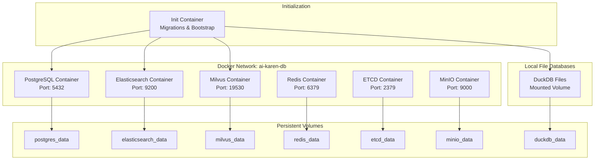

# Database Containerization Design Document

## Overview

This design creates a comprehensive Docker-based database infrastructure for AI Karen that simplifies deployment and management. The system will provide a multi-database stack including PostgreSQL, Elasticsearch, Milvus (vector database), and Redis, all orchestrated through Docker Compose with automated initialization, migration, and health monitoring.

The design focuses on creating a production-ready, developer-friendly database environment that can be deployed with a single command while maintaining data persistence, backup capabilities, and seamless integration with the existing AI Karen codebase.

## Architecture

### Container Stack Architecture



### Service Dependencies

- **PostgreSQL**: Memory storage, session data, and extension management
- **DuckDB**: User profiles, profile history, long-term memory, and structured analytics
- **Elasticsearch**: Document search and indexing for memory retrieval
- **Milvus**: Vector database for embeddings and similarity search
- **Redis**: Caching and session storage
- **ETCD**: Configuration management for Milvus
- **MinIO**: Object storage for Milvus data persistence

## Components and Interfaces

### 1. Docker Compose Configuration

**File**: `docker/database/docker-compose.yml`

The main orchestration file that defines all database services with:
- Service definitions with proper resource limits
- Network configuration for inter-service communication
- Volume mounts for data persistence
- Environment variable configuration
- Health checks for all services
- Dependency ordering for startup sequence

### 2. Database Initialization System

**Directory**: `docker/database/init/`

**Components**:
- `init-postgres.sh`: PostgreSQL initialization and migration runner
- `init-elasticsearch.sh`: Elasticsearch index creation and configuration
- `init-milvus.sh`: Milvus collection setup and configuration
- `init-duckdb.sh`: DuckDB database file creation and schema setup
- `wait-for-services.sh`: Service readiness checker

**Initialization Flow**:
1. Wait for all database services to be healthy
2. Run PostgreSQL migrations in order
3. Create Elasticsearch indices with proper mappings
4. Initialize Milvus collections with correct schemas
5. Create DuckDB database files with proper schemas
6. Load bootstrap data (classifier seeds, default configurations)
7. Verify all connections and data integrity

### 3. Migration Management

**Directory**: `docker/database/migrations/`

**Structure**:
```
migrations/
├── postgres/
│   ├── 001_create_tables.sql
│   ├── 002_create_extension_tables.sql
│   └── 003_add_indexes.sql
├── duckdb/
│   ├── 001_create_profile_tables.sql
│   ├── 002_create_history_tables.sql
│   └── 003_create_indexes.sql
├── elasticsearch/
│   ├── 001_memory_index.json
│   └── 002_document_index.json
└── milvus/
    ├── 001_persona_collection.py
    └── 002_memory_collection.py
```

### 4. Configuration Management

**File**: `docker/database/.env.template`

Template for environment variables:
- Database credentials and connection strings
- Resource allocation settings
- Feature flags for optional services
- Backup and retention policies

### 5. Management Scripts

**Directory**: `docker/database/scripts/`

**Scripts**:
- `start.sh`: Start all database services
- `stop.sh`: Gracefully stop all services
- `restart.sh`: Restart services with health checks
- `reset.sh`: Reset all data and reinitialize
- `backup.sh`: Create backups of all databases
- `restore.sh`: Restore from backup files
- `health-check.sh`: Comprehensive health monitoring

## Data Models

### PostgreSQL Schema Extensions

Building on existing migrations, add:

```sql
-- Service health tracking
CREATE TABLE IF NOT EXISTS service_health (
    service_name VARCHAR(50) PRIMARY KEY,
    status VARCHAR(20) NOT NULL,
    last_check TIMESTAMP DEFAULT NOW(),
    metadata JSONB
);

-- Database migration tracking
CREATE TABLE IF NOT EXISTS migration_history (
    id SERIAL PRIMARY KEY,
    service VARCHAR(50) NOT NULL,
    migration_name VARCHAR(255) NOT NULL,
    applied_at TIMESTAMP DEFAULT NOW(),
    checksum VARCHAR(64)
);
```

### Elasticsearch Index Mappings

**Memory Index**:
```json
{
  "mappings": {
    "properties": {
      "tenant_id": {"type": "keyword"},
      "user_id": {"type": "keyword"},
      "session_id": {"type": "keyword"},
      "query": {"type": "text", "analyzer": "standard"},
      "result": {"type": "text"},
      "timestamp": {"type": "date"},
      "vector_id": {"type": "long"}
    }
  }
}
```

### DuckDB Schema

**Profile Tables** (based on existing DuckDBClient):
```sql
CREATE TABLE IF NOT EXISTS profiles (
    user_id VARCHAR PRIMARY KEY,
    profile_json VARCHAR,
    last_update TIMESTAMP
);

CREATE TABLE IF NOT EXISTS profile_history (
    id BIGINT AUTO_INCREMENT PRIMARY KEY,
    user_id VARCHAR,
    timestamp DOUBLE,
    field VARCHAR,
    old VARCHAR,
    new VARCHAR
);

CREATE TABLE IF NOT EXISTS long_term_memory (
    user_id VARCHAR,
    memory_json VARCHAR
);

CREATE TABLE IF NOT EXISTS user_roles (
    user_id VARCHAR,
    role VARCHAR
);
```

### Milvus Collection Schemas

**Persona Embeddings Collection**:
```python
schema = CollectionSchema([
    FieldSchema("user_id", DataType.VARCHAR, is_primary=True, max_length=64),
    FieldSchema("tenant_id", DataType.VARCHAR, max_length=64),
    FieldSchema("embedding", DataType.FLOAT_VECTOR, dim=384),
    FieldSchema("metadata", DataType.JSON),
    FieldSchema("timestamp", DataType.INT64)
])
```

## Error Handling

### Service Health Monitoring

**Health Check Strategy**:
1. **Startup Health Checks**: Verify each service is ready before proceeding
2. **Runtime Health Monitoring**: Continuous health checks with automatic restart
3. **Dependency Health**: Check service dependencies and cascade failures
4. **Recovery Procedures**: Automated recovery for common failure scenarios

**Health Check Endpoints**:
- PostgreSQL: Connection test with simple query
- Elasticsearch: Cluster health API
- Milvus: Collection status check
- Redis: PING command

### Error Recovery

**Failure Scenarios**:
1. **Service Startup Failure**: Retry with exponential backoff
2. **Data Corruption**: Automatic backup restoration
3. **Network Issues**: Service discovery and reconnection
4. **Resource Exhaustion**: Graceful degradation and alerting

**Recovery Actions**:
- Automatic service restart with health verification
- Data integrity checks and repair procedures
- Fallback to backup services when available
- Comprehensive logging for troubleshooting

## Testing Strategy

### Integration Testing

**Test Categories**:
1. **Service Startup Tests**: Verify all services start correctly
2. **Migration Tests**: Ensure migrations run successfully
3. **Data Persistence Tests**: Verify data survives container restarts
4. **Health Check Tests**: Validate monitoring and recovery
5. **Performance Tests**: Ensure acceptable startup and query times

**Test Environment**:
- Separate test Docker Compose configuration
- Automated test data generation
- Cleanup procedures for test isolation
- CI/CD integration for automated testing

### Load Testing

**Scenarios**:
- Concurrent database connections
- High-volume data ingestion
- Complex query performance
- Memory usage under load
- Recovery time after failures

### Backup and Restore Testing

**Procedures**:
- Automated backup creation and verification
- Restore procedures with data validation
- Cross-environment backup compatibility
- Disaster recovery simulation

## Configuration Options

### Environment Variables

**Core Configuration**:
```bash
# PostgreSQL
POSTGRES_DB=ai_karen
POSTGRES_USER=karen_user
POSTGRES_PASSWORD=secure_password
POSTGRES_HOST=postgres
POSTGRES_PORT=5432

# Elasticsearch
ELASTICSEARCH_HOST=elasticsearch
ELASTICSEARCH_PORT=9200
ELASTICSEARCH_USER=elastic
ELASTICSEARCH_PASSWORD=elastic_password

# Milvus
MILVUS_HOST=milvus
MILVUS_PORT=19530
MILVUS_USER=milvus_user
MILVUS_PASSWORD=milvus_password

# Redis
REDIS_HOST=redis
REDIS_PORT=6379
REDIS_PASSWORD=redis_password

# DuckDB
DUCKDB_PATH=/data/duckdb/kari_duckdb.db
DUCKDB_BACKUP_PATH=/data/duckdb/backups

# Resource Limits
POSTGRES_MAX_CONNECTIONS=100
ELASTICSEARCH_HEAP_SIZE=1g
MILVUS_MEMORY_LIMIT=2g
REDIS_MEMORY_LIMIT=512m
```

### Feature Flags

**Optional Services**:
- `ENABLE_MILVUS`: Enable/disable vector database
- `ENABLE_REDIS`: Enable/disable caching layer
- `ENABLE_ELASTICSEARCH`: Enable/disable document search
- `ENABLE_MONITORING`: Enable/disable health monitoring
- `ENABLE_BACKUPS`: Enable/disable automated backups

### Development vs Production

**Development Mode**:
- Reduced resource requirements
- Exposed ports for direct access
- Debug logging enabled
- Simplified authentication

**Production Mode**:
- Full resource allocation
- Internal networking only
- Comprehensive monitoring
- Strong authentication and encryption