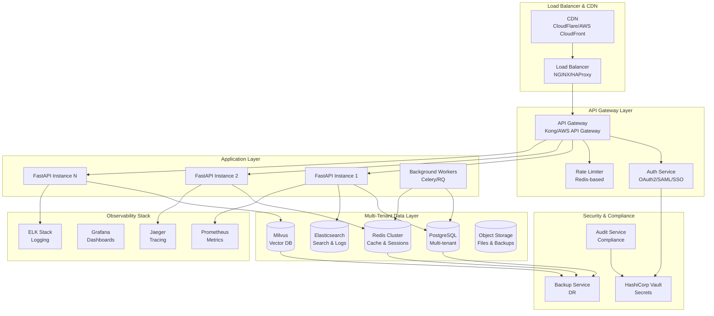

# Production SaaS Platform Design Document

## Overview

This design transforms AI-Karen from its current prototype state into a production-ready, enterprise-grade, multi-tenant SaaS platform. The transformation addresses critical production requirements including comprehensive backend auditing and fixes, security hardening with multi-tenant data isolation, modern CI/CD pipelines, observability infrastructure, and architectural streamlining for scalability and maintainability.

The design follows a phased approach that ensures zero-downtime migration from the current system while introducing enterprise-grade capabilities. The resulting platform will support thousands of concurrent users across multiple tenants with enterprise-level security, performance, and reliability guarantees.

## Architecture

### High-Level Production Architecture



### Multi-Tenant Data Architecture

```mermaid
graph TB
    subgraph "Tenant Isolation Strategy"
        TENANT_A[Tenant A<br/>org_123]
        TENANT_B[Tenant B<br/>org_456]
        TENANT_C[Tenant C<br/>org_789]
    end
    
    subgraph "PostgreSQL Multi-Tenant"
        PG_SCHEMA_A[Schema: tenant_123]
        PG_SCHEMA_B[Schema: tenant_456]
        PG_SCHEMA_C[Schema: tenant_789]
        PG_SHARED[Shared Tables<br/>tenants, users, billing]
    end
    
    subgraph "Milvus Collections"
        MILVUS_A[Collection: vectors_123]
        MILVUS_B[Collection: vectors_456]
        MILVUS_C[Collection: vectors_789]
    end
    
    subgraph "Redis Namespacing"
        REDIS_A[Namespace: cache:123:*]
        REDIS_B[Namespace: cache:456:*]
        REDIS_C[Namespace: cache:789:*]
    end
    
    subgraph "Elasticsearch Indices"
        ES_A[Index: logs-123-*]
        ES_B[Index: logs-456-*]
        ES_C[Index: logs-789-*]
    end
    
    TENANT_A --> PG_SCHEMA_A
    TENANT_A --> MILVUS_A
    TENANT_A --> REDIS_A
    TENANT_A --> ES_A
    
    TENANT_B --> PG_SCHEMA_B
    TENANT_B --> MILVUS_B
    TENANT_B --> REDIS_B
    TENANT_B --> ES_B
    
    TENANT_C --> PG_SCHEMA_C
    TENANT_C --> MILVUS_C
    TENANT_C --> REDIS_C
    TENANT_C --> ES_C
```



## Components and Interfaces

### 1. Enhanced FastAPI Application Layer

**Production-Ready FastAPI Service**:
- Comprehensive error handling with structured logging
- Request/response validation with Pydantic v2
- Async/await throughout for maximum concurrency
- Health checks and readiness probes
- Graceful shutdown handling
- Request correlation IDs for tracing

**Multi-Tenant Request Context**:
```python
@dataclass
class TenantContext:
    tenant_id: str
    user_id: str
    roles: List[str]
    permissions: Set[str]
    subscription_tier: str
    rate_limits: Dict[str, int]
    feature_flags: Dict[str, bool]
    correlation_id: str
    request_timestamp: datetime
```

**Enhanced Middleware Stack**:
```python
class ProductionMiddleware:
    - TenantIsolationMiddleware: Enforce tenant boundaries
    - AuthenticationMiddleware: JWT/OAuth2 validation
    - RateLimitingMiddleware: Per-tenant rate limiting
    - AuditLoggingMiddleware: Comprehensive audit trails
    - MetricsMiddleware: Prometheus metrics collection
    - TracingMiddleware: OpenTelemetry distributed tracing
    - SecurityHeadersMiddleware: OWASP security headers
    - CompressionMiddleware: Response compression
```

### 2. Multi-Tenant Database Layer

**PostgreSQL Schema Design**:
```sql
-- Shared tables (cross-tenant)
CREATE TABLE tenants (
    id UUID PRIMARY KEY DEFAULT gen_random_uuid(),
    name VARCHAR(255) NOT NULL,
    slug VARCHAR(100) UNIQUE NOT NULL,
    subscription_tier VARCHAR(50) NOT NULL,
    created_at TIMESTAMP WITH TIME ZONE DEFAULT NOW(),
    updated_at TIMESTAMP WITH TIME ZONE DEFAULT NOW()
);

CREATE TABLE users (
    id UUID PRIMARY KEY DEFAULT gen_random_uuid(),
    tenant_id UUID NOT NULL REFERENCES tenants(id),
    email VARCHAR(255) UNIQUE NOT NULL,
    roles TEXT[] DEFAULT '{}',
    created_at TIMESTAMP WITH TIME ZONE DEFAULT NOW()
);

-- Tenant-specific schema pattern
CREATE SCHEMA tenant_${tenant_id};

-- Per-tenant tables
CREATE TABLE tenant_${tenant_id}.conversations (
    id UUID PRIMARY KEY DEFAULT gen_random_uuid(),
    user_id UUID NOT NULL,
    title VARCHAR(255),
    messages JSONB NOT NULL DEFAULT '[]',
    created_at TIMESTAMP WITH TIME ZONE DEFAULT NOW()
);

CREATE TABLE tenant_${tenant_id}.memory_entries (
    id UUID PRIMARY KEY DEFAULT gen_random_uuid(),
    content TEXT NOT NULL,
    embedding_id VARCHAR(255),
    metadata JSONB DEFAULT '{}',
    created_at TIMESTAMP WITH TIME ZONE DEFAULT NOW()
);
```

**Milvus Multi-Tenant Collections**:
```python
class MilvusMultiTenantManager:
    def get_collection_name(self, tenant_id: str, collection_type: str) -> str:
        return f"{collection_type}_{tenant_id}"
    
    async def create_tenant_collections(self, tenant_id: str):
        collections = [
            f"vectors_{tenant_id}",
            f"embeddings_{tenant_id}",
            f"knowledge_{tenant_id}"
        ]
        for collection in collections:
            await self.create_collection(collection)
    
    async def query_tenant_data(self, tenant_id: str, query_vector: List[float]):
        collection_name = self.get_collection_name(tenant_id, "vectors")
        return await self.search(collection_name, query_vector)
```

### 3. Security and Authentication Layer

**OAuth2/SAML Integration**:
```python
class EnterpriseAuthProvider:
    def __init__(self):
        self.oauth2_providers = {
            'google': GoogleOAuth2Provider(),
            'microsoft': MicrosoftOAuth2Provider(),
            'okta': OktaOAuth2Provider(),
            'auth0': Auth0Provider()
        }
        self.saml_providers = {
            'enterprise_sso': SAMLProvider()
        }
    
    async def authenticate(self, token: str, provider: str) -> TenantContext:
        if provider in self.oauth2_providers:
            return await self.oauth2_providers[provider].validate_token(token)
        elif provider in self.saml_providers:
            return await self.saml_providers[provider].validate_assertion(token)
        raise AuthenticationError(f"Unknown provider: {provider}")
```

**Role-Based Access Control (RBAC)**:
```python
class RBACManager:
    ROLES = {
        'tenant_admin': {
            'permissions': ['*'],
            'description': 'Full tenant administration'
        },
        'user_manager': {
            'permissions': ['users:read', 'users:write', 'users:delete'],
            'description': 'User management'
        },
        'analyst': {
            'permissions': ['analytics:read', 'reports:read'],
            'description': 'Analytics and reporting'
        },
        'end_user': {
            'permissions': ['chat:read', 'chat:write', 'memory:read'],
            'description': 'Standard user access'
        }
    }
    
    def check_permission(self, user_roles: List[str], required_permission: str) -> bool:
        for role in user_roles:
            if role in self.ROLES:
                permissions = self.ROLES[role]['permissions']
                if '*' in permissions or required_permission in permissions:
                    return True
        return False
```

### 4. Observability and Monitoring

**Prometheus Metrics Collection**:
```python
class ProductionMetrics:
    # Request metrics
    REQUEST_COUNT = Counter('http_requests_total', 'Total HTTP requests', ['method', 'endpoint', 'status', 'tenant'])
    REQUEST_DURATION = Histogram('http_request_duration_seconds', 'HTTP request duration', ['method', 'endpoint', 'tenant'])
    
    # Business metrics
    ACTIVE_USERS = Gauge('active_users_total', 'Active users', ['tenant'])
    CHAT_MESSAGES = Counter('chat_messages_total', 'Chat messages sent', ['tenant'])
    PLUGIN_EXECUTIONS = Counter('plugin_executions_total', 'Plugin executions', ['plugin', 'tenant'])
    
    # System metrics
    DATABASE_CONNECTIONS = Gauge('database_connections_active', 'Active database connections', ['database'])
    MEMORY_USAGE = Gauge('memory_usage_bytes', 'Memory usage in bytes', ['component'])
    CACHE_HIT_RATE = Gauge('cache_hit_rate', 'Cache hit rate', ['cache_type'])
```

**OpenTelemetry Distributed Tracing**:
```python
class TracingManager:
    def __init__(self):
        self.tracer = trace.get_tracer(__name__)
    
    @contextmanager
    def trace_operation(self, operation_name: str, tenant_id: str = None):
        with self.tracer.start_as_current_span(operation_name) as span:
            if tenant_id:
                span.set_attribute("tenant.id", tenant_id)
            span.set_attribute("service.name", "ai-karen")
            yield span
```

**Structured Logging**:
```python
class StructuredLogger:
    def __init__(self):
        self.logger = structlog.get_logger()
    
    def log_request(self, request: Request, response: Response, duration: float):
        self.logger.info(
            "http_request",
            method=request.method,
            path=request.url.path,
            status_code=response.status_code,
            duration_ms=duration * 1000,
            tenant_id=getattr(request.state, 'tenant_id', None),
            user_id=getattr(request.state, 'user_id', None),
            correlation_id=getattr(request.state, 'correlation_id', None)
        )
```

### 5. CI/CD Pipeline Architecture

**GitHub Actions Workflow**:
```yaml
name: Production CI/CD Pipeline

on:
  push:
    branches: [main, develop]
  pull_request:
    branches: [main]

jobs:
  test:
    runs-on: ubuntu-latest
    services:
      postgres:
        image: postgres:15
        env:
          POSTGRES_PASSWORD: postgres
        options: >-
          --health-cmd pg_isready
          --health-interval 10s
          --health-timeout 5s
          --health-retries 5
      redis:
        image: redis:7
        options: >-
          --health-cmd "redis-cli ping"
          --health-interval 10s
          --health-timeout 5s
          --health-retries 5
    
    steps:
      - uses: actions/checkout@v4
      - uses: actions/setup-python@v4
        with:
          python-version: '3.11'
      
      - name: Install dependencies
        run: |
          pip install -r requirements.txt
          pip install -r requirements-dev.txt
      
      - name: Run linting
        run: |
          black --check .
          isort --check-only .
          flake8 .
          mypy .
      
      - name: Run security scan
        run: |
          bandit -r src/
          safety check
      
      - name: Run tests
        run: |
          pytest --cov=src --cov-report=xml --cov-fail-under=85
      
      - name: Upload coverage
        uses: codecov/codecov-action@v3

  build:
    needs: test
    runs-on: ubuntu-latest
    steps:
      - uses: actions/checkout@v4
      
      - name: Build Docker image
        run: |
          docker build -t ai-karen:${{ github.sha }} .
      
      - name: Security scan image
        run: |
          docker run --rm -v /var/run/docker.sock:/var/run/docker.sock \
            aquasec/trivy image ai-karen:${{ github.sha }}
      
      - name: Push to registry
        if: github.ref == 'refs/heads/main'
        run: |
          echo ${{ secrets.DOCKER_PASSWORD }} | docker login -u ${{ secrets.DOCKER_USERNAME }} --password-stdin
          docker push ai-karen:${{ github.sha }}

  deploy-staging:
    needs: build
    if: github.ref == 'refs/heads/develop'
    runs-on: ubuntu-latest
    steps:
      - name: Deploy to staging
        run: |
          kubectl set image deployment/ai-karen ai-karen=ai-karen:${{ github.sha }} -n staging

  deploy-production:
    needs: build
    if: github.ref == 'refs/heads/main'
    runs-on: ubuntu-latest
    environment: production
    steps:
      - name: Deploy to production
        run: |
          kubectl set image deployment/ai-karen ai-karen=ai-karen:${{ github.sha }} -n production
```

### 6. Kubernetes Deployment Configuration

**Production Kubernetes Manifests**:
```yaml
apiVersion: apps/v1
kind: Deployment
metadata:
  name: ai-karen-api
  namespace: production
spec:
  replicas: 3
  selector:
    matchLabels:
      app: ai-karen-api
  template:
    metadata:
      labels:
        app: ai-karen-api
    spec:
      containers:
      - name: ai-karen
        image: ai-karen:latest
        ports:
        - containerPort: 8000
        env:
        - name: DATABASE_URL
          valueFrom:
            secretKeyRef:
              name: ai-karen-secrets
              key: database-url
        - name: REDIS_URL
          valueFrom:
            secretKeyRef:
              name: ai-karen-secrets
              key: redis-url
        resources:
          requests:
            memory: "512Mi"
            cpu: "250m"
          limits:
            memory: "1Gi"
            cpu: "500m"
        livenessProbe:
          httpGet:
            path: /health
            port: 8000
          initialDelaySeconds: 30
          periodSeconds: 10
        readinessProbe:
          httpGet:
            path: /ready
            port: 8000
          initialDelaySeconds: 5
          periodSeconds: 5
---
apiVersion: v1
kind: Service
metadata:
  name: ai-karen-service
  namespace: production
spec:
  selector:
    app: ai-karen-api
  ports:
  - port: 80
    targetPort: 8000
  type: ClusterIP
---
apiVersion: networking.k8s.io/v1
kind: Ingress
metadata:
  name: ai-karen-ingress
  namespace: production
  annotations:
    kubernetes.io/ingress.class: nginx
    cert-manager.io/cluster-issuer: letsencrypt-prod
    nginx.ingress.kubernetes.io/rate-limit: "100"
spec:
  tls:
  - hosts:
    - api.ai-karen.com
    secretName: ai-karen-tls
  rules:
  - host: api.ai-karen.com
    http:
      paths:
      - path: /
        pathType: Prefix
        backend:
          service:
            name: ai-karen-service
            port:
              number: 80
```

## Data Models

### Enhanced Multi-Tenant Data Models

```python
from sqlalchemy import Column, String, UUID, DateTime, Text, JSON, ForeignKey, Index
from sqlalchemy.ext.declarative import declarative_base
from sqlalchemy.dialects.postgresql import ARRAY
from datetime import datetime
import uuid

Base = declarative_base()

class Tenant(Base):
    __tablename__ = 'tenants'
    
    id = Column(UUID(as_uuid=True), primary_key=True, default=uuid.uuid4)
    name = Column(String(255), nullable=False)
    slug = Column(String(100), unique=True, nullable=False)
    subscription_tier = Column(String(50), nullable=False, default='basic')
    settings = Column(JSON, default={})
    created_at = Column(DateTime, default=datetime.utcnow)
    updated_at = Column(DateTime, default=datetime.utcnow, onupdate=datetime.utcnow)
    
    __table_args__ = (
        Index('idx_tenant_slug', 'slug'),
    )

class User(Base):
    __tablename__ = 'users'
    
    id = Column(UUID(as_uuid=True), primary_key=True, default=uuid.uuid4)
    tenant_id = Column(UUID(as_uuid=True), ForeignKey('tenants.id'), nullable=False)
    email = Column(String(255), unique=True, nullable=False)
    roles = Column(ARRAY(String), default=[])
    preferences = Column(JSON, default={})
    last_login = Column(DateTime)
    created_at = Column(DateTime, default=datetime.utcnow)
    
    __table_args__ = (
        Index('idx_user_tenant', 'tenant_id'),
        Index('idx_user_email', 'email'),
    )

class TenantConversation(Base):
    __tablename__ = 'conversations'
    __table_args__ = {'schema': 'tenant_${tenant_id}'}
    
    id = Column(UUID(as_uuid=True), primary_key=True, default=uuid.uuid4)
    user_id = Column(UUID(as_uuid=True), nullable=False)
    title = Column(String(255))
    messages = Column(JSON, default=[])
    metadata = Column(JSON, default={})
    created_at = Column(DateTime, default=datetime.utcnow)
    updated_at = Column(DateTime, default=datetime.utcnow, onupdate=datetime.utcnow)

class TenantMemoryEntry(Base):
    __tablename__ = 'memory_entries'
    __table_args__ = {'schema': 'tenant_${tenant_id}'}
    
    id = Column(UUID(as_uuid=True), primary_key=True, default=uuid.uuid4)
    content = Column(Text, nullable=False)
    embedding_id = Column(String(255))
    metadata = Column(JSON, default={})
    ttl = Column(DateTime)
    created_at = Column(DateTime, default=datetime.utcnow)
```

### Pydantic Models for API Validation

```python
from pydantic import BaseModel, EmailStr, Field, validator
from typing import List, Dict, Any, Optional
from datetime import datetime
import uuid

class TenantCreate(BaseModel):
    name: str = Field(..., min_length=1, max_length=255)
    slug: str = Field(..., min_length=1, max_length=100, regex=r'^[a-z0-9-]+$')
    subscription_tier: str = Field(default='basic')

class TenantResponse(BaseModel):
    id: uuid.UUID
    name: str
    slug: str
    subscription_tier: str
    created_at: datetime
    
    class Config:
        from_attributes = True

class UserCreate(BaseModel):
    email: EmailStr
    roles: List[str] = Field(default=[])
    
    @validator('roles')
    def validate_roles(cls, v):
        valid_roles = {'tenant_admin', 'user_manager', 'analyst', 'end_user'}
        for role in v:
            if role not in valid_roles:
                raise ValueError(f'Invalid role: {role}')
        return v

class ChatMessage(BaseModel):
    role: str = Field(..., regex=r'^(user|assistant|system)$')
    content: str = Field(..., min_length=1)
    timestamp: datetime = Field(default_factory=datetime.utcnow)
    metadata: Dict[str, Any] = Field(default={})

class ChatRequest(BaseModel):
    message: str = Field(..., min_length=1, max_length=10000)
    conversation_id: Optional[uuid.UUID] = None
    context: Dict[str, Any] = Field(default={})

class ChatResponse(BaseModel):
    message: str
    conversation_id: uuid.UUID
    metadata: Dict[str, Any] = Field(default={})
    usage_stats: Dict[str, Any] = Field(default={})
```

## Error Handling

### Comprehensive Error Management Strategy

```python
from enum import Enum
from typing import Dict, Any, Optional
import logging
import traceback

class ErrorCode(Enum):
    # Authentication & Authorization
    UNAUTHORIZED = "AUTH_001"
    FORBIDDEN = "AUTH_002"
    TOKEN_EXPIRED = "AUTH_003"
    INVALID_TENANT = "AUTH_004"
    
    # Validation
    VALIDATION_ERROR = "VAL_001"
    INVALID_INPUT = "VAL_002"
    MISSING_REQUIRED_FIELD = "VAL_003"
    
    # Business Logic
    RESOURCE_NOT_FOUND = "BIZ_001"
    RESOURCE_CONFLICT = "BIZ_002"
    QUOTA_EXCEEDED = "BIZ_003"
    FEATURE_NOT_AVAILABLE = "BIZ_004"
    
    # System
    DATABASE_ERROR = "SYS_001"
    EXTERNAL_SERVICE_ERROR = "SYS_002"
    RATE_LIMIT_EXCEEDED = "SYS_003"
    INTERNAL_ERROR = "SYS_004"

class ProductionException(Exception):
    def __init__(
        self,
        error_code: ErrorCode,
        message: str,
        details: Optional[Dict[str, Any]] = None,
        correlation_id: Optional[str] = None
    ):
        self.error_code = error_code
        self.message = message
        self.details = details or {}
        self.correlation_id = correlation_id
        super().__init__(message)

class ErrorHandler:
    def __init__(self):
        self.logger = logging.getLogger("ai_karen.errors")
    
    async def handle_exception(
        self,
        request: Request,
        exc: Exception
    ) -> JSONResponse:
        correlation_id = getattr(request.state, 'correlation_id', 'unknown')
        tenant_id = getattr(request.state, 'tenant_id', 'unknown')
        
        if isinstance(exc, ProductionException):
            return await self._handle_production_exception(exc, correlation_id, tenant_id)
        elif isinstance(exc, ValidationError):
            return await self._handle_validation_error(exc, correlation_id, tenant_id)
        else:
            return await self._handle_unexpected_error(exc, correlation_id, tenant_id)
    
    async def _handle_production_exception(
        self,
        exc: ProductionException,
        correlation_id: str,
        tenant_id: str
    ) -> JSONResponse:
        self.logger.warning(
            "Production exception",
            extra={
                "error_code": exc.error_code.value,
                "message": exc.message,
                "details": exc.details,
                "correlation_id": correlation_id,
                "tenant_id": tenant_id
            }
        )
        
        status_code = self._get_status_code(exc.error_code)
        return JSONResponse(
            status_code=status_code,
            content={
                "error": {
                    "code": exc.error_code.value,
                    "message": exc.message,
                    "details": exc.details,
                    "correlation_id": correlation_id
                }
            }
        )
    
    def _get_status_code(self, error_code: ErrorCode) -> int:
        mapping = {
            ErrorCode.UNAUTHORIZED: 401,
            ErrorCode.FORBIDDEN: 403,
            ErrorCode.TOKEN_EXPIRED: 401,
            ErrorCode.INVALID_TENANT: 400,
            ErrorCode.VALIDATION_ERROR: 400,
            ErrorCode.INVALID_INPUT: 400,
            ErrorCode.MISSING_REQUIRED_FIELD: 400,
            ErrorCode.RESOURCE_NOT_FOUND: 404,
            ErrorCode.RESOURCE_CONFLICT: 409,
            ErrorCode.QUOTA_EXCEEDED: 429,
            ErrorCode.FEATURE_NOT_AVAILABLE: 403,
            ErrorCode.DATABASE_ERROR: 500,
            ErrorCode.EXTERNAL_SERVICE_ERROR: 502,
            ErrorCode.RATE_LIMIT_EXCEEDED: 429,
            ErrorCode.INTERNAL_ERROR: 500,
        }
        return mapping.get(error_code, 500)
```

## Testing Strategy

### Comprehensive Testing Framework

```python
import pytest
import asyncio
from httpx import AsyncClient
from sqlalchemy import create_engine
from sqlalchemy.orm import sessionmaker
from testcontainers.postgres import PostgresContainer
from testcontainers.redis import RedisContainer

class TestEnvironment:
    def __init__(self):
        self.postgres_container = None
        self.redis_container = None
        self.test_client = None
    
    async def setup(self):
        # Start test containers
        self.postgres_container = PostgresContainer("postgres:15")
        self.redis_container = RedisContainer("redis:7")
        
        self.postgres_container.start()
        self.redis_container.start()
        
        # Configure test database
        db_url = self.postgres_container.get_connection_url()
        engine = create_engine(db_url)
        Base.metadata.create_all(engine)
        
        # Configure test app
        app.dependency_overrides[get_database] = lambda: engine
        app.dependency_overrides[get_redis] = lambda: self.redis_container.get_client()
        
        self.test_client = AsyncClient(app=app, base_url="http://test")
    
    async def teardown(self):
        if self.test_client:
            await self.test_client.aclose()
        if self.postgres_container:
            self.postgres_container.stop()
        if self.redis_container:
            self.redis_container.stop()

@pytest.fixture
async def test_env():
    env = TestEnvironment()
    await env.setup()
    yield env
    await env.teardown()

# Multi-tenant isolation tests
@pytest.mark.asyncio
async def test_tenant_data_isolation(test_env):
    # Create two tenants
    tenant_a = await create_test_tenant("tenant-a")
    tenant_b = await create_test_tenant("tenant-b")
    
    # Create data for tenant A
    async with test_env.test_client as client:
        response = await client.post(
            "/chat",
            json={"message": "Hello from tenant A"},
            headers={"X-Tenant-ID": tenant_a.id}
        )
        assert response.status_code == 200
    
    # Verify tenant B cannot access tenant A's data
    async with test_env.test_client as client:
        response = await client.get(
            "/conversations",
            headers={"X-Tenant-ID": tenant_b.id}
        )
        assert response.status_code == 200
        assert len(response.json()["conversations"]) == 0

# Load testing
@pytest.mark.load
async def test_concurrent_requests():
    async def make_request():
        async with AsyncClient(app=app, base_url="http://test") as client:
            response = await client.post(
                "/chat",
                json={"message": "Load test message"},
                headers={"X-Tenant-ID": "test-tenant"}
            )
            return response.status_code
    
    # Run 100 concurrent requests
    tasks = [make_request() for _ in range(100)]
    results = await asyncio.gather(*tasks)
    
    # Verify all requests succeeded
    assert all(status == 200 for status in results)

# Security testing
@pytest.mark.security
async def test_sql_injection_protection(test_env):
    malicious_input = "'; DROP TABLE users; --"
    
    async with test_env.test_client as client:
        response = await client.post(
            "/chat",
            json={"message": malicious_input},
            headers={"X-Tenant-ID": "test-tenant"}
        )
        # Should not cause internal server error
        assert response.status_code in [200, 400]
```

## Performance Optimization

### Caching Strategy

```python
from redis.asyncio import Redis
from typing import Any, Optional
import json
import hashlib

class MultiLevelCache:
    def __init__(self, redis_client: Redis):
        self.redis = redis_client
        self.local_cache = {}  # In-memory L1 cache
        self.cache_stats = {
            'hits': 0,
            'misses': 0,
            'l1_hits': 0,
            'l2_hits': 0
        }
    
    async def get(self, key: str, tenant_id: str) -> Optional[Any]:
        cache_key = f"{tenant_id}:{key}"
        
        # L1 cache (in-memory)
        if cache_key in self.local_cache:
            self.cache_stats['hits'] += 1
            self.cache_stats['l1_hits'] += 1
            return self.local_cache[cache_key]
        
        # L2 cache (Redis)
        value = await self.redis.get(cache_key)
        if value:
            self.cache_stats['hits'] += 1
            self.cache_stats['l2_hits'] += 1
            # Promote to L1
            self.local_cache[cache_key] = json.loads(value)
            return self.local_cache[cache_key]
        
        self.cache_stats['misses'] += 1
        return None
    
    async def set(
        self,
        key: str,
        value: Any,
        tenant_id: str,
        ttl: int = 3600
    ):
        cache_key = f"{tenant_id}:{key}"
        
        # Set in both caches
        self.local_cache[cache_key] = value
        await self.redis.setex(
            cache_key,
            ttl,
            json.dumps(value, default=str)
        )
```

### Database Query Optimization

```python
from sqlalchemy import select, func
from sqlalchemy.orm import selectinload, joinedload

class OptimizedQueries:
    @staticmethod
    async def get_user_conversations_with_stats(
        session: AsyncSession,
        user_id: str,
        tenant_id: str,
        limit: int = 50
    ):
        # Optimized query with eager loading and aggregation
        query = (
            select(TenantConversation)
            .where(
                TenantConversation.user_id == user_id,
                TenantConversation.__table__.schema == f"tenant_{tenant_id}"
            )
            .options(selectinload(TenantConversation.messages))
            .order_by(TenantConversation.updated_at.desc())
            .limit(limit)
        )
        
        result = await session.execute(query)
        return result.scalars().all()
    
    @staticmethod
    async def get_tenant_usage_stats(
        session: AsyncSession,
        tenant_id: str,
        start_date: datetime,
        end_date: datetime
    ):
        # Aggregated usage statistics
        query = (
            select(
                func.count(TenantConversation.id).label('total_conversations'),
                func.sum(
                    func.json_array_length(TenantConversation.messages)
                ).label('total_messages'),
                func.avg(
                    func.json_array_length(TenantConversation.messages)
                ).label('avg_messages_per_conversation')
            )
            .where(
                TenantConversation.__table__.schema == f"tenant_{tenant_id}",
                TenantConversation.created_at.between(start_date, end_date)
            )
        )
        
        result = await session.execute(query)
        return result.first()
```

## Security Implementation

### Comprehensive Security Framework

```python
from cryptography.fernet import Fernet
from passlib.context import CryptContext
import secrets
import jwt
from datetime import datetime, timedelta

class SecurityManager:
    def __init__(self):
        self.pwd_context = CryptContext(schemes=["bcrypt"], deprecated="auto")
        self.encryption_key = Fernet.generate_key()
        self.cipher_suite = Fernet(self.encryption_key)
        self.jwt_secret = secrets.token_urlsafe(32)
    
    def hash_password(self, password: str) -> str:
        return self.pwd_context.hash(password)
    
    def verify_password(self, plain_password: str, hashed_password: str) -> bool:
        return self.pwd_context.verify(plain_password, hashed_password)
    
    def encrypt_sensitive_data(self, data: str) -> str:
        return self.cipher_suite.encrypt(data.encode()).decode()
    
    def decrypt_sensitive_data(self, encrypted_data: str) -> str:
        return self.cipher_suite.decrypt(encrypted_data.encode()).decode()
    
    def create_access_token(
        self,
        data: dict,
        expires_delta: Optional[timedelta] = None
    ) -> str:
        to_encode = data.copy()
        if expires_delta:
            expire = datetime.utcnow() + expires_delta
        else:
            expire = datetime.utcnow() + timedelta(minutes=15)
        
        to_encode.update({"exp": expire})
        encoded_jwt = jwt.encode(to_encode, self.jwt_secret, algorithm="HS256")
        return encoded_jwt
    
    def verify_token(self, token: str) -> Optional[dict]:
        try:
            payload = jwt.decode(token, self.jwt_secret, algorithms=["HS256"])
            return payload
        except jwt.PyJWTError:
            return None

class InputSanitizer:
    @staticmethod
    def sanitize_sql_input(input_str: str) -> str:
        # Remove potential SQL injection patterns
        dangerous_patterns = [
            "';", "'--", "/*", "*/", "xp_", "sp_", "DROP", "DELETE", "INSERT", "UPDATE"
        ]
        sanitized = input_str
        for pattern in dangerous_patterns:
            sanitized = sanitized.replace(pattern, "")
        return sanitized
    
    @staticmethod
    def sanitize_html_input(input_str: str) -> str:
        # Basic HTML sanitization
        import html
        return html.escape(input_str)
    
    @staticmethod
    def validate_tenant_id(tenant_id: str) -> bool:
        # Validate tenant ID format
        import re
        pattern = r'^[a-zA-Z0-9-_]{1,50}$'
        return bool(re.match(pattern, tenant_id))
```

This comprehensive design document provides the foundation for transforming AI-Karen into a production-ready, multi-tenant SaaS platform. The next step would be to create the detailed implementation tasks that break down each component into actionable development work.