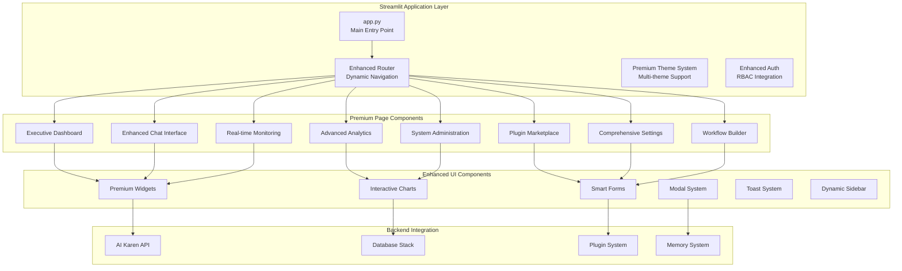

# Streamlit UI Modernization Design Document

## Overview

This design transforms the existing Streamlit UI into a premium, comprehensive interface that showcases all AI Karen capabilities through a modern, professional dashboard. The enhanced UI will provide a cohesive user experience with advanced features, comprehensive system monitoring, and intuitive navigation while maintaining the existing architecture and leveraging the robust foundation already in place.

The modernization focuses on visual enhancement, feature completeness, user experience optimization, and premium functionality that positions AI Karen as an enterprise-grade AI assistant platform.

## Architecture

### Enhanced UI Architecture



### Component Hierarchy

**Core Application Structure**:
- **app.py**: Enhanced main entry point with premium theming
- **Enhanced Router**: Dynamic navigation with role-based access
- **Premium Theme System**: Multiple professional themes with customization
- **Advanced Authentication**: Comprehensive RBAC with user management

**Premium Page Components**:
- **Executive Dashboard**: High-level overview with KPIs and quick actions
- **Enhanced Chat Interface**: Feature-rich conversation experience
- **Advanced Analytics**: Comprehensive system and usage analytics
- **Plugin Marketplace**: Professional plugin management and discovery
- **Comprehensive Settings**: Complete system configuration interface
- **System Administration**: Full administrative control panel
- **Real-time Monitoring**: Live system health and performance monitoring
- **Workflow Builder**: Visual workflow creation and management

## Components and Interfaces

### 1. Enhanced Main Application (app.py)

**Premium Features**:
- Multi-theme support with smooth transitions
- Dynamic sidebar with contextual navigation
- Real-time notifications and status indicators
- Progressive loading with skeleton screens
- Responsive design for different screen sizes

**Enhanced Navigation**:
```python
PREMIUM_NAVIGATION = {
    "executive": {
        "Dashboard": {"icon": "📊", "page": "dashboard", "roles": ["admin", "executive"]},
        "Analytics": {"icon": "📈", "page": "analytics", "roles": ["admin", "analyst"]},
        "Reports": {"icon": "📋", "page": "reports", "roles": ["admin", "manager"]}
    },
    "operations": {
        "Chat": {"icon": "💬", "page": "chat", "roles": ["user", "admin"]},
        "Memory": {"icon": "🧠", "page": "memory", "roles": ["user", "admin"]},
        "Workflows": {"icon": "⚡", "page": "workflows", "roles": ["admin", "developer"]}
    },
    "system": {
        "Plugins": {"icon": "🧩", "page": "plugins", "roles": ["admin", "developer"]},
        "Settings": {"icon": "⚙️", "page": "settings", "roles": ["user", "admin"]},
        "Monitoring": {"icon": "📡", "page": "monitoring", "roles": ["admin", "ops"]}
    }
}
```

### 2. Executive Dashboard

**Premium Dashboard Features**:
- Real-time KPI widgets with trend indicators
- Interactive system health overview
- Quick action panels for common tasks
- Customizable widget layout with drag-and-drop
- Executive summary reports with export capabilities

**Dashboard Widgets**:
```python
DASHBOARD_WIDGETS = {
    "system_health": {
        "title": "System Health",
        "type": "status_grid",
        "data_source": "health_metrics",
        "refresh_interval": 30
    },
    "usage_analytics": {
        "title": "Usage Analytics",
        "type": "time_series_chart",
        "data_source": "usage_metrics",
        "time_range": "24h"
    },
    "active_sessions": {
        "title": "Active Sessions",
        "type": "counter_widget",
        "data_source": "session_count",
        "real_time": True
    }
}
```

### 3. Enhanced Chat Interface

**Premium Chat Features**:
- Rich message formatting with syntax highlighting
- File upload and attachment support
- Conversation branching and history management
- Real-time typing indicators and presence
- Advanced search and filtering capabilities
- Export conversations in multiple formats

**Chat Enhancement Components**:
- **Message Composer**: Rich text editor with formatting options
- **Attachment Manager**: File upload with preview and management
- **Conversation Manager**: Session organization and search
- **Response Analytics**: Message sentiment and engagement metrics

### 4. Advanced Analytics Dashboard

**Comprehensive Analytics Features**:
- Interactive charts with drill-down capabilities
- Custom report builder with drag-and-drop interface
- Real-time metrics with historical comparisons
- Export capabilities (PDF, Excel, CSV)
- Scheduled report generation and delivery

**Analytics Modules**:
```python
ANALYTICS_MODULES = {
    "usage_analytics": {
        "charts": ["user_activity", "feature_usage", "session_duration"],
        "filters": ["date_range", "user_group", "feature_category"],
        "export_formats": ["pdf", "excel", "csv"]
    },
    "performance_analytics": {
        "charts": ["response_times", "error_rates", "throughput"],
        "alerts": ["performance_degradation", "error_spike"],
        "real_time": True
    },
    "business_analytics": {
        "charts": ["roi_metrics", "user_satisfaction", "feature_adoption"],
        "reports": ["executive_summary", "monthly_report"],
        "scheduled_delivery": True
    }
}
```

### 5. Plugin Marketplace

**Premium Plugin Management**:
- Visual plugin marketplace with ratings and reviews
- One-click installation and configuration
- Plugin dependency management
- Custom plugin development tools
- Plugin performance monitoring and analytics

**Marketplace Features**:
- **Plugin Discovery**: Categorized browsing with search and filters
- **Installation Manager**: Automated installation with dependency resolution
- **Configuration Wizard**: Guided setup for complex plugins
- **Performance Monitor**: Plugin resource usage and performance metrics

### 6. Comprehensive Settings Interface

**Advanced Settings Categories**:
- **User Preferences**: Personal customization and preferences
- **System Configuration**: Core system settings and parameters
- **Integration Settings**: Third-party service configurations
- **Security Settings**: Authentication, authorization, and security policies
- **Performance Tuning**: System optimization and resource allocation

**Settings Interface Features**:
```python
SETTINGS_CATEGORIES = {
    "appearance": {
        "theme_selection": "multi_choice",
        "layout_preferences": "toggle_group",
        "notification_settings": "checkbox_group"
    },
    "ai_configuration": {
        "model_selection": "dropdown_with_preview",
        "response_parameters": "slider_group",
        "memory_settings": "advanced_form"
    },
    "system_settings": {
        "database_configuration": "connection_manager",
        "performance_tuning": "advanced_sliders",
        "logging_configuration": "multi_select"
    }
}
```

### 7. Real-time Monitoring Dashboard

**Monitoring Capabilities**:
- Live system metrics with real-time updates
- Service health monitoring with alerting
- Resource usage tracking and optimization suggestions
- Log aggregation and analysis
- Performance profiling and bottleneck identification

**Monitoring Components**:
- **System Health Grid**: Visual status indicators for all services
- **Performance Charts**: Real-time graphs of key metrics
- **Alert Manager**: Notification system for critical events
- **Log Viewer**: Searchable, filterable log interface

## Data Models

### Enhanced User Context Model

```python
@dataclass
class EnhancedUserContext:
    user_id: str
    username: str
    email: str
    roles: List[str]
    permissions: List[str]
    preferences: Dict[str, Any]
    theme: str
    dashboard_layout: Dict[str, Any]
    notification_settings: Dict[str, bool]
    last_activity: datetime
    session_data: Dict[str, Any]
```

### Dashboard Configuration Model

```python
@dataclass
class DashboardConfig:
    user_id: str
    layout: List[Dict[str, Any]]
    widgets: List[Dict[str, Any]]
    filters: Dict[str, Any]
    refresh_intervals: Dict[str, int]
    export_settings: Dict[str, Any]
```

### Analytics Data Model

```python
@dataclass
class AnalyticsMetric:
    metric_id: str
    name: str
    description: str
    value: Union[int, float, str]
    timestamp: datetime
    tags: Dict[str, str]
    metadata: Dict[str, Any]
```

## Error Handling

### Enhanced Error Management

**Error Categories**:
1. **User Interface Errors**: Component rendering failures, navigation issues
2. **Data Loading Errors**: API failures, database connection issues
3. **Authentication Errors**: Login failures, permission denied
4. **System Errors**: Service unavailability, resource exhaustion

**Error Handling Strategy**:
```python
class ErrorHandler:
    @staticmethod
    def handle_ui_error(error: Exception, component: str):
        """Handle UI component errors with graceful degradation"""
        logger.error(f"UI Error in {component}: {error}")
        st.error(f"Component temporarily unavailable: {component}")
        return render_fallback_component(component)
    
    @staticmethod
    def handle_data_error(error: Exception, data_source: str):
        """Handle data loading errors with retry mechanisms"""
        logger.error(f"Data Error from {data_source}: {error}")
        return render_error_state_with_retry(data_source)
```

### Graceful Degradation

**Fallback Strategies**:
- **Component Failures**: Show simplified versions or error messages
- **Data Unavailability**: Display cached data or placeholder content
- **Service Outages**: Provide offline functionality where possible
- **Performance Issues**: Reduce update frequencies and simplify displays

## Testing Strategy

### Comprehensive Testing Approach

**Testing Categories**:
1. **Visual Regression Testing**: Ensure UI consistency across updates
2. **Functional Testing**: Verify all features work as expected
3. **Performance Testing**: Ensure responsive performance under load
4. **Accessibility Testing**: Verify compliance with accessibility standards
5. **Cross-browser Testing**: Ensure compatibility across different browsers

**Testing Tools and Frameworks**:
```python
TESTING_STACK = {
    "unit_tests": "pytest",
    "ui_tests": "selenium",
    "visual_tests": "percy",
    "performance_tests": "locust",
    "accessibility_tests": "axe-core"
}
```

### User Experience Testing

**UX Testing Scenarios**:
- **New User Onboarding**: First-time user experience flow
- **Power User Workflows**: Advanced feature usage patterns
- **Mobile Responsiveness**: Touch interface and small screen usability
- **Accessibility Compliance**: Screen reader and keyboard navigation

## Premium Theme System

### Multi-Theme Architecture

**Available Themes**:
```python
PREMIUM_THEMES = {
    "executive": {
        "name": "Executive",
        "description": "Professional theme for business users",
        "colors": {
            "primary": "#1f2937",
            "secondary": "#3b82f6",
            "accent": "#10b981",
            "background": "#f9fafb"
        }
    },
    "developer": {
        "name": "Developer",
        "description": "Dark theme optimized for development",
        "colors": {
            "primary": "#0f172a",
            "secondary": "#7c3aed",
            "accent": "#06b6d4",
            "background": "#020617"
        }
    },
    "minimal": {
        "name": "Minimal",
        "description": "Clean, distraction-free interface",
        "colors": {
            "primary": "#374151",
            "secondary": "#6b7280",
            "accent": "#f59e0b",
            "background": "#ffffff"
        }
    }
}
```

### Theme Customization

**Customization Options**:
- **Color Schemes**: Primary, secondary, and accent color selection
- **Typography**: Font family and size preferences
- **Layout Density**: Compact, comfortable, or spacious layouts
- **Animation Preferences**: Motion sensitivity and animation speeds

## Performance Optimization

### Optimization Strategies

**Performance Enhancements**:
1. **Lazy Loading**: Load components and data on demand
2. **Caching**: Implement intelligent caching for frequently accessed data
3. **Pagination**: Implement pagination for large data sets
4. **Debouncing**: Reduce API calls with input debouncing
5. **Progressive Loading**: Show content incrementally as it loads

**Caching Strategy**:
```python
CACHE_CONFIGURATION = {
    "user_data": {"ttl": 300, "strategy": "lru"},
    "system_metrics": {"ttl": 30, "strategy": "time_based"},
    "static_content": {"ttl": 3600, "strategy": "persistent"},
    "analytics_data": {"ttl": 600, "strategy": "sliding_window"}
}
```

### Resource Management

**Resource Optimization**:
- **Memory Management**: Efficient data structures and cleanup
- **Network Optimization**: Minimize API calls and payload sizes
- **Rendering Optimization**: Efficient component updates and re-renders
- **Asset Optimization**: Compressed images and optimized CSS/JS