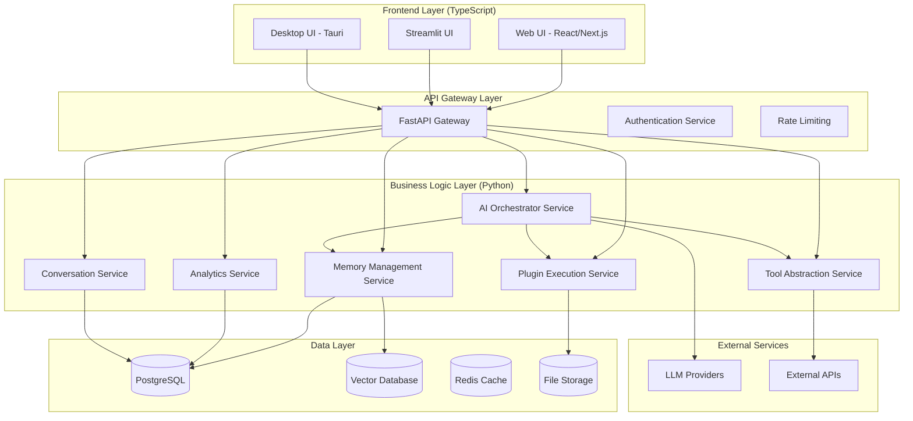

# Design Document

## Overview

This design outlines the integration of the web UI with the AI Karen engine, creating a hybrid architecture where the TypeScript frontend handles presentation and user interaction while Python backend services handle all business logic, AI processing, and data management. The design focuses on creating reusable Python services that can be shared across all UI launchers while maintaining the modern web interface experience.

## Architecture

### High-Level Architecture



### Service Architecture

The system follows a microservices-inspired architecture with clear separation of concerns:

1. **Frontend Layer**: TypeScript-based UIs handle presentation and user interaction
2. **API Gateway**: FastAPI-based gateway handles routing, authentication, and rate limiting
3. **Business Logic Layer**: Python services handle all AI processing and business logic
4. **Data Layer**: Persistent storage for different data types
5. **External Services**: Integration with LLM providers and external APIs

## Components and Interfaces

### 1. AI Orchestrator Service

**Purpose**: Central service that coordinates AI processing, decision-making, and workflow orchestration.

**Key Components**:
- **Flow Manager**: Manages AI processing workflows similar to Genkit flows
- **Decision Engine**: Handles cognitive decision-making processes
- **Context Manager**: Manages conversation context and memory integration
- **Prompt Manager**: Handles structured prompt templates and generation

**Python Implementation**:
```python
# src/ai_karen_engine/services/ai_orchestrator.py
from typing import Dict, List, Optional, Any
from pydantic import BaseModel
from enum import Enum

class FlowType(str, Enum):
    DECIDE_ACTION = "decide_action"
    CONVERSATION_PROCESSING = "conversation_processing"
    CONVERSATION_SUMMARY = "conversation_summary"

class FlowInput(BaseModel):
    prompt: str
    conversation_history: List[Dict[str, Any]]
    user_settings: Dict[str, Any]
    context: Optional[Dict[str, Any]] = None
    user_id: Optional[str] = None
    session_id: Optional[str] = None

class FlowOutput(BaseModel):
    response: str
    requires_plugin: bool = False
    plugin_to_execute: Optional[str] = None
    plugin_parameters: Optional[Dict[str, Any]] = None
    memory_to_store: Optional[Dict[str, Any]] = None
    suggested_actions: Optional[List[str]] = None
    ai_data: Optional[Dict[str, Any]] = None
    proactive_suggestion: Optional[str] = None

class AIOrchestrator:
    def __init__(self):
        self.flow_manager = FlowManager()
        self.decision_engine = DecisionEngine()
        self.context_manager = ContextManager()
        self.prompt_manager = PromptManager()
    
    async def process_flow(self, flow_type: FlowType, input_data: FlowInput) -> FlowOutput:
        """Process an AI flow with the given input"""
        pass
    
    async def decide_action(self, input_data: FlowInput) -> FlowOutput:
        """Equivalent to TypeScript decideAction flow"""
        pass
    
    async def conversation_processing_flow(self, input_data: FlowInput) -> FlowOutput:
        """Handles comprehensive conversation processing with memory integration"""
        pass
```

**API Endpoints**:
- `POST /api/ai/process-flow` - Process AI flows
- `POST /api/ai/decide-action` - Decision-making flow
- `POST /api/ai/conversation-processing` - Conversation processing flow
- `GET /api/ai/available-flows` - List available flows

### 2. Memory Management Service

**Purpose**: Handles all memory operations including storage, retrieval, and context management.

**Key Components**:
- **Memory Store**: Persistent memory storage and retrieval
- **Context Builder**: Builds conversation context from memories
- **Memory Analytics**: Analyzes memory patterns and usage
- **Memory Cleanup**: Manages memory lifecycle and cleanup

**Python Implementation**:
```python
# src/ai_karen_engine/services/memory_service.py
from typing import List, Dict, Optional, Any
from pydantic import BaseModel
from datetime import datetime

class MemoryEntry(BaseModel):
    id: str
    content: str
    metadata: Dict[str, Any]
    tags: List[str]
    user_id: Optional[str]
    session_id: Optional[str]
    timestamp: datetime
    similarity_score: Optional[float] = None

class MemoryQuery(BaseModel):
    text: str
    user_id: Optional[str] = None
    session_id: Optional[str] = None
    tags: Optional[List[str]] = None
    top_k: int = 5
    similarity_threshold: float = 0.7
    time_range: Optional[tuple[datetime, datetime]] = None

class MemoryService:
    def __init__(self):
        self.vector_store = VectorStore()
        self.metadata_store = MetadataStore()
        self.context_builder = ContextBuilder()
    
    async def store_memory(self, content: str, metadata: Dict[str, Any], 
                          tags: List[str], user_id: str, session_id: str) -> str:
        """Store a new memory entry"""
        pass
    
    async def query_memories(self, query: MemoryQuery) -> List[MemoryEntry]:
        """Query memories based on similarity and filters"""
        pass
    
    async def build_context(self, query: str, user_id: str, 
                           session_id: str) -> Dict[str, Any]:
        """Build conversation context from relevant memories"""
        pass
    
    async def get_memory_stats(self, user_id: str) -> Dict[str, Any]:
        """Get memory statistics for a user"""
        pass
```

**API Endpoints**:
- `POST /api/memory/store` - Store new memory
- `POST /api/memory/query` - Query memories
- `GET /api/memory/context/{user_id}` - Get context for user
- `GET /api/memory/stats/{user_id}` - Get memory statistics

### 3. Plugin Execution Service

**Purpose**: Manages plugin discovery, validation, and execution with proper sandboxing.

**Key Components**:
- **Plugin Registry**: Manages available plugins and their metadata
- **Execution Engine**: Safely executes plugins in sandboxed environments
- **Plugin Validator**: Validates plugin inputs and outputs
- **Plugin Communicator**: Handles plugin-to-system communication

**Python Implementation**:
```python
# src/ai_karen_engine/services/plugin_service.py
from typing import Dict, List, Any, Optional
from pydantic import BaseModel
from enum import Enum

class PluginStatus(str, Enum):
    ENABLED = "enabled"
    DISABLED = "disabled"
    ERROR = "error"

class PluginInfo(BaseModel):
    name: str
    description: str
    version: str
    category: str
    status: PluginStatus
    parameters: Dict[str, Any]
    author: str
    enabled: bool

class PluginExecutionRequest(BaseModel):
    plugin_name: str
    parameters: Dict[str, Any]
    user_id: Optional[str] = None
    session_id: Optional[str] = None
    timeout: int = 30

class PluginExecutionResult(BaseModel):
    success: bool
    result: Optional[Any] = None
    stdout: Optional[str] = None
    stderr: Optional[str] = None
    error: Optional[str] = None
    execution_time: float
    timestamp: datetime

class PluginService:
    def __init__(self):
        self.registry = PluginRegistry()
        self.executor = PluginExecutor()
        self.validator = PluginValidator()
    
    async def list_plugins(self) -> List[PluginInfo]:
        """List all available plugins"""
        pass
    
    async def execute_plugin(self, request: PluginExecutionRequest) -> PluginExecutionResult:
        """Execute a plugin with given parameters"""
        pass
    
    async def validate_plugin(self, plugin_name: str, parameters: Dict[str, Any]) -> bool:
        """Validate plugin parameters"""
        pass
    
    async def get_plugin_info(self, plugin_name: str) -> Optional[PluginInfo]:
        """Get detailed information about a plugin"""
        pass
```

**API Endpoints**:
- `GET /api/plugins/list` - List available plugins
- `POST /api/plugins/execute` - Execute a plugin
- `GET /api/plugins/{plugin_name}` - Get plugin information
- `POST /api/plugins/validate` - Validate plugin parameters

### 4. Tool Abstraction Service

**Purpose**: Provides unified interface for all tools and external service integrations.

**Key Components**:
- **Tool Registry**: Manages available tools and their interfaces
- **Tool Executor**: Executes tools with proper error handling
- **Tool Validator**: Validates tool inputs and outputs
- **Tool Adapter**: Adapts different tool interfaces to unified format

**Python Implementation**:
```python
# src/ai_karen_engine/services/tool_service.py
from typing import Dict, List, Any, Optional, Union
from pydantic import BaseModel
from abc import ABC, abstractmethod

class ToolInput(BaseModel):
    tool_name: str
    parameters: Dict[str, Any]
    user_context: Optional[Dict[str, Any]] = None

class ToolOutput(BaseModel):
    success: bool
    result: Any
    error: Optional[str] = None
    execution_time: float
    metadata: Optional[Dict[str, Any]] = None

class BaseTool(ABC):
    @abstractmethod
    async def execute(self, parameters: Dict[str, Any]) -> ToolOutput:
        """Execute the tool with given parameters"""
        pass
    
    @abstractmethod
    def validate_input(self, parameters: Dict[str, Any]) -> bool:
        """Validate input parameters"""
        pass

class WeatherTool(BaseTool):
    async def execute(self, parameters: Dict[str, Any]) -> ToolOutput:
        """Get weather information"""
        pass

class TimeTool(BaseTool):
    async def execute(self, parameters: Dict[str, Any]) -> ToolOutput:
        """Get time information"""
        pass

class ToolService:
    def __init__(self):
        self.tools: Dict[str, BaseTool] = {}
        self.register_default_tools()
    
    def register_tool(self, name: str, tool: BaseTool):
        """Register a new tool"""
        self.tools[name] = tool
    
    async def execute_tool(self, tool_input: ToolInput) -> ToolOutput:
        """Execute a tool by name"""
        pass
    
    def list_tools(self) -> List[str]:
        """List available tools"""
        return list(self.tools.keys())
```

**API Endpoints**:
- `GET /api/tools/list` - List available tools
- `POST /api/tools/execute` - Execute a tool
- `GET /api/tools/{tool_name}/schema` - Get tool input schema

### 5. Conversation Service

**Purpose**: Manages conversation history, context, and session management.

**Key Components**:
- **Session Manager**: Manages user sessions and conversation state
- **History Manager**: Stores and retrieves conversation history
- **Context Tracker**: Tracks conversation context and flow
- **Summary Generator**: Generates conversation summaries

**Python Implementation**:
```python
# src/ai_karen_engine/services/conversation_service.py
from typing import List, Dict, Optional, Any
from pydantic import BaseModel
from datetime import datetime

class ConversationMessage(BaseModel):
    id: str
    role: str  # user, assistant, system
    content: str
    timestamp: datetime
    metadata: Optional[Dict[str, Any]] = None

class ConversationSession(BaseModel):
    session_id: str
    user_id: str
    created_at: datetime
    updated_at: datetime
    messages: List[ConversationMessage]
    context: Dict[str, Any]
    summary: Optional[str] = None

class ConversationService:
    def __init__(self):
        self.session_store = SessionStore()
        self.history_store = HistoryStore()
        self.summary_generator = SummaryGenerator()
    
    async def create_session(self, user_id: str) -> str:
        """Create a new conversation session"""
        pass
    
    async def add_message(self, session_id: str, message: ConversationMessage):
        """Add a message to the conversation"""
        pass
    
    async def get_conversation(self, session_id: str) -> Optional[ConversationSession]:
        """Get conversation by session ID"""
        pass
    
    async def generate_summary(self, session_id: str) -> str:
        """Generate conversation summary"""
        pass
    
    async def get_user_conversations(self, user_id: str) -> List[ConversationSession]:
        """Get all conversations for a user"""
        pass
```

**API Endpoints**:
- `POST /api/conversations/create` - Create new conversation
- `POST /api/conversations/{session_id}/messages` - Add message
- `GET /api/conversations/{session_id}` - Get conversation
- `POST /api/conversations/{session_id}/summary` - Generate summary

## Data Models

### Unified Type System

To maintain consistency between TypeScript and Python, we'll create equivalent data models:

**TypeScript Types** → **Python Models**:
```python
# src/ai_karen_engine/models/shared_types.py
from pydantic import BaseModel
from typing import List, Optional, Dict, Any, Literal
from datetime import datetime
from enum import Enum

class MessageRole(str, Enum):
    USER = "user"
    ASSISTANT = "assistant"
    SYSTEM = "system"

class MemoryDepth(str, Enum):
    SHORT = "short"
    MEDIUM = "medium"
    LONG = "long"

class PersonalityTone(str, Enum):
    NEUTRAL = "neutral"
    FRIENDLY = "friendly"
    FORMAL = "formal"
    HUMOROUS = "humorous"

class PersonalityVerbosity(str, Enum):
    CONCISE = "concise"
    BALANCED = "balanced"
    DETAILED = "detailed"

class AiData(BaseModel):
    keywords: Optional[List[str]] = None
    knowledge_graph_insights: Optional[str] = None
    confidence: Optional[float] = None
    reasoning: Optional[str] = None

class ChatMessage(BaseModel):
    id: str
    role: MessageRole
    content: str
    timestamp: datetime
    ai_data: Optional[AiData] = None
    should_auto_play: Optional[bool] = None

class KarenSettings(BaseModel):
    memory_depth: MemoryDepth
    personality_tone: PersonalityTone
    personality_verbosity: PersonalityVerbosity
    personal_facts: List[str]
    custom_persona_instructions: str
    temperature_unit: Literal["C", "F"] = "C"
    default_weather_location: Optional[str] = None
    active_listen_mode: bool = False

class HandleUserMessageResult(BaseModel):
    acknowledgement: Optional[str] = None
    final_response: str
    ai_data_for_final_response: Optional[AiData] = None
    suggested_new_facts: Optional[List[str]] = None
    proactive_suggestion: Optional[str] = None
    summary_was_generated: Optional[bool] = None
```

### Database Schema

**PostgreSQL Tables**:
```sql
-- Users and Sessions
CREATE TABLE users (
    id UUID PRIMARY KEY DEFAULT gen_random_uuid(),
    username VARCHAR(255) UNIQUE NOT NULL,
    email VARCHAR(255) UNIQUE,
    settings JSONB DEFAULT '{}',
    created_at TIMESTAMP DEFAULT NOW(),
    updated_at TIMESTAMP DEFAULT NOW()
);

CREATE TABLE sessions (
    id UUID PRIMARY KEY DEFAULT gen_random_uuid(),
    user_id UUID REFERENCES users(id),
    session_data JSONB DEFAULT '{}',
    created_at TIMESTAMP DEFAULT NOW(),
    updated_at TIMESTAMP DEFAULT NOW(),
    expires_at TIMESTAMP
);

-- Conversations
CREATE TABLE conversations (
    id UUID PRIMARY KEY DEFAULT gen_random_uuid(),
    session_id UUID REFERENCES sessions(id),
    user_id UUID REFERENCES users(id),
    title VARCHAR(255),
    summary TEXT,
    metadata JSONB DEFAULT '{}',
    created_at TIMESTAMP DEFAULT NOW(),
    updated_at TIMESTAMP DEFAULT NOW()
);

CREATE TABLE messages (
    id UUID PRIMARY KEY DEFAULT gen_random_uuid(),
    conversation_id UUID REFERENCES conversations(id),
    role VARCHAR(20) NOT NULL,
    content TEXT NOT NULL,
    metadata JSONB DEFAULT '{}',
    created_at TIMESTAMP DEFAULT NOW()
);

-- Memory System
CREATE TABLE memories (
    id UUID PRIMARY KEY DEFAULT gen_random_uuid(),
    user_id UUID REFERENCES users(id),
    session_id UUID REFERENCES sessions(id),
    content TEXT NOT NULL,
    embedding VECTOR(1536), -- For vector similarity search
    metadata JSONB DEFAULT '{}',
    tags TEXT[],
    created_at TIMESTAMP DEFAULT NOW()
);

-- Analytics
CREATE TABLE analytics_events (
    id UUID PRIMARY KEY DEFAULT gen_random_uuid(),
    user_id UUID REFERENCES users(id),
    event_type VARCHAR(100) NOT NULL,
    event_data JSONB DEFAULT '{}',
    created_at TIMESTAMP DEFAULT NOW()
);

-- Plugins
CREATE TABLE plugin_executions (
    id UUID PRIMARY KEY DEFAULT gen_random_uuid(),
    user_id UUID REFERENCES users(id),
    plugin_name VARCHAR(255) NOT NULL,
    parameters JSONB DEFAULT '{}',
    result JSONB DEFAULT '{}',
    success BOOLEAN DEFAULT FALSE,
    execution_time FLOAT,
    created_at TIMESTAMP DEFAULT NOW()
);
```

## Error Handling

### Unified Error Response Format

```python
# src/ai_karen_engine/models/errors.py
from pydantic import BaseModel
from typing import Optional, Dict, Any
from enum import Enum

class ErrorCode(str, Enum):
    VALIDATION_ERROR = "VALIDATION_ERROR"
    AUTHENTICATION_ERROR = "AUTHENTICATION_ERROR"
    AUTHORIZATION_ERROR = "AUTHORIZATION_ERROR"
    NOT_FOUND = "NOT_FOUND"
    INTERNAL_ERROR = "INTERNAL_ERROR"
    SERVICE_UNAVAILABLE = "SERVICE_UNAVAILABLE"
    RATE_LIMIT_EXCEEDED = "RATE_LIMIT_EXCEEDED"
    PLUGIN_EXECUTION_ERROR = "PLUGIN_EXECUTION_ERROR"
    MEMORY_ERROR = "MEMORY_ERROR"
    AI_PROCESSING_ERROR = "AI_PROCESSING_ERROR"

class ErrorResponse(BaseModel):
    error_code: ErrorCode
    message: str
    details: Optional[Dict[str, Any]] = None
    request_id: Optional[str] = None
    timestamp: str
    
class ErrorHandler:
    @staticmethod
    def handle_validation_error(error: Exception) -> ErrorResponse:
        """Handle validation errors"""
        pass
    
    @staticmethod
    def handle_service_error(error: Exception) -> ErrorResponse:
        """Handle service-level errors"""
        pass
    
    @staticmethod
    def handle_plugin_error(error: Exception, plugin_name: str) -> ErrorResponse:
        """Handle plugin execution errors"""
        pass
```

### Error Recovery Strategies

1. **Graceful Degradation**: When AI services fail, provide basic responses
2. **Retry Logic**: Implement exponential backoff for transient failures
3. **Circuit Breaker**: Prevent cascade failures in service dependencies
4. **Fallback Responses**: Provide meaningful fallback when services are unavailable

## Testing Strategy

### Unit Testing

```python
# tests/services/test_ai_orchestrator.py
import pytest
from ai_karen_engine.services.ai_orchestrator import AIOrchestrator, FlowInput, FlowType

class TestAIOrchestrator:
    @pytest.fixture
    def orchestrator(self):
        return AIOrchestrator()
    
    @pytest.mark.asyncio
    async def test_decide_action_flow(self, orchestrator):
        """Test decision-making flow"""
        input_data = FlowInput(
            prompt="What's the weather like?",
            conversation_history=[],
            user_settings={}
        )
        result = await orchestrator.process_flow(FlowType.DECIDE_ACTION, input_data)
        assert result.response is not None
        assert isinstance(result.requires_plugin, bool)
    
    @pytest.mark.asyncio
    async def test_conversation_processing_flow(self, orchestrator):
        """Test conversation processing flow"""
        input_data = FlowInput(
            prompt="Remember that I like coffee",
            conversation_history=[],
            user_settings={},
            user_id="test-user"
        )
        result = await orchestrator.process_flow(FlowType.CONVERSATION_PROCESSING, input_data)
        assert result.response is not None
        assert result.memory_to_store is not None
```

### Integration Testing

```python
# tests/integration/test_full_workflow.py
import pytest
from fastapi.testclient import TestClient
from ai_karen_engine.main import app

class TestFullWorkflow:
    @pytest.fixture
    def client(self):
        return TestClient(app)
    
    def test_complete_conversation_flow(self, client):
        """Test complete conversation workflow"""
        # Create session
        response = client.post("/api/conversations/create", json={"user_id": "test-user"})
        session_id = response.json()["session_id"]
        
        # Send message
        response = client.post(f"/api/conversations/{session_id}/messages", json={
            "role": "user",
            "content": "Hello, remember that I like pizza"
        })
        assert response.status_code == 200
        
        # Check memory was stored
        response = client.post("/api/memory/query", json={
            "text": "pizza",
            "user_id": "test-user"
        })
        memories = response.json()["memories"]
        assert len(memories) > 0
        assert "pizza" in memories[0]["content"].lower()
```

### Performance Testing

```python
# tests/performance/test_load.py
import asyncio
import time
from concurrent.futures import ThreadPoolExecutor
from ai_karen_engine.services.ai_orchestrator import AIOrchestrator

class TestPerformance:
    @pytest.mark.asyncio
    async def test_concurrent_requests(self):
        """Test handling concurrent requests"""
        orchestrator = AIOrchestrator()
        
        async def process_request():
            input_data = FlowInput(
                prompt="Test prompt",
                conversation_history=[],
                user_settings={}
            )
            start_time = time.time()
            result = await orchestrator.process_flow(FlowType.DECIDE_ACTION, input_data)
            end_time = time.time()
            return end_time - start_time
        
        # Run 100 concurrent requests
        tasks = [process_request() for _ in range(100)]
        response_times = await asyncio.gather(*tasks)
        
        avg_response_time = sum(response_times) / len(response_times)
        assert avg_response_time < 2.0  # Should respond within 2 seconds on average
        assert max(response_times) < 10.0  # No request should take more than 10 seconds
```

This design provides a comprehensive architecture for integrating the web UI with the AI Karen engine while maintaining clear separation between frontend presentation and backend business logic. The Python services can be shared across all UI launchers, and the unified type system ensures consistency across the entire system.