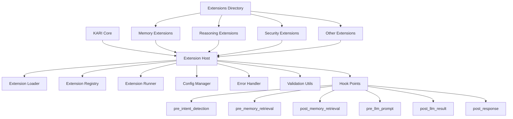

# KARI Extension System - Two-Tier Architecture Implementation Plan

## Overview

This document outlines the implementation plan for the new two-tier extension architecture for KARI, replacing the existing extension and plugin systems with a unified, clean, and production-ready architecture.

## Architecture Diagram



## Directory Structure

```
src/
 ├── ai_karen_engine/
 │    └── extension_host/     ← runtime, loader, runner, registry
 │         ├── __init__.py
 │         ├── base.py
 │         ├── loader.py
 │         ├── registry.py
 │         ├── runner.py
 │         ├── config.py
 │         ├── errors.py
 │         └── utils/
 │              └── validation.py
 └── extensions/              ← all actual extensions (first-party + user)
      ├── README.md
      ├── memory_short_term_booster/
      │    ├── extension_manifest.json
      │    ├── handler.py
      │    └── prompt.txt
      │
      ├── reasoning_rewriter/
      │    ├── extension_manifest.json
      │    ├── handler.py
      │    └── prompt.txt
      │
      ├── security_redactor/
      │    ├── extension_manifest.json
      │    ├── handler.py
      │    └── prompt.txt
      │
      └── <more_extensions>/
```

## Implementation Tasks

### 1. Create Extension Host Directory Structure

**Status**: Pending

Create the `src/ai_karen_engine/extension_host/` directory with all necessary files.

**Key Components**:
- `__init__.py` - Package initialization
- `base.py` - Base classes and interfaces
- `loader.py` - Extension loading and discovery
- `registry.py` - Extension registration and management
- `runner.py` - Extension execution and lifecycle
- `config.py` - Configuration management
- `errors.py` - Error handling and exceptions
- `utils/validation.py` - Manifest validation utilities

### 2. Implement Core Extension Host Files

**Status**: Pending

#### base.py
- Define `ExtensionBase` abstract class
- Define hook interfaces and base implementations
- Define extension context and lifecycle methods
- Implement extension metadata handling

#### loader.py
- Implement extension discovery from filesystem
- Handle manifest parsing and validation
- Implement dynamic loading of extension modules
- Handle dependency resolution

#### registry.py
- Implement extension registration system
- Maintain extension state and status
- Handle extension lookups and queries
- Implement extension categorization

#### runner.py
- Implement extension execution engine
- Handle hook point dispatching
- Manage extension lifecycle (start/stop/reload)
- Implement timeout and error isolation

#### config.py
- Handle extension configuration
- Implement environment-specific settings
- Manage extension preferences
- Handle configuration validation

#### errors.py
- Define extension-specific exceptions
- Implement error handling strategies
- Define error codes and messages
- Implement error recovery mechanisms

### 3. Create Extension Validation Utilities

**Status**: Pending

#### utils/validation.py
- Implement manifest schema validation
- Validate extension structure and files
- Verify hook point implementations
- Validate permissions and RBAC settings

### 4. Create Extensions Directory Structure

**Status**: Pending

Create the unified `src/extensions/` directory with proper structure and documentation.

**Key Components**:
- `README.md` - Extensions directory documentation
- Example extensions with proper structure
- Migration guide for existing plugins

### 5. Migrate Existing Plugins

**Status**: Pending

Migrate existing plugins from `src/plugins/` to `src/extensions/` with the new structure.

**Migration Tasks**:
- Convert `plugin_manifest.json` to `extension_manifest.json`
- Update `handler.py` to implement new hook interfaces
- Migrate plugin functionality to extension format
- Update directory structure to match new conventions

### 6. Create Example Extensions

**Status**: Pending

Create example extensions following the new architecture:

#### memory_short_term_booster
- Implements `pre_memory_retrieval`, `post_memory_retrieval`, and `pre_llm_prompt` hooks
- Enhances memory retrieval quality before LLM call
- Includes configuration for similarity threshold and max items

#### reasoning_rewriter
- Implements `pre_llm_prompt` and `post_llm_result` hooks
- Rewrites and enhances reasoning chains
- Includes prompt templates for reasoning enhancement

#### security_redactor
- Implements `post_response` hook
- Redacts sensitive information from responses
- Includes configurable redaction rules

### 7. Implement Hook Point System

**Status**: Pending

Implement the six standardized hook points:

- `pre_intent_detection` - Before intent detection
- `pre_memory_retrieval` - Before memory retrieval
- `post_memory_retrieval` - After memory retrieval
- `pre_llm_prompt` - Before LLM prompt generation
- `post_llm_result` - After LLM response
- `post_response` - Before final response to user

**Implementation Details**:
- Define hook interfaces and signatures
- Implement hook registration and execution
- Handle hook priorities and ordering
- Implement hook error handling and isolation

### 8. Create Extension Manifest Schema

**Status**: Pending

Define and implement the extension manifest schema:

```json
{
  "id": "kari.memory.short_term_booster",
  "name": "Short-Term Memory Booster",
  "version": "1.0.0",
  "entrypoint": "handler:ShortTermMemoryExtension",
  "description": "Enhances memory retrieval quality before LLM call.",
  "hook_points": [
    "pre_memory_retrieval",
    "post_memory_retrieval",
    "pre_llm_prompt"
  ],
  "prompt_files": {
    "system": "prompt.txt"
  },
  "config_schema": {
    "type": "object",
    "properties": {
      "similarity_threshold": { "type": "number", "default": 0.75 },
      "max_items": { "type": "integer", "default": 12 }
    }
  },
  "permissions": {
    "memory_read": true,
    "memory_write": false,
    "tools": ["search_basic"]
  },
  "rbac": {
    "allowed_roles": ["system", "admin"],
    "default_enabled": true
  }
}
```

### 9. Update ExtensionManager

**Status**: Pending

Update the existing `ExtensionManager` to work with the new two-tier architecture:

**Key Changes**:
- Update extension discovery to use new directory structure
- Implement new hook point system
- Update manifest parsing and validation
- Integrate with new extension host components

### 10. Implement RBAC and Permissions

**Status**: Pending

Implement role-based access control and permissions enforcement:

**Key Features**:
- Role-based extension access
- Permission checking for extension operations
- User and system role differentiation
- Configurable permission sets

### 11. Add Observability and Metrics

**Status**: Pending

Implement monitoring and metrics collection for extensions:

**Key Features**:
- Extension execution metrics
- Hook point performance tracking
- Error and failure monitoring
- Prometheus metrics integration
- Logging and audit trails

### 12. Create Documentation

**Status**: Pending

Create comprehensive documentation for the new extension system:

**Documentation Components**:
- Extension development guide
- API reference documentation
- Hook point documentation
- Migration guide for existing extensions
- Best practices and examples

### 13. Update Existing Code

**Status**: Pending

Update existing code to use the new extension system:

**Key Areas**:
- Core pipeline integration
- Extension host initialization
- Hook point integration
- Configuration and settings

### 14. Test New Extension System

**Status**: Pending

Implement comprehensive testing for the new extension system:

**Testing Areas**:
- Unit tests for extension host components
- Integration tests for extension loading and execution
- Hook point testing
- Performance and load testing
- Security and permissions testing

## Implementation Timeline

### Phase 1: Core Infrastructure (Weeks 1-2)
- Create extension host directory structure
- Implement core extension host files
- Create validation utilities
- Set up extensions directory structure

### Phase 2: Extension System (Weeks 3-4)
- Implement hook point system
- Create extension manifest schema
- Update ExtensionManager
- Implement RBAC and permissions

### Phase 3: Extensions and Integration (Weeks 5-6)
- Create example extensions
- Migrate existing plugins
- Add observability and metrics
- Update existing code to use new system

### Phase 4: Testing and Documentation (Weeks 7-8)
- Implement comprehensive testing
- Create documentation
- Final integration and bug fixes
- Deployment preparation

## Success Criteria

The implementation is considered complete when:

1. **Architecture Requirements Met**:
   - Two-tier architecture is implemented
   - Extension host contains zero business logic
   - All extensions follow the unified structure

2. **Functional Requirements Met**:
   - All six hook points are implemented
   - Extension manifest schema is validated
   - RBAC and permissions are enforced
   - Observability and metrics are collected

3. **Quality Requirements Met**:
   - All tests pass
   - Documentation is complete
   - Example extensions work correctly
   - Performance meets requirements

## Risks and Mitigation

### Risk 1: Migration Complexity
- **Risk**: Migrating existing plugins may be complex and time-consuming
- **Mitigation**: Focus on new implementation only, as specified by the user

### Risk 2: Performance Impact
- **Risk**: New extension system may impact performance
- **Mitigation**: Implement performance testing and optimization

### Risk 3: Compatibility Issues
- **Risk**: New system may have compatibility issues with existing code
- **Mitigation**: Thorough testing and gradual integration

### Risk 4: Security Concerns
- **Risk**: New extension system may introduce security vulnerabilities
- **Mitigation**: Implement comprehensive security testing and RBAC

## Next Steps

1. Review and approve this implementation plan
2. Begin with Phase 1: Core Infrastructure
3. Update progress regularly and address any issues
4. Proceed through each phase until completion

This plan provides a comprehensive roadmap for implementing the two-tier extension architecture for KARI, ensuring a clean, maintainable, and production-ready system.