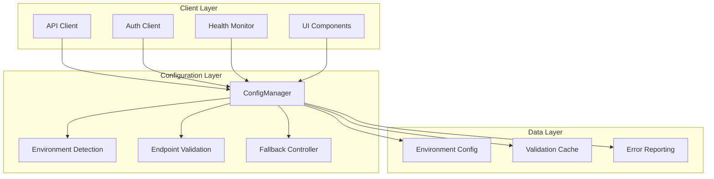

# AI Karen - Developer Configuration System Guide

This guide provides comprehensive documentation for developers working with AI Karen's centralized endpoint configuration system. It covers the architecture, APIs, and best practices for extending and maintaining the configuration system.

## Architecture Overview

The configuration system is built around a centralized `ConfigManager` class that provides consistent endpoint configuration across all Web UI components. The system automatically detects the deployment environment and configures appropriate backend URLs with fallback mechanisms.

### Core Components



## ConfigManager API Reference

### Core Interface

```typescript
interface ConfigManager {
  // Primary endpoint methods
  getBackendUrl(): string;
  getAuthEndpoint(): string;
  getChatEndpoint(): string;
  getMemoryEndpoint(): string;
  getPluginsEndpoint(): string;
  getHealthEndpoint(): string;

  // Configuration management
  getConfiguration(): EndpointConfig;
  updateConfiguration(updates: Partial<EndpointConfig>): void;

  // Environment detection
  getEnvironmentInfo(): EnvironmentInfo;

  // Validation and health checks
  validateEndpoints(): Promise<EndpointValidationResult[]>;
  clearValidationCache(): void;

  // Fallback management
  getFallbackUrls(): string[];
}
```

### Configuration Types

```typescript
export type NetworkMode = "localhost" | "container" | "external";
export type Environment = "local" | "docker" | "production";

export interface EndpointConfig {
  backendUrl: string;
  environment: Environment;
  networkMode: NetworkMode;
  fallbackUrls: string[];
  healthCheckEnabled: boolean;
  healthCheckInterval: number;
  healthCheckTimeout: number;
  corsOrigins: string[];
}

export interface EndpointValidationResult {
  isValid: boolean;
  endpoint: string;
  responseTime?: number;
  error?: string;
  timestamp: string;
}

export interface EnvironmentInfo {
  environment: Environment;
  networkMode: NetworkMode;
  backendUrl: string;
  isDocker: boolean;
  isExternal: boolean;
}
```

## Usage Examples

### Basic Configuration Usage

```typescript
import { getConfigManager } from "@/lib/endpoint-config";

// Get singleton instance
const configManager = getConfigManager();

// Get backend URL
const backendUrl = configManager.getBackendUrl();

// Get specific endpoint
const authEndpoint = configManager.getAuthEndpoint();

// Make API call
const response = await fetch(`${authEndpoint}/login`, {
  method: "POST",
  headers: { "Content-Type": "application/json" },
  body: JSON.stringify({ username, password }),
});
```

### Environment Detection

```typescript
import { getConfigManager } from "@/lib/endpoint-config";

const configManager = getConfigManager();
const envInfo = configManager.getEnvironmentInfo();

console.log("Current environment:", envInfo.environment);
console.log("Network mode:", envInfo.networkMode);
console.log("Backend URL:", envInfo.backendUrl);

// Conditional logic based on environment
if (envInfo.isDocker) {
  // Docker-specific configuration
  console.log("Running in Docker container");
} else if (envInfo.isExternal) {
  // External access configuration
  console.log("External IP access detected");
} else {
  // Local development configuration
  console.log("Local development environment");
}
```

### Endpoint Validation

```typescript
import { getConfigManager } from "@/lib/endpoint-config";

const configManager = getConfigManager();

// Validate all endpoints
const validationResults = await configManager.validateEndpoints();

validationResults.forEach((result) => {
  if (result.isValid) {
    console.log(`✓ ${result.endpoint} - ${result.responseTime}ms`);
  } else {
    console.error(`✗ ${result.endpoint} - ${result.error}`);
  }
});

// Handle validation failures
const validEndpoints = validationResults.filter((r) => r.isValid);
if (validEndpoints.length === 0) {
  throw new Error("No valid endpoints available");
}
```

### Dynamic Configuration Updates

```typescript
import { getConfigManager } from "@/lib/endpoint-config";

const configManager = getConfigManager();

// Update configuration at runtime
configManager.updateConfiguration({
  backendUrl: "http://new-backend:8000",
  healthCheckInterval: 60000,
  fallbackUrls: ["http://backup-backend:8000"],
});

// Clear validation cache after configuration change
configManager.clearValidationCache();

// Re-validate endpoints
const newResults = await configManager.validateEndpoints();
```

## API Client Integration

### Base API Client

```typescript
import { getConfigManager } from "@/lib/endpoint-config";

class ApiClient {
  private configManager = getConfigManager();
  private baseURL: string;

  constructor() {
    this.baseURL = this.configManager.getBackendUrl();
  }

  async request<T>(endpoint: string, options: RequestInit = {}): Promise<T> {
    const url = `${this.baseURL}${endpoint}`;

    try {
      const response = await fetch(url, {
        ...options,
        headers: {
          "Content-Type": "application/json",
          ...options.headers,
        },
      });

      if (!response.ok) {
        throw new Error(`HTTP ${response.status}: ${response.statusText}`);
      }

      return await response.json();
    } catch (error) {
      // Handle connection errors with fallback
      return this.handleConnectionError(endpoint, options, error);
    }
  }

  private async handleConnectionError<T>(
    endpoint: string,
    options: RequestInit,
    originalError: any
  ): Promise<T> {
    const fallbackUrls = this.configManager.getFallbackUrls();

    for (const fallbackUrl of fallbackUrls) {
      try {
        const response = await fetch(`${fallbackUrl}${endpoint}`, options);

        if (response.ok) {
          // Update configuration to use working fallback
          this.configManager.updateConfiguration({
            backendUrl: fallbackUrl,
          });

          return await response.json();
        }
      } catch (fallbackError) {
        console.warn(`Fallback ${fallbackUrl} also failed:`, fallbackError);
      }
    }

    // All endpoints failed, throw original error
    throw originalError;
  }
}

export const apiClient = new ApiClient();
```

### Authentication Client

```typescript
import { getConfigManager } from "@/lib/endpoint-config";

class AuthClient {
  private configManager = getConfigManager();

  async login(username: string, password: string) {
    const authEndpoint = this.configManager.getAuthEndpoint();

    const response = await fetch(`${authEndpoint}/login`, {
      method: "POST",
      headers: { "Content-Type": "application/json" },
      body: JSON.stringify({ username, password }),
    });

    if (!response.ok) {
      throw new Error("Authentication failed");
    }

    return await response.json();
  }

  async logout() {
    const authEndpoint = this.configManager.getAuthEndpoint();

    const response = await fetch(`${authEndpoint}/logout`, {
      method: "POST",
      credentials: "include",
    });

    return response.ok;
  }

  async validateSession() {
    const authEndpoint = this.configManager.getAuthEndpoint();

    try {
      const response = await fetch(`${authEndpoint}/validate`, {
        credentials: "include",
      });

      return response.ok;
    } catch (error) {
      console.error("Session validation failed:", error);
      return false;
    }
  }
}

export const authClient = new AuthClient();
```

## React Integration

### Configuration Hook

```typescript
import { useState, useEffect } from "react";
import {
  getConfigManager,
  EndpointConfig,
  EnvironmentInfo,
} from "@/lib/endpoint-config";

export function useEndpointConfig() {
  const [config, setConfig] = useState<EndpointConfig | null>(null);
  const [envInfo, setEnvInfo] = useState<EnvironmentInfo | null>(null);
  const [isLoading, setIsLoading] = useState(true);

  useEffect(() => {
    const configManager = getConfigManager();

    setConfig(configManager.getConfiguration());
    setEnvInfo(configManager.getEnvironmentInfo());
    setIsLoading(false);
  }, []);

  const updateConfig = (updates: Partial<EndpointConfig>) => {
    const configManager = getConfigManager();
    configManager.updateConfiguration(updates);
    setConfig(configManager.getConfiguration());
  };

  return {
    config,
    envInfo,
    isLoading,
    updateConfig,
  };
}
```

### Health Check Hook

```typescript
import { useState, useEffect, useCallback } from "react";
import {
  getConfigManager,
  EndpointValidationResult,
} from "@/lib/endpoint-config";

export function useHealthCheck(interval: number = 30000) {
  const [healthStatus, setHealthStatus] = useState<EndpointValidationResult[]>(
    []
  );
  const [isChecking, setIsChecking] = useState(false);
  const [lastCheck, setLastCheck] = useState<Date | null>(null);

  const performHealthCheck = useCallback(async () => {
    setIsChecking(true);

    try {
      const configManager = getConfigManager();
      const results = await configManager.validateEndpoints();

      setHealthStatus(results);
      setLastCheck(new Date());
    } catch (error) {
      console.error("Health check failed:", error);
    } finally {
      setIsChecking(false);
    }
  }, []);

  useEffect(() => {
    // Initial health check
    performHealthCheck();

    // Set up periodic health checks
    const intervalId = setInterval(performHealthCheck, interval);

    return () => clearInterval(intervalId);
  }, [performHealthCheck, interval]);

  const isHealthy = healthStatus.some((result) => result.isValid);

  return {
    healthStatus,
    isChecking,
    lastCheck,
    isHealthy,
    performHealthCheck,
  };
}
```

### Configuration Provider

```typescript
import React, { createContext, useContext, ReactNode } from "react";
import { useEndpointConfig } from "./useEndpointConfig";
import { EndpointConfig, EnvironmentInfo } from "@/lib/endpoint-config";

interface ConfigContextType {
  config: EndpointConfig | null;
  envInfo: EnvironmentInfo | null;
  isLoading: boolean;
  updateConfig: (updates: Partial<EndpointConfig>) => void;
}

const ConfigContext = createContext<ConfigContextType | undefined>(undefined);

export function ConfigProvider({ children }: { children: ReactNode }) {
  const configData = useEndpointConfig();

  return (
    <ConfigContext.Provider value={configData}>
      {children}
    </ConfigContext.Provider>
  );
}

export function useConfig() {
  const context = useContext(ConfigContext);
  if (context === undefined) {
    throw new Error("useConfig must be used within a ConfigProvider");
  }
  return context;
}
```

## Environment Detection Logic

### Detection Methods

```typescript
class EnvironmentDetector {
  /**
   * Detect if running in Docker container
   */
  static isRunningInDocker(): boolean {
    // Check environment variables
    if (
      process.env.DOCKER_CONTAINER ||
      process.env.HOSTNAME?.startsWith("docker-") ||
      process.env.KAREN_CONTAINER_MODE === "true"
    ) {
      return true;
    }

    // Check for container-specific files (server-side only)
    if (typeof window === "undefined") {
      try {
        const fs = require("fs");
        // Check for Docker-specific files
        if (fs.existsSync("/.dockerenv") || fs.existsSync("/proc/1/cgroup")) {
          const cgroup = fs.readFileSync("/proc/1/cgroup", "utf8");
          return cgroup.includes("docker") || cgroup.includes("containerd");
        }
      } catch (error) {
        // Ignore file system errors
      }
    }

    // Check hostname patterns
    if (typeof window !== "undefined") {
      const hostname = window.location.hostname;
      return hostname.includes("docker") || hostname.includes("container");
    }

    return false;
  }

  /**
   * Detect external IP access
   */
  static isExternalAccess(): boolean {
    if (typeof window === "undefined") {
      return false;
    }

    const hostname = window.location.hostname;

    // Localhost check
    if (hostname === "localhost" || hostname === "127.0.0.1") {
      return false;
    }

    // IP address pattern check
    if (hostname.match(/^\d+\.\d+\.\d+\.\d+$/)) {
      return true;
    }

    // Non-localhost hostname
    return hostname !== "localhost" && hostname !== "127.0.0.1";
  }

  /**
   * Detect network mode
   */
  static detectNetworkMode(): NetworkMode {
    if (this.isRunningInDocker()) {
      return "container";
    } else if (this.isExternalAccess()) {
      return "external";
    } else {
      return "localhost";
    }
  }

  /**
   * Detect environment type
   */
  static detectEnvironment(): Environment {
    // Check explicit environment variable
    const explicitEnv = process.env.KAREN_ENVIRONMENT as Environment;
    if (
      explicitEnv &&
      ["local", "docker", "production"].includes(explicitEnv)
    ) {
      return explicitEnv;
    }

    // Auto-detect based on other indicators
    if (this.isRunningInDocker()) {
      return "docker";
    }

    if (process.env.NODE_ENV === "production") {
      return "production";
    }

    return "local";
  }
}
```

## Error Handling Patterns

### Connection Error Handler

```typescript
export class ConnectionErrorHandler {
  private configManager = getConfigManager();
  private retryAttempts = 0;
  private maxRetries = 3;
  private retryDelay = 1000; // Start with 1 second

  async handleConnectionError(
    originalRequest: () => Promise<any>,
    context: string
  ): Promise<any> {
    try {
      return await originalRequest();
    } catch (error) {
      return this.retryWithFallback(originalRequest, error, context);
    }
  }

  private async retryWithFallback(
    originalRequest: () => Promise<any>,
    error: any,
    context: string
  ): Promise<any> {
    this.retryAttempts++;

    // Log the error
    console.error(
      `Connection error in ${context} (attempt ${this.retryAttempts}):`,
      error
    );

    // If we've exceeded max retries, throw the original error
    if (this.retryAttempts >= this.maxRetries) {
      this.retryAttempts = 0;
      throw error;
    }

    // Try fallback endpoints
    const fallbackUrls = this.configManager.getFallbackUrls();

    for (const fallbackUrl of fallbackUrls) {
      try {
        // Update configuration to use fallback
        const originalConfig = this.configManager.getConfiguration();
        this.configManager.updateConfiguration({ backendUrl: fallbackUrl });

        // Retry the request
        const result = await originalRequest();

        // Success with fallback - reset retry counter
        this.retryAttempts = 0;
        return result;
      } catch (fallbackError) {
        console.warn(`Fallback ${fallbackUrl} failed:`, fallbackError);

        // Restore original configuration
        this.configManager.updateConfiguration({
          backendUrl: originalConfig.backendUrl,
        });
      }
    }

    // All fallbacks failed, wait and retry with exponential backoff
    await this.delay(this.retryDelay * Math.pow(2, this.retryAttempts - 1));

    return this.retryWithFallback(originalRequest, error, context);
  }

  private delay(ms: number): Promise<void> {
    return new Promise((resolve) => setTimeout(resolve, ms));
  }

  reset(): void {
    this.retryAttempts = 0;
  }
}
```

### CORS Error Handler

```typescript
export class CorsErrorHandler {
  static isCorsError(error: any): boolean {
    return (
      error.message?.includes("CORS") ||
      error.message?.includes("Cross-Origin") ||
      (error.name === "TypeError" && error.message?.includes("fetch"))
    );
  }

  static generateCorsErrorMessage(endpoint: string, origin: string): string {
    return `
CORS Error: Unable to access ${endpoint} from ${origin}

Possible solutions:
1. Add ${origin} to KAREN_CORS_ORIGINS environment variable
2. Check if backend is running and accessible
3. Verify CORS middleware configuration in backend
4. For Docker: ensure container networking is configured correctly

Current CORS origins: ${process.env.KAREN_CORS_ORIGINS || "Not configured"}
    `.trim();
  }

  static async diagnoseCorsIssue(endpoint: string): Promise<string[]> {
    const issues: string[] = [];

    try {
      // Test preflight request
      const response = await fetch(endpoint, {
        method: "OPTIONS",
        headers: {
          Origin: window.location.origin,
          "Access-Control-Request-Method": "GET",
          "Access-Control-Request-Headers": "Content-Type",
        },
      });

      if (!response.headers.get("Access-Control-Allow-Origin")) {
        issues.push(
          "Backend is not sending Access-Control-Allow-Origin header"
        );
      }

      if (!response.headers.get("Access-Control-Allow-Methods")) {
        issues.push(
          "Backend is not sending Access-Control-Allow-Methods header"
        );
      }
    } catch (error) {
      issues.push(`Preflight request failed: ${error.message}`);
    }

    return issues;
  }
}
```

## Testing Utilities

### Configuration Test Helpers

```typescript
export class ConfigTestHelpers {
  /**
   * Create test configuration
   */
  static createTestConfig(
    overrides: Partial<EndpointConfig> = {}
  ): EndpointConfig {
    return {
      backendUrl: "http://localhost:8000",
      environment: "local",
      networkMode: "localhost",
      fallbackUrls: ["http://127.0.0.1:8000"],
      healthCheckEnabled: true,
      healthCheckInterval: 30000,
      healthCheckTimeout: 5000,
      corsOrigins: ["http://localhost:9002"],
      ...overrides,
    };
  }

  /**
   * Mock environment variables
   */
  static mockEnvironmentVariables(vars: Record<string, string>): () => void {
    const originalEnv = { ...process.env };

    Object.assign(process.env, vars);

    // Return cleanup function
    return () => {
      process.env = originalEnv;
    };
  }

  /**
   * Mock fetch for endpoint testing
   */
  static mockFetch(responses: Record<string, any>): () => void {
    const originalFetch = global.fetch;

    global.fetch = jest.fn((url: string) => {
      const response = responses[url];

      if (response) {
        return Promise.resolve({
          ok: response.ok !== false,
          status: response.status || 200,
          json: () => Promise.resolve(response.data || {}),
          headers: new Map(Object.entries(response.headers || {})),
        });
      }

      return Promise.reject(new Error(`No mock response for ${url}`));
    });

    // Return cleanup function
    return () => {
      global.fetch = originalFetch;
    };
  }

  /**
   * Wait for configuration to stabilize
   */
  static async waitForConfigStabilization(
    configManager: ConfigManager,
    timeout: number = 5000
  ): Promise<void> {
    const startTime = Date.now();

    while (Date.now() - startTime < timeout) {
      const results = await configManager.validateEndpoints();

      if (results.some((r) => r.isValid)) {
        return;
      }

      await new Promise((resolve) => setTimeout(resolve, 100));
    }

    throw new Error("Configuration did not stabilize within timeout");
  }
}
```

### Example Test Cases

```typescript
import { ConfigManager, ConfigTestHelpers } from "@/lib/endpoint-config";

describe("ConfigManager", () => {
  let configManager: ConfigManager;
  let cleanupEnv: () => void;
  let cleanupFetch: () => void;

  beforeEach(() => {
    // Mock environment variables
    cleanupEnv = ConfigTestHelpers.mockEnvironmentVariables({
      KAREN_BACKEND_URL: "http://localhost:8000",
      KAREN_ENVIRONMENT: "local",
      KAREN_NETWORK_MODE: "localhost",
    });

    // Mock fetch responses
    cleanupFetch = ConfigTestHelpers.mockFetch({
      "http://localhost:8000/health": { ok: true, data: { status: "healthy" } },
      "http://127.0.0.1:8000/health": { ok: true, data: { status: "healthy" } },
    });

    configManager = new ConfigManager();
  });

  afterEach(() => {
    cleanupEnv();
    cleanupFetch();
  });

  test("should initialize with correct configuration", () => {
    const config = configManager.getConfiguration();

    expect(config.backendUrl).toBe("http://localhost:8000");
    expect(config.environment).toBe("local");
    expect(config.networkMode).toBe("localhost");
  });

  test("should validate endpoints successfully", async () => {
    const results = await configManager.validateEndpoints();

    expect(results).toHaveLength(2); // Primary + fallback
    expect(results[0].isValid).toBe(true);
    expect(results[0].endpoint).toBe("http://localhost:8000");
  });

  test("should handle endpoint failures with fallback", async () => {
    // Mock primary endpoint failure
    cleanupFetch();
    cleanupFetch = ConfigTestHelpers.mockFetch({
      "http://localhost:8000/health": { ok: false, status: 500 },
      "http://127.0.0.1:8000/health": { ok: true, data: { status: "healthy" } },
    });

    const results = await configManager.validateEndpoints();

    expect(results[0].isValid).toBe(false);
    expect(results[1].isValid).toBe(true);
  });
});
```

## Best Practices

### Configuration Management

1. **Environment Variable Naming**: Use consistent `KAREN_` prefix for all configuration variables
2. **Default Values**: Always provide sensible defaults for configuration options
3. **Validation**: Validate configuration on startup and provide clear error messages
4. **Documentation**: Document all configuration options and their effects

### Error Handling

1. **Graceful Degradation**: Implement fallback mechanisms for all critical functionality
2. **User-Friendly Messages**: Provide clear, actionable error messages to users
3. **Logging**: Log configuration issues with sufficient detail for debugging
4. **Recovery**: Implement automatic recovery mechanisms where possible

### Performance

1. **Caching**: Cache validation results to avoid repeated network calls
2. **Lazy Loading**: Initialize configuration only when needed
3. **Debouncing**: Debounce configuration updates to avoid excessive reconfiguration
4. **Connection Pooling**: Reuse connections where possible

### Security

1. **Input Validation**: Validate all configuration inputs
2. **Secure Defaults**: Use secure defaults for all configuration options
3. **Environment Isolation**: Separate configuration for different environments
4. **Secrets Management**: Never expose secrets in configuration files

## Extension Points

### Custom Environment Detection

```typescript
import { ConfigManager } from "@/lib/endpoint-config";

class CustomConfigManager extends ConfigManager {
  protected detectEnvironment(): void {
    // Custom environment detection logic
    if (this.isKubernetesEnvironment()) {
      this.config.networkMode = "container";
      this.config.environment = "production";
      this.adjustBackendUrlForKubernetes();
    } else {
      super.detectEnvironment();
    }
  }

  private isKubernetesEnvironment(): boolean {
    return process.env.KUBERNETES_SERVICE_HOST !== undefined;
  }

  private adjustBackendUrlForKubernetes(): void {
    const serviceName = process.env.KAREN_K8S_SERVICE_NAME || "ai-karen-api";
    const namespace = process.env.KAREN_K8S_NAMESPACE || "default";
    this.config.backendUrl = `http://${serviceName}.${namespace}.svc.cluster.local:8000`;
  }
}
```

### Custom Validation Logic

```typescript
import { ConfigManager, EndpointValidationResult } from "@/lib/endpoint-config";

class EnhancedConfigManager extends ConfigManager {
  protected async validateSingleEndpoint(
    endpoint: string
  ): Promise<EndpointValidationResult> {
    // Run standard validation
    const standardResult = await super.validateSingleEndpoint(endpoint);

    if (!standardResult.isValid) {
      return standardResult;
    }

    // Additional custom validation
    try {
      const authResult = await this.validateAuthEndpoint(endpoint);
      const dbResult = await this.validateDatabaseConnection(endpoint);

      if (!authResult || !dbResult) {
        return {
          ...standardResult,
          isValid: false,
          error: "Backend services not fully operational",
        };
      }

      return standardResult;
    } catch (error) {
      return {
        ...standardResult,
        isValid: false,
        error: `Enhanced validation failed: ${error.message}`,
      };
    }
  }

  private async validateAuthEndpoint(endpoint: string): Promise<boolean> {
    try {
      const response = await fetch(`${endpoint}/api/auth/status`);
      return response.ok;
    } catch {
      return false;
    }
  }

  private async validateDatabaseConnection(endpoint: string): Promise<boolean> {
    try {
      const response = await fetch(`${endpoint}/api/health/database`);
      return response.ok;
    } catch {
      return false;
    }
  }
}
```

## Migration Guide

### Upgrading from Legacy Configuration

If you're migrating from a legacy configuration system:

1. **Identify Current Configuration**: Document all existing configuration points
2. **Map to New System**: Map legacy configuration to new environment variables
3. **Update Components**: Update all components to use ConfigManager
4. **Test Thoroughly**: Test all deployment scenarios
5. **Gradual Migration**: Consider a gradual migration approach

### Breaking Changes

When making breaking changes to the configuration system:

1. **Version Configuration**: Use configuration versioning
2. **Backward Compatibility**: Maintain backward compatibility where possible
3. **Migration Scripts**: Provide migration scripts for complex changes
4. **Documentation**: Update all documentation
5. **Communication**: Communicate changes clearly to all stakeholders

This developer guide provides the foundation for working with AI Karen's configuration system. For specific implementation details, refer to the source code and additional documentation.
