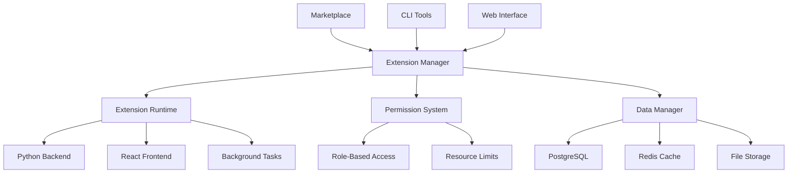

# Kari Extension System Documentation

Welcome to the comprehensive documentation for the Kari Extension System. This documentation covers everything you need to know about developing, deploying, and managing extensions in the Kari platform.

## Quick Navigation

### 📚 Core Documentation

- **[Development Guide](development-guide.md)** - Complete guide to building extensions
- **[API Reference](api-reference.md)** - Detailed API documentation and examples
- **[Security Guide](security-guide.md)** - Security best practices and guidelines
- **[Marketplace Guide](marketplace-guide.md)** - Using and publishing in the marketplace

### 🔧 Support Resources

- **[Troubleshooting Guide](troubleshooting-guide.md)** - Diagnose and fix common issues
- **[FAQ](faq.md)** - Frequently asked questions and answers

## What are Kari Extensions?

Kari Extensions are powerful, modular add-ons that extend the functionality of the Kari platform. They provide:

- **Isolated Execution**: Each extension runs in its own secure environment
- **Rich APIs**: Comprehensive APIs for data, UI, and system integration
- **UI Integration**: Full React component and page support
- **Background Processing**: Scheduled tasks and event handling
- **Secure Storage**: Isolated data storage with encryption
- **Marketplace Distribution**: Easy discovery and installation

## Getting Started

### For Users

1. **Browse Extensions**: Visit the marketplace to discover available extensions
2. **Install Extensions**: Use the web interface or CLI to install extensions
3. **Configure Settings**: Customize extension behavior through settings
4. **Monitor Performance**: Track extension usage and performance

**Quick Start:**
```bash
# List available extensions
kari extension search

# Install an extension
kari extension install task-manager

# Check status
kari extension status task-manager
```

### For Developers

1. **Read the Development Guide**: Understand the extension architecture
2. **Set Up Development Environment**: Install required tools and dependencies
3. **Create Your First Extension**: Use the scaffolding tools
4. **Test and Deploy**: Validate your extension and publish to marketplace

**Quick Start:**
```bash
# Create new extension
kari extension create my-first-extension

# Develop with hot reload
kari extension dev ./my-first-extension --watch

# Test extension
kari extension test ./my-first-extension

# Package for distribution
kari extension package ./my-first-extension
```

## Architecture Overview

### Core Components



### Extension Lifecycle

1. **Discovery**: Extensions are discovered in directories or marketplace
2. **Installation**: Package download, validation, and extraction
3. **Loading**: Extension initialization and dependency resolution
4. **Runtime**: Active execution with monitoring and resource management
5. **Updates**: Version management and migration
6. **Unloading**: Graceful shutdown and cleanup

## Key Features

### 🔒 Security First

- **Sandboxed Execution**: Process isolation and resource limits
- **Permission System**: Granular access controls
- **Code Signing**: Cryptographic verification of extension integrity
- **Audit Logging**: Comprehensive security event tracking
- **Vulnerability Scanning**: Automated security analysis

### 🚀 Developer Experience

- **Modern APIs**: RESTful APIs with async/await support
- **Rich Tooling**: CLI tools for development, testing, and deployment
- **Hot Reload**: Real-time development with automatic reloading
- **Comprehensive Testing**: Unit, integration, and security testing
- **Documentation**: Auto-generated API docs and examples

### 🎨 UI Integration

- **React Components**: Full React component library support
- **Custom Pages**: Create complete application pages
- **Theme Integration**: Automatic theme and styling support
- **Responsive Design**: Mobile-first responsive components
- **Accessibility**: Built-in accessibility features

### 📊 Data Management

- **Isolated Storage**: Tenant-specific data isolation
- **Multiple Backends**: PostgreSQL, Redis, and file storage
- **Query Builder**: Powerful query interface with filtering
- **Migrations**: Automatic schema migration support
- **Backup/Restore**: Integrated backup and recovery

### ⚡ Performance

- **Lazy Loading**: Extensions load only when needed
- **Caching**: Multi-level caching for optimal performance
- **Resource Monitoring**: Real-time performance tracking
- **Optimization**: Automatic performance optimization
- **Scaling**: Horizontal scaling support

## Extension Categories

### 🔧 System Extensions
- Authentication providers
- Database connectors
- Monitoring and alerting
- Backup and recovery

### 🤝 Integration Extensions
- Third-party service connectors (Slack, GitHub, etc.)
- API gateways and proxies
- Data synchronization
- Webhook handlers

### 📈 Analytics Extensions
- Custom dashboards
- Reporting tools
- Data visualization
- Business intelligence

### 🤖 AI/ML Extensions
- Machine learning models
- Natural language processing
- Computer vision
- Predictive analytics

### 🎯 Productivity Extensions
- Task management
- Calendar integration
- Note-taking
- Project management

## Best Practices

### Development

- **Follow Security Guidelines**: Implement proper input validation and authentication
- **Use Async/Await**: Make all I/O operations asynchronous
- **Handle Errors Gracefully**: Implement comprehensive error handling
- **Write Tests**: Maintain high test coverage
- **Document Everything**: Provide clear documentation and examples

### Deployment

- **Test Thoroughly**: Validate in staging environments
- **Monitor Performance**: Track resource usage and performance
- **Plan for Rollback**: Prepare rollback procedures
- **Update Regularly**: Keep dependencies and security patches current
- **Backup Data**: Implement regular backup procedures

### Security

- **Principle of Least Privilege**: Request minimal necessary permissions
- **Validate All Inputs**: Never trust user or external data
- **Encrypt Sensitive Data**: Use proper encryption for secrets
- **Audit Access**: Log security-relevant events
- **Stay Updated**: Monitor security advisories and updates

## Community and Support

### 🌟 Community Resources

- **Forums**: [community.kari.ai](https://community.kari.ai)
- **Discord**: [discord.gg/kari-ai](https://discord.gg/kari-ai)
- **GitHub**: [github.com/kari-ai/extensions](https://github.com/kari-ai/extensions)
- **Stack Overflow**: Tag `kari-extensions`

### 📞 Professional Support

- **Documentation**: Comprehensive guides and references
- **Email Support**: support@kari.ai
- **Live Chat**: Available in dashboard
- **Enterprise Support**: Dedicated support for enterprise customers

### 🎓 Learning Resources

- **Tutorials**: Step-by-step extension development tutorials
- **Examples**: Sample extensions and code snippets
- **Webinars**: Regular developer webinars and Q&A sessions
- **Certification**: Extension developer certification program

## Roadmap

### Current Version (1.0)
- ✅ Core extension system
- ✅ Security and isolation
- ✅ UI integration
- ✅ Marketplace
- ✅ Development tools

### Next Release (1.1)
- 🔄 AI-powered development assistance
- 🔄 Visual extension builder
- 🔄 Enhanced monitoring and analytics
- 🔄 Mobile extension support

### Future Releases
- 📋 Edge computing support
- 📋 Blockchain integration
- 📋 Advanced workflow automation
- 📋 Multi-tenant marketplace

## Contributing

We welcome contributions to the extension system:

### 🐛 Bug Reports
- Report issues on GitHub
- Include detailed reproduction steps
- Provide system information and logs

### 💡 Feature Requests
- Submit ideas through community forums
- Participate in feature discussions
- Vote on proposed features

### 🔧 Code Contributions
- Fork the repository
- Create feature branches
- Submit pull requests
- Follow coding standards

### 📖 Documentation
- Improve existing documentation
- Add examples and tutorials
- Translate documentation
- Review and edit content

## License and Legal

### Extension System License
The Kari Extension System is licensed under the MIT License, allowing for both commercial and non-commercial use.

### Extension Licensing
Individual extensions may have their own licenses. Always review extension licenses before installation or modification.

### Terms of Service
By using the extension system, you agree to the [Kari Terms of Service](https://kari.ai/terms) and [Privacy Policy](https://kari.ai/privacy).

### Marketplace Guidelines
Extensions published to the marketplace must comply with our [Marketplace Guidelines](https://marketplace.kari.ai/guidelines).

---

## Quick Links

| Resource | Description | Link |
|----------|-------------|------|
| Development Guide | Complete development documentation | [📖 Read Guide](development-guide.md) |
| API Reference | Detailed API documentation | [📚 View API Docs](api-reference.md) |
| Security Guide | Security best practices | [🔒 Security Guide](security-guide.md) |
| Marketplace | Browse and install extensions | [🏪 Visit Marketplace](https://marketplace.kari.ai) |
| Community Forum | Get help and share ideas | [💬 Join Discussion](https://community.kari.ai) |
| GitHub Repository | Source code and issues | [⚡ View Code](https://github.com/kari-ai/extensions) |

---

*This documentation is continuously updated. For the latest information, visit [docs.kari.ai/extensions](https://docs.kari.ai/extensions).*

**Last Updated**: December 2023  
**Version**: 1.0.0  
**Contributors**: Kari Development Team and Community