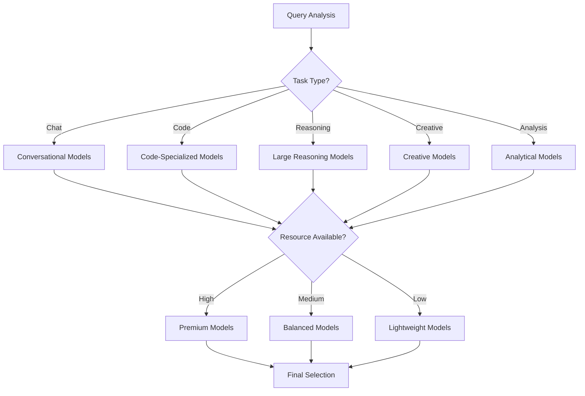

# Model Selection Best Practices

This guide provides comprehensive best practices for selecting and using models across different use cases, modalities, and scenarios in the Intelligent Response Optimization System.

## Table of Contents

1. [Overview](#overview)
2. [Model Selection Framework](#model-selection-framework)
3. [Use Case Specific Recommendations](#use-case-specific-recommendations)
4. [Modality-Based Selection](#modality-based-selection)
5. [Performance Considerations](#performance-considerations)
6. [Resource-Aware Selection](#resource-aware-selection)
7. [Quality vs Speed Trade-offs](#quality-vs-speed-trade-offs)
8. [Advanced Selection Strategies](#advanced-selection-strategies)

## Overview

Effective model selection is crucial for optimal system performance. The Intelligent Response Optimization System supports multiple model types and provides intelligent routing to help you choose the best model for each specific task.

### Key Selection Principles

1. **Task Alignment**: Match model capabilities to task requirements
2. **Resource Efficiency**: Balance performance with resource consumption
3. **Quality Requirements**: Consider accuracy vs speed trade-offs
4. **User Context**: Adapt selection based on user expertise and preferences
5. **System Load**: Adjust selection based on current system capacity

## Model Selection Framework

### Decision Matrix

Use this framework to evaluate model selection:

| Factor | Weight | Considerations |
|--------|--------|----------------|
| **Task Type** | 40% | Chat, code, reasoning, creative, analysis |
| **Response Time** | 25% | User expectations, real-time requirements |
| **Resource Usage** | 20% | CPU, memory, GPU availability |
| **Quality Requirements** | 10% | Accuracy, coherence, safety |
| **User Context** | 5% | Expertise level, preferences |

### Selection Process



## Use Case Specific Recommendations

### 1. Conversational Chat

#### Primary Recommendations
- **High Quality**: `llama-2-70b-chat`, `mixtral-8x7b-instruct`
- **Balanced**: `llama-2-13b-chat`, `mistral-7b-instruct`
- **Fast**: `llama-2-7b-chat`, `tinyllama-1.1b-chat`

#### Configuration Example
```json
{
  "use_case": "conversational_chat",
  "model_selection": {
    "primary": "llama-2-13b-chat",
    "fallback": "llama-2-7b-chat",
    "lightweight": "tinyllama-1.1b-chat"
  },
  "selection_criteria": {
    "response_time_target_ms": 2000,
    "quality_threshold": 0.8,
    "max_cpu_usage": 5.0
  }
}
```

#### Best Practices
- Use instruction-tuned models for better following of user requests
- Consider safety-aligned models for production environments
- Enable conversation context for multi-turn interactions
- Use smaller models for simple queries, larger for complex discussions

### 2. Code Generation and Programming

#### Primary Recommendations
- **High Quality**: `codellama-34b-instruct`, `deepseek-coder-33b`
- **Balanced**: `codellama-13b-instruct`, `starcoder-15b`
- **Fast**: `codellama-7b-instruct`, `deepseek-coder-6.7b`

#### Configuration Example
```json
{
  "use_case": "code_generation",
  "model_selection": {
    "primary": "codellama-13b-instruct",
    "fallback": "codellama-7b-instruct",
    "specialized": {
      "python": "deepseek-coder-6.7b",
      "javascript": "starcoder-15b",
      "general": "codellama-13b-instruct"
    }
  },
  "optimization": {
    "enable_syntax_highlighting": true,
    "code_formatting": true,
    "include_explanations": true
  }
}
```

#### Best Practices
- Use code-specialized models for programming tasks
- Consider language-specific models for better performance
- Enable code formatting and syntax highlighting
- Include code explanations for educational contexts
- Use larger models for complex algorithms, smaller for simple snippets

### 3. Reasoning and Problem Solving

#### Primary Recommendations
- **High Quality**: `llama-2-70b`, `mixtral-8x7b`, `gpt-4`
- **Balanced**: `llama-2-13b`, `mistral-7b`
- **Fast**: `llama-2-7b` with reasoning scaffolding

#### Configuration Example
```json
{
  "use_case": "reasoning",
  "model_selection": {
    "primary": "mixtral-8x7b",
    "fallback": "llama-2-13b",
    "scaffolding": "tinyllama-1.1b"
  },
  "reasoning_enhancement": {
    "enable_scaffolding": true,
    "step_by_step_thinking": true,
    "verification_steps": true
  }
}
```

#### Best Practices
- Use larger models for complex reasoning tasks
- Enable step-by-step thinking for better accuracy
- Combine with TinyLlama scaffolding for efficiency
- Allow longer processing time for quality reasoning
- Use chain-of-thought prompting techniques

### 4. Creative Writing

#### Primary Recommendations
- **High Quality**: `llama-2-70b`, `mixtral-8x7b-instruct`
- **Balanced**: `llama-2-13b`, `mistral-7b-instruct`
- **Fast**: `llama-2-7b`, `tinyllama-1.1b`

#### Configuration Example
```json
{
  "use_case": "creative_writing",
  "model_selection": {
    "primary": "llama-2-13b",
    "fallback": "llama-2-7b"
  },
  "creativity_settings": {
    "temperature": 0.8,
    "top_p": 0.9,
    "enable_diverse_outputs": true
  }
}
```

#### Best Practices
- Use models with higher temperature for creativity
- Allow longer responses for creative content
- Consider fine-tuned creative writing models
- Enable diverse output generation
- Balance creativity with coherence

### 5. Technical Analysis

#### Primary Recommendations
- **High Quality**: `llama-2-70b`, `mixtral-8x7b`
- **Specialized**: Domain-specific models (medical, legal, scientific)
- **Balanced**: `llama-2-13b`, `mistral-7b`

#### Configuration Example
```json
{
  "use_case": "technical_analysis",
  "model_selection": {
    "primary": "llama-2-13b",
    "specialized": {
      "medical": "biogpt-large",
      "legal": "legal-bert",
      "scientific": "scibert-scivocab"
    }
  },
  "analysis_settings": {
    "enable_citations": true,
    "fact_checking": true,
    "technical_accuracy": "high"
  }
}
```

## Modality-Based Selection

### Text-Only Tasks

#### Model Categories
- **General Purpose**: Llama-2, Mistral, GPT models
- **Specialized**: Domain-specific BERT variants
- **Lightweight**: TinyLlama, DistilBERT

#### Selection Criteria
```json
{
  "text_only_selection": {
    "factors": {
      "context_length": "required_context <= model_context",
      "language_support": "model_languages.includes(user_language)",
      "domain_expertise": "model_domain == task_domain"
    }
  }
}
```

### Vision Tasks

#### Model Categories
- **Vision-Language**: LLaVA, BLIP-2, Flamingo
- **Vision-Only**: CLIP, ResNet, Vision Transformer
- **Multimodal**: GPT-4V, Gemini Vision

#### Selection Example
```json
{
  "vision_task_selection": {
    "image_description": "llava-1.5-13b",
    "image_classification": "clip-vit-large",
    "visual_question_answering": "blip2-opt-6.7b",
    "multimodal_chat": "gpt-4-vision"
  }
}
```

### Audio Tasks

#### Model Categories
- **Speech Recognition**: Whisper variants
- **Audio Classification**: Wav2Vec2, Audio Spectrogram Transformer
- **Speech Synthesis**: Tacotron, WaveNet

#### Selection Example
```json
{
  "audio_task_selection": {
    "transcription": "whisper-large-v3",
    "translation": "whisper-large-v3",
    "audio_classification": "wav2vec2-large",
    "speaker_identification": "ecapa-tdnn"
  }
}
```

### Multimodal Tasks

#### Model Selection Strategy
```json
{
  "multimodal_selection": {
    "text_image": {
      "primary": "gpt-4-vision",
      "fallback": "llava-1.5-13b",
      "lightweight": "blip2-opt-2.7b"
    },
    "text_audio": {
      "primary": "whisper-large-v3",
      "fallback": "wav2vec2-base"
    },
    "all_modalities": {
      "primary": "flamingo-9b",
      "fallback": "multimodal-gpt-4"
    }
  }
}
```

## Performance Considerations

### Response Time Optimization

#### Fast Response Models (< 1 second)
- TinyLlama-1.1B variants
- DistilBERT models
- Quantized 7B models with GPU acceleration

#### Balanced Response Models (1-3 seconds)
- Llama-2-7B variants
- Mistral-7B variants
- CodeLlama-7B variants

#### High Quality Models (3-10 seconds)
- Llama-2-13B/70B variants
- Mixtral-8x7B variants
- Large specialized models

### Resource Usage Patterns

#### Memory Usage by Model Size
```json
{
  "memory_requirements": {
    "1B_models": "2-4 GB RAM",
    "7B_models": "8-16 GB RAM", 
    "13B_models": "16-32 GB RAM",
    "70B_models": "64-128 GB RAM"
  },
  "gpu_memory": {
    "1B_models": "1-2 GB VRAM",
    "7B_models": "4-8 GB VRAM",
    "13B_models": "8-16 GB VRAM",
    "70B_models": "32-80 GB VRAM"
  }
}
```

## Resource-Aware Selection

### Dynamic Model Selection

```python
# Example selection logic
def select_model_based_on_resources(task_type, available_resources):
    if available_resources.gpu_memory > 16:
        return get_high_quality_model(task_type)
    elif available_resources.gpu_memory > 8:
        return get_balanced_model(task_type)
    else:
        return get_lightweight_model(task_type)
```

### Load-Based Selection

```json
{
  "load_based_selection": {
    "low_load": {
      "cpu_threshold": 30,
      "memory_threshold": 50,
      "preferred_models": "high_quality"
    },
    "medium_load": {
      "cpu_threshold": 70,
      "memory_threshold": 80,
      "preferred_models": "balanced"
    },
    "high_load": {
      "cpu_threshold": 90,
      "memory_threshold": 95,
      "preferred_models": "lightweight"
    }
  }
}
```

## Quality vs Speed Trade-offs

### Trade-off Matrix

| Use Case | Speed Priority | Quality Priority | Balanced |
|----------|---------------|------------------|----------|
| **Chat** | TinyLlama-1.1B | Llama-2-70B | Llama-2-13B |
| **Code** | CodeLlama-7B | CodeLlama-34B | CodeLlama-13B |
| **Reasoning** | Llama-2-7B + Scaffolding | Mixtral-8x7B | Llama-2-13B |
| **Creative** | TinyLlama-1.1B | Llama-2-70B | Mistral-7B |
| **Analysis** | DistilBERT | Llama-2-70B | Llama-2-13B |

### Adaptive Quality Settings

```json
{
  "adaptive_quality": {
    "user_patience_high": {
      "max_response_time": 10000,
      "prefer_quality": true,
      "model_tier": "premium"
    },
    "user_patience_medium": {
      "max_response_time": 3000,
      "balance_quality_speed": true,
      "model_tier": "balanced"
    },
    "user_patience_low": {
      "max_response_time": 1000,
      "prefer_speed": true,
      "model_tier": "fast"
    }
  }
}
```

## Advanced Selection Strategies

### Ensemble Model Selection

```json
{
  "ensemble_strategy": {
    "reasoning_tasks": {
      "primary": "mixtral-8x7b",
      "validator": "llama-2-13b",
      "scaffolding": "tinyllama-1.1b"
    },
    "code_generation": {
      "generator": "codellama-13b",
      "reviewer": "deepseek-coder-6.7b",
      "formatter": "lightweight-formatter"
    }
  }
}
```

### Context-Aware Selection

```json
{
  "context_aware_selection": {
    "user_expertise": {
      "beginner": {
        "prefer_explanatory_models": true,
        "detailed_responses": true,
        "model_preference": "educational_focused"
      },
      "expert": {
        "prefer_concise_models": true,
        "technical_accuracy": "high",
        "model_preference": "precision_focused"
      }
    },
    "conversation_history": {
      "technical_discussion": "specialized_models",
      "casual_chat": "conversational_models",
      "problem_solving": "reasoning_models"
    }
  }
}
```

### A/B Testing for Model Selection

```json
{
  "ab_testing": {
    "enabled": true,
    "test_scenarios": [
      {
        "name": "chat_model_comparison",
        "models": ["llama-2-7b-chat", "mistral-7b-instruct"],
        "traffic_split": 0.5,
        "metrics": ["response_time", "user_satisfaction"]
      },
      {
        "name": "code_model_comparison", 
        "models": ["codellama-7b", "deepseek-coder-6.7b"],
        "traffic_split": 0.3,
        "metrics": ["code_quality", "response_time"]
      }
    ]
  }
}
```

### Predictive Model Selection

```json
{
  "predictive_selection": {
    "user_behavior_analysis": true,
    "query_pattern_recognition": true,
    "performance_prediction": true,
    "preload_likely_models": true,
    "cache_user_preferences": true
  }
}
```

## Implementation Guidelines

### Configuration Management

```python
# Example model selection configuration
class ModelSelectionConfig:
    def __init__(self):
        self.selection_rules = {
            "chat": self.get_chat_models(),
            "code": self.get_code_models(),
            "reasoning": self.get_reasoning_models()
        }
    
    def select_model(self, task_type, context):
        rules = self.selection_rules[task_type]
        return self.apply_selection_logic(rules, context)
```

### Monitoring and Optimization

```json
{
  "selection_monitoring": {
    "track_selection_accuracy": true,
    "measure_user_satisfaction": true,
    "monitor_resource_efficiency": true,
    "optimize_selection_rules": true,
    "generate_selection_reports": true
  }
}
```

### Best Practices Summary

1. **Start Simple**: Begin with balanced models and optimize based on metrics
2. **Monitor Performance**: Track response times, resource usage, and user satisfaction
3. **Test Thoroughly**: A/B test different model selections for your use cases
4. **Consider Context**: Adapt selection based on user expertise and conversation history
5. **Plan for Scale**: Design selection logic that works under varying system loads
6. **Regular Review**: Periodically review and update selection criteria based on new models and performance data

This guide provides a comprehensive framework for making informed model selection decisions. Adapt these recommendations based on your specific requirements, user base, and system constraints.