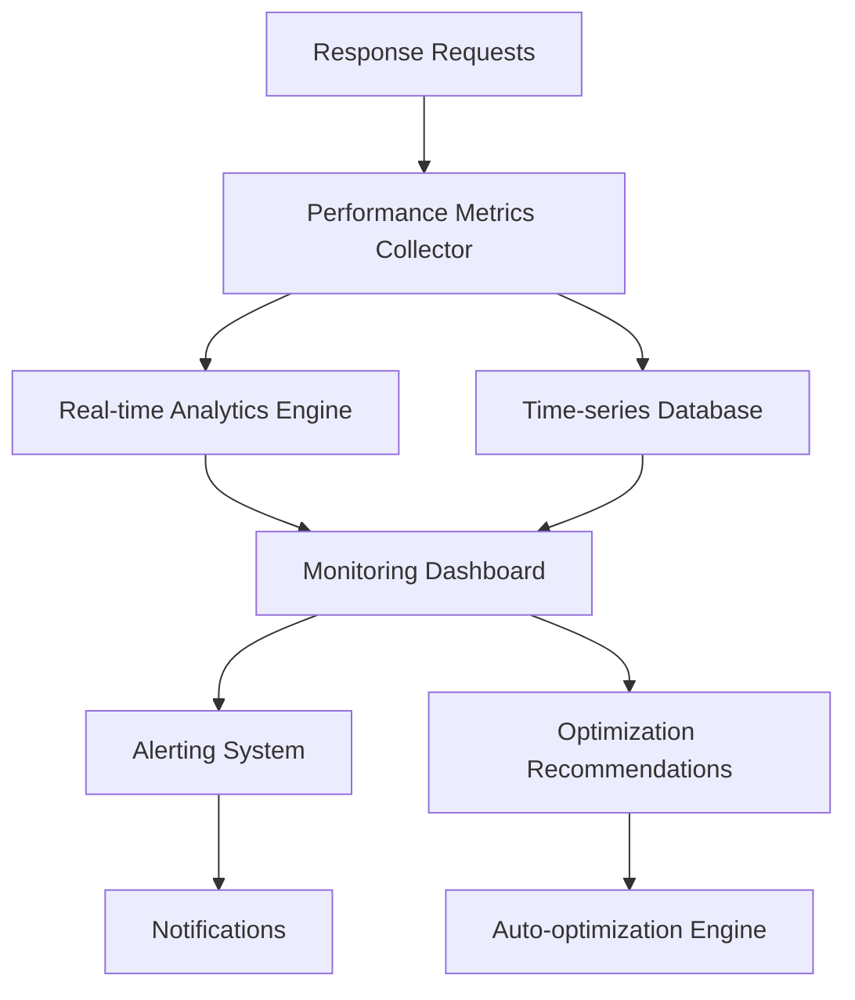

# Performance Monitoring and Optimization Guide

This guide provides comprehensive instructions for system operators to monitor, analyze, and optimize the performance of the Intelligent Response Optimization System.

## Table of Contents

1. [Overview](#overview)
2. [Key Performance Indicators](#key-performance-indicators)
3. [Monitoring Dashboard](#monitoring-dashboard)
4. [Performance Metrics Collection](#performance-metrics-collection)
5. [Real-time Monitoring](#real-time-monitoring)
6. [Performance Analysis](#performance-analysis)
7. [Optimization Strategies](#optimization-strategies)
8. [Alerting and Notifications](#alerting-and-notifications)
9. [Capacity Planning](#capacity-planning)
10. [Troubleshooting Performance Issues](#troubleshooting-performance-issues)

## Overview

The Intelligent Response Optimization System provides comprehensive performance monitoring capabilities to help operators maintain optimal system performance, identify bottlenecks, and make data-driven optimization decisions.

### Monitoring Architecture



## Key Performance Indicators

### Primary KPIs

#### Response Performance
- **Response Time**: Target < 2000ms (60% improvement from baseline)
- **CPU Usage**: Target < 5% per response
- **Memory Usage**: Efficient allocation and cleanup
- **GPU Utilization**: Optimal CUDA acceleration usage
- **Cache Hit Rate**: Target > 70%

#### System Health
- **Throughput**: Requests processed per second
- **Error Rate**: Target < 1%
- **Availability**: Target > 99.9%
- **Resource Utilization**: CPU, memory, GPU, disk usage
- **Model Performance**: Individual model response times and accuracy

#### User Experience
- **User Satisfaction Score**: Based on feedback and usage patterns
- **Progressive Delivery Efficiency**: Time to first meaningful content
- **Content Quality Score**: Relevance and usefulness metrics
- **Streaming Performance**: Continuity and coherence of streamed responses

### KPI Configuration

```json
{
  "performance_targets": {
    "response_time_ms": {
      "target": 2000,
      "warning_threshold": 3000,
      "critical_threshold": 5000
    },
    "cpu_usage_percent": {
      "target": 5.0,
      "warning_threshold": 7.0,
      "critical_threshold": 10.0
    },
    "cache_hit_rate": {
      "target": 0.70,
      "warning_threshold": 0.50,
      "critical_threshold": 0.30
    },
    "error_rate": {
      "target": 0.01,
      "warning_threshold": 0.05,
      "critical_threshold": 0.10
    }
  }
}
```

## Monitoring Dashboard

### Dashboard Components

#### 1. System Overview Panel
```json
{
  "system_overview": {
    "widgets": [
      {
        "type": "metric_card",
        "title": "Average Response Time",
        "metric": "response_time_avg",
        "format": "milliseconds",
        "target": 2000
      },
      {
        "type": "metric_card", 
        "title": "CPU Usage",
        "metric": "cpu_usage_avg",
        "format": "percentage",
        "target": 5.0
      },
      {
        "type": "metric_card",
        "title": "Cache Hit Rate",
        "metric": "cache_hit_rate",
        "format": "percentage",
        "target": 70.0
      },
      {
        "type": "status_indicator",
        "title": "System Health",
        "metric": "system_health_status"
      }
    ]
  }
}
```

#### 2. Response Performance Charts
```json
{
  "response_performance": {
    "charts": [
      {
        "type": "time_series",
        "title": "Response Time Trend",
        "metrics": ["response_time_p50", "response_time_p95", "response_time_p99"],
        "time_range": "24h"
      },
      {
        "type": "histogram",
        "title": "Response Time Distribution",
        "metric": "response_time_distribution",
        "buckets": [0, 500, 1000, 2000, 5000, 10000]
      }
    ]
  }
}
```

#### 3. Resource Utilization
```json
{
  "resource_utilization": {
    "charts": [
      {
        "type": "multi_line",
        "title": "CPU and Memory Usage",
        "metrics": ["cpu_usage", "memory_usage"],
        "time_range": "1h"
      },
      {
        "type": "gauge",
        "title": "GPU Utilization",
        "metric": "gpu_utilization",
        "max_value": 100
      }
    ]
  }
}
```

### Dashboard Access

```bash
# Access monitoring dashboard
http://localhost:8000/dashboard/optimization

# API endpoints for dashboard data
curl -X GET http://localhost:8000/api/monitoring/dashboard/overview
curl -X GET http://localhost:8000/api/monitoring/dashboard/performance
curl -X GET http://localhost:8000/api/monitoring/dashboard/resources
```

## Performance Metrics Collection

### Metrics Categories

#### 1. Response Metrics
```python
class ResponseMetrics:
    response_time: float
    cpu_usage: float
    memory_usage: int
    gpu_usage: Optional[float]
    cache_hit: bool
    model_used: str
    content_length: int
    optimization_applied: List[str]
    user_satisfaction: Optional[float]
```

#### 2. System Metrics
```python
class SystemMetrics:
    timestamp: datetime
    cpu_utilization: float
    memory_utilization: float
    gpu_utilization: Optional[float]
    disk_usage: float
    network_io: Dict[str, float]
    active_connections: int
    queue_length: int
```

#### 3. Model Performance Metrics
```python
class ModelMetrics:
    model_id: str
    response_time: float
    accuracy_score: Optional[float]
    resource_usage: ResourceUsage
    usage_count: int
    error_rate: float
    user_preference_score: float
```

### Metrics Collection Configuration

```json
{
  "metrics_collection": {
    "enabled": true,
    "collection_interval_seconds": 10,
    "retention_days": 30,
    "aggregation_intervals": ["1m", "5m", "1h", "1d"],
    "storage": {
      "backend": "prometheus",
      "endpoint": "http://prometheus:9090"
    },
    "custom_metrics": {
      "business_metrics": true,
      "user_journey_metrics": true,
      "model_performance_metrics": true
    }
  }
}
```

### Metrics API Endpoints

```bash
# Get current metrics
curl -X GET http://localhost:8000/api/metrics/current

# Get historical metrics
curl -X GET http://localhost:8000/api/metrics/historical?start=2024-01-01&end=2024-01-02

# Get model-specific metrics
curl -X GET http://localhost:8000/api/metrics/models/{model_id}

# Get aggregated metrics
curl -X GET http://localhost:8000/api/metrics/aggregated?interval=1h&metric=response_time
```

## Real-time Monitoring

### Live Monitoring Setup

#### 1. WebSocket Monitoring
```javascript
// Real-time metrics streaming
const ws = new WebSocket('ws://localhost:8000/ws/metrics');

ws.onmessage = function(event) {
    const metrics = JSON.parse(event.data);
    updateDashboard(metrics);
};
```

#### 2. Server-Sent Events
```bash
# Stream real-time metrics
curl -N http://localhost:8000/api/metrics/stream
```

#### 3. Monitoring Commands
```bash
# Real-time system status
watch -n 1 'curl -s http://localhost:8000/api/system/status | jq .'

# Real-time performance metrics
watch -n 5 'curl -s http://localhost:8000/api/metrics/performance | jq .'

# Real-time resource usage
watch -n 2 'curl -s http://localhost:8000/api/system/resources | jq .'
```

### Live Alerting

```json
{
  "live_alerting": {
    "enabled": true,
    "alert_rules": [
      {
        "name": "high_response_time",
        "condition": "response_time_avg > 3000",
        "duration": "2m",
        "severity": "warning"
      },
      {
        "name": "cpu_usage_high",
        "condition": "cpu_usage > 8.0",
        "duration": "1m", 
        "severity": "critical"
      },
      {
        "name": "cache_hit_rate_low",
        "condition": "cache_hit_rate < 0.5",
        "duration": "5m",
        "severity": "warning"
      }
    ]
  }
}
```

## Performance Analysis

### Analysis Tools

#### 1. Performance Profiler
```bash
# Profile response generation
curl -X POST http://localhost:8000/api/analysis/profile \
  -d '{"query": "test query", "enable_profiling": true}'

# Get profiling results
curl -X GET http://localhost:8000/api/analysis/profile/results/{session_id}
```

#### 2. Bottleneck Analysis
```bash
# Identify bottlenecks
curl -X GET http://localhost:8000/api/analysis/bottlenecks

# Analyze specific time period
curl -X GET http://localhost:8000/api/analysis/bottlenecks?start=2024-01-01T00:00:00&end=2024-01-01T23:59:59
```

#### 3. Performance Comparison
```bash
# Compare model performance
curl -X GET http://localhost:8000/api/analysis/compare/models

# Compare optimization strategies
curl -X GET http://localhost:8000/api/analysis/compare/optimizations
```

### Analysis Reports

#### Daily Performance Report
```json
{
  "daily_report": {
    "date": "2024-01-01",
    "summary": {
      "total_requests": 10000,
      "avg_response_time": 1850,
      "cpu_usage_avg": 4.2,
      "cache_hit_rate": 0.75,
      "error_rate": 0.008
    },
    "trends": {
      "response_time": "improving",
      "cpu_usage": "stable",
      "cache_performance": "improving"
    },
    "recommendations": [
      "Consider increasing cache size",
      "Monitor GPU utilization trends",
      "Review model selection for peak hours"
    ]
  }
}
```

#### Weekly Performance Analysis
```bash
# Generate weekly report
curl -X POST http://localhost:8000/api/analysis/reports/weekly

# Get report
curl -X GET http://localhost:8000/api/analysis/reports/weekly/latest
```

## Optimization Strategies

### Automated Optimization

#### 1. Performance-Based Optimization
```json
{
  "auto_optimization": {
    "enabled": true,
    "optimization_rules": [
      {
        "name": "high_load_optimization",
        "trigger": "cpu_usage > 7.0 for 5m",
        "actions": [
          "enable_aggressive_caching",
          "switch_to_lightweight_models",
          "increase_batch_size"
        ]
      },
      {
        "name": "low_cache_hit_optimization",
        "trigger": "cache_hit_rate < 0.6 for 10m",
        "actions": [
          "adjust_cache_similarity_threshold",
          "enable_cache_warming",
          "increase_cache_size"
        ]
      }
    ]
  }
}
```

#### 2. Model Selection Optimization
```json
{
  "model_optimization": {
    "dynamic_selection": true,
    "performance_based_routing": true,
    "load_balancing": true,
    "optimization_criteria": {
      "response_time_weight": 0.4,
      "resource_usage_weight": 0.3,
      "accuracy_weight": 0.3
    }
  }
}
```

### Manual Optimization

#### Performance Tuning Commands
```bash
# Optimize cache settings
curl -X PUT http://localhost:8000/api/optimization/cache/tune \
  -d '{"target_hit_rate": 0.8, "max_memory_mb": 2048}'

# Optimize resource allocation
curl -X PUT http://localhost:8000/api/optimization/resources/tune \
  -d '{"cpu_limit": 4.0, "memory_limit_mb": 4096}'

# Optimize model selection
curl -X PUT http://localhost:8000/api/optimization/models/tune \
  -d '{"prefer_speed": true, "quality_threshold": 0.8}'
```

## Alerting and Notifications

### Alert Configuration

```json
{
  "alerting": {
    "enabled": true,
    "channels": [
      {
        "name": "email",
        "type": "email",
        "config": {
          "smtp_server": "smtp.company.com",
          "recipients": ["ops@company.com"]
        }
      },
      {
        "name": "slack",
        "type": "slack",
        "config": {
          "webhook_url": "https://hooks.slack.com/...",
          "channel": "#ops-alerts"
        }
      }
    ],
    "alert_rules": [
      {
        "name": "performance_degradation",
        "condition": "response_time_p95 > 5000",
        "duration": "3m",
        "severity": "critical",
        "channels": ["email", "slack"]
      },
      {
        "name": "resource_exhaustion",
        "condition": "memory_usage > 90",
        "duration": "1m",
        "severity": "critical",
        "channels": ["email", "slack"]
      }
    ]
  }
}
```

### Alert Management

```bash
# List active alerts
curl -X GET http://localhost:8000/api/alerts/active

# Acknowledge alert
curl -X POST http://localhost:8000/api/alerts/{alert_id}/acknowledge

# Silence alert
curl -X POST http://localhost:8000/api/alerts/{alert_id}/silence \
  -d '{"duration_minutes": 60}'

# Get alert history
curl -X GET http://localhost:8000/api/alerts/history
```

## Capacity Planning

### Capacity Metrics

```json
{
  "capacity_planning": {
    "current_capacity": {
      "max_concurrent_requests": 50,
      "avg_requests_per_second": 10,
      "peak_requests_per_second": 25,
      "resource_utilization": {
        "cpu": 0.4,
        "memory": 0.6,
        "gpu": 0.3
      }
    },
    "growth_projections": {
      "30_days": {
        "expected_growth": 0.2,
        "capacity_needed": 60
      },
      "90_days": {
        "expected_growth": 0.5,
        "capacity_needed": 75
      }
    }
  }
}
```

### Capacity Analysis

```bash
# Get capacity analysis
curl -X GET http://localhost:8000/api/analysis/capacity

# Get growth projections
curl -X GET http://localhost:8000/api/analysis/capacity/projections

# Get scaling recommendations
curl -X GET http://localhost:8000/api/analysis/capacity/recommendations
```

## Troubleshooting Performance Issues

### Performance Issue Categories

#### 1. High Response Times
```bash
# Analyze response time issues
curl -X GET http://localhost:8000/api/analysis/performance/response-time

# Check model performance
curl -X GET http://localhost:8000/api/analysis/performance/models

# Check optimization effectiveness
curl -X GET http://localhost:8000/api/analysis/performance/optimizations
```

#### 2. Resource Usage Issues
```bash
# Analyze CPU usage patterns
curl -X GET http://localhost:8000/api/analysis/performance/cpu

# Analyze memory usage patterns
curl -X GET http://localhost:8000/api/analysis/performance/memory

# Analyze GPU utilization
curl -X GET http://localhost:8000/api/analysis/performance/gpu
```

#### 3. Cache Performance Issues
```bash
# Analyze cache performance
curl -X GET http://localhost:8000/api/analysis/performance/cache

# Check cache hit patterns
curl -X GET http://localhost:8000/api/analysis/cache/hit-patterns

# Analyze cache efficiency
curl -X GET http://localhost:8000/api/analysis/cache/efficiency
```

### Performance Optimization Workflow

1. **Identify Issue**: Use monitoring dashboard to identify performance problems
2. **Analyze Root Cause**: Use analysis tools to understand the underlying cause
3. **Apply Optimization**: Implement targeted optimization strategies
4. **Monitor Results**: Track the impact of optimization changes
5. **Iterate**: Continuously refine based on results

### Best Practices

#### Monitoring Best Practices
- Set up comprehensive alerting for critical metrics
- Monitor trends, not just current values
- Use multiple time ranges for analysis (1h, 1d, 1w, 1m)
- Correlate performance metrics with business metrics
- Regular review of monitoring configuration

#### Optimization Best Practices
- Make incremental changes and measure impact
- Test optimizations in staging before production
- Document all optimization changes
- Monitor for unintended side effects
- Regular performance reviews and tuning

#### Capacity Planning Best Practices
- Plan for peak usage scenarios
- Consider seasonal variations in usage
- Monitor growth trends regularly
- Plan capacity upgrades in advance
- Test system behavior under load

This performance monitoring guide provides comprehensive tools and strategies for maintaining optimal system performance. Regular monitoring, analysis, and optimization will ensure the Intelligent Response Optimization System continues to meet performance targets and user expectations.