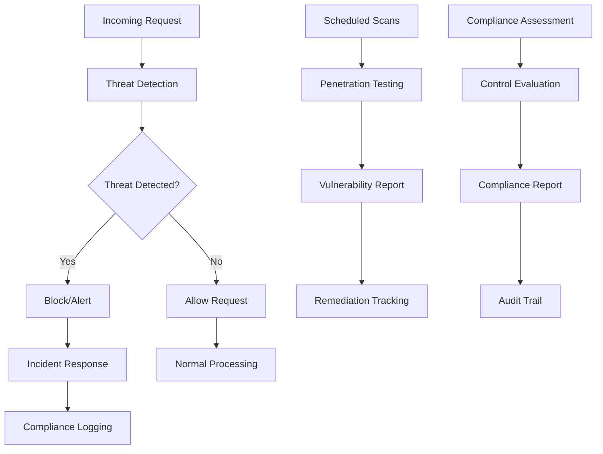
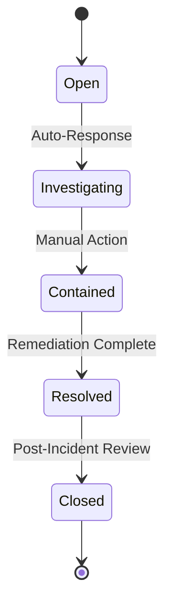

# AI Karen Security Framework Documentation

## Overview

The AI Karen Security Framework provides comprehensive security testing, threat protection, incident response, and compliance monitoring capabilities for production SaaS deployments. This framework implements enterprise-grade security controls to protect against common attack vectors and ensure regulatory compliance.

## Architecture

### Core Components

1. **Penetration Testing Suite** - Automated vulnerability scanning and testing
2. **Threat Protection System** - Real-time threat detection and response
3. **Incident Response Manager** - Automated incident handling and escalation
4. **Compliance Reporter** - SOC2, GDPR, and other regulatory compliance monitoring

### Security Flow



## Penetration Testing

### Automated Testing Capabilities

The penetration testing suite provides automated testing for:

- **SQL Injection** - Tests for SQL injection vulnerabilities in all input parameters
- **Cross-Site Scripting (XSS)** - Detects reflected and stored XSS vulnerabilities
- **Authentication Bypass** - Tests for authentication and authorization flaws
- **Session Management** - Validates session security controls
- **API Security** - Tests REST API endpoints for security issues
- **Input Validation** - Checks for improper input handling

### Usage

```python
from ai_karen_engine.security.penetration_testing import PenetrationTestSuite

# Initialize test suite
pen_test = PenetrationTestSuite("https://your-api.com")

# Define endpoints to test
endpoints = [
    "/api/v1/users",
    "/api/v1/auth/login",
    "/api/v1/data"
]

# Run comprehensive test
result = await pen_test.run_comprehensive_test(endpoints)

# Generate executive summary
summary = pen_test.generate_executive_summary(result)
print(summary)
```

### Running Tests via CLI

```bash
# Run comprehensive security testing
python scripts/security_testing.py --base-url https://your-api.com

# Skip specific test types
python scripts/security_testing.py --skip-pentest --skip-compliance

# Use custom endpoints file
python scripts/security_testing.py --endpoints-file config/endpoints.json

# Save report to specific file
python scripts/security_testing.py --output security_report_2024.json
```

## Threat Protection

### Real-Time Threat Detection

The threat protection system monitors incoming requests for:

- **Malicious Patterns** - SQL injection, XSS, command injection attempts
- **Suspicious Behavior** - Unusual request patterns, rate limit abuse
- **IP Reputation** - Known malicious IP addresses and ranges
- **User Agent Analysis** - Security tools and automated scanners
- **Behavioral Anomalies** - Deviations from normal user behavior

### Configuration

```yaml
# config/security_config.yml
threat_detection:
  enabled: true
  rate_limits:
    requests_per_minute: 100
    failed_logins_per_hour: 10
  ip_blocking:
    auto_block_enabled: true
    block_duration_hours: 24
```

### Integration with FastAPI

```python
from ai_karen_engine.security.threat_protection import ThreatProtectionSystem

# Initialize threat protection
threat_system = ThreatProtectionSystem(redis_client, database_session)

# Add middleware to FastAPI app
app.middleware("http")(threat_system.middleware_handler)
```

### Threat Response Actions

When threats are detected, the system can automatically:

- **Block IP addresses** - Temporarily or permanently block malicious IPs
- **Rate limit requests** - Throttle suspicious traffic
- **Alert administrators** - Send notifications via email, Slack, PagerDuty
- **Log security events** - Create detailed audit trails
- **Quarantine users** - Disable compromised user accounts

## Incident Response

### Automated Incident Detection

The incident response system automatically detects security incidents based on:

- **Threat event correlation** - Multiple related threats from same source
- **Attack pattern recognition** - Coordinated attacks across endpoints
- **Severity thresholds** - Critical threats trigger immediate response
- **Time-based analysis** - Attacks within specific time windows

### Response Playbooks

Pre-defined response playbooks for common incident types:

#### SQL Injection Response
1. Block attacking IP address
2. Alert security team
3. Backup affected databases
4. Escalate to management
5. Generate incident report

#### Data Breach Response
1. Contain the breach
2. Assess data exposure
3. Notify legal team
4. Prepare regulatory notifications
5. Coordinate customer communications

### Incident Lifecycle



### Usage Example

```python
from ai_karen_engine.security.incident_response import SecurityIncidentManager

# Initialize incident manager
incident_manager = SecurityIncidentManager(redis_client, database_session)

# Process threat events
await incident_manager.process_threat_events(threat_events)

# Get incident summary
summary = await incident_manager.get_incident_summary()
```

## Compliance Monitoring

### Supported Frameworks

- **SOC 2 Type II** - Security, Availability, Confidentiality controls
- **GDPR** - Data protection and privacy requirements
- **HIPAA** - Healthcare data protection (optional)
- **PCI DSS** - Payment card industry standards (optional)
- **ISO 27001** - Information security management (planned)

### SOC 2 Controls

The framework monitors key SOC 2 controls:

- **CC6.1** - Logical and Physical Access Controls
- **CC6.2** - Access Control Management
- **CC6.3** - Access Credentials Management
- **CC6.7** - Data Transmission Controls
- **CC6.8** - System Monitoring
- **A1.1** - Availability Performance Monitoring
- **A1.2** - System Backup and Recovery
- **C1.1** - Confidentiality Agreements
- **C1.2** - Data Classification

### GDPR Requirements

Automated monitoring for GDPR compliance:

- **Article 6** - Lawfulness of Processing
- **Article 7** - Conditions for Consent
- **Article 17** - Right to Erasure
- **Article 20** - Right to Data Portability
- **Article 25** - Data Protection by Design
- **Article 32** - Security of Processing
- **Article 33** - Breach Notification (72-hour requirement)

### Compliance Assessment

```python
from ai_karen_engine.security.compliance import ComplianceReporter

# Initialize compliance reporter
compliance = ComplianceReporter(redis_client, database_session)

# Generate comprehensive report
reports = await compliance.generate_comprehensive_report()

# Get dashboard data
dashboard = await compliance.get_compliance_dashboard_data()
```

### Automated Evidence Collection

The system automatically collects evidence for compliance:

- **Access logs** - User authentication and authorization events
- **System monitoring** - Performance and availability metrics
- **Security events** - Threat detection and incident response
- **Data processing** - GDPR processing activities and consent records
- **Backup verification** - Backup completion and integrity checks

## Security Configuration

### Configuration File Structure

```yaml
# config/security_config.yml
threat_detection:
  enabled: true
  rate_limits: {...}
  
incident_response:
  auto_response: {...}
  notifications: {...}
  
compliance:
  frameworks: {...}
  evidence_collection: {...}
  
penetration_testing:
  automated_testing: {...}
  test_categories: {...}
```

### Environment Variables

```bash
# Security settings
SECURITY_ENABLED=true
THREAT_DETECTION_ENABLED=true
AUTO_BLOCK_IPS=true
COMPLIANCE_MONITORING=true

# Notification settings
SECURITY_EMAIL_ALERTS=security@company.com
SLACK_WEBHOOK_URL=https://hooks.slack.com/...
PAGERDUTY_INTEGRATION_KEY=your-key-here
```

## Monitoring and Alerting

### Security Metrics

The framework collects comprehensive security metrics:

- **Threat detection rates** - Threats detected per hour/day
- **Incident response times** - Time to detect, respond, resolve
- **Compliance scores** - Percentage of controls passing
- **Vulnerability trends** - New vulnerabilities over time
- **Attack patterns** - Most common attack types and sources

### Prometheus Integration

```python
# Metrics exported to Prometheus
security_threats_total = Counter('security_threats_total', 'Total security threats detected')
incident_response_duration = Histogram('incident_response_duration_seconds', 'Incident response time')
compliance_score = Gauge('compliance_score', 'Overall compliance score')
```

### Grafana Dashboard

Pre-built Grafana dashboard includes:

- **Security Overview** - High-level security status
- **Threat Detection** - Real-time threat monitoring
- **Incident Response** - Active incidents and response times
- **Compliance Status** - Compliance scores by framework
- **Vulnerability Trends** - Historical vulnerability data

## Testing

### Running Security Tests

```bash
# Run all security framework tests
pytest tests/test_security_framework.py -v

# Run specific test categories
pytest tests/test_security_framework.py::TestPenetrationTesting -v
pytest tests/test_security_framework.py::TestThreatProtection -v
pytest tests/test_security_framework.py::TestIncidentResponse -v
pytest tests/test_security_framework.py::TestCompliance -v

# Run with coverage
pytest tests/test_security_framework.py --cov=src/ai_karen_engine/security
```

### Test Coverage

The test suite covers:

- **Penetration testing** - All vulnerability detection methods
- **Threat protection** - Pattern matching and behavioral analysis
- **Incident response** - Detection, escalation, and response actions
- **Compliance** - Control assessment and reporting
- **Integration** - End-to-end security workflows

## Deployment

### Production Deployment

1. **Configure security settings** in `config/security_config.yml`
2. **Set environment variables** for sensitive configuration
3. **Initialize Redis and database** connections
4. **Add middleware** to FastAPI application
5. **Schedule automated testing** and compliance assessments
6. **Configure monitoring** and alerting systems

### Docker Configuration

```dockerfile
# Add security configuration
COPY config/security_config.yml /app/config/
COPY scripts/security_testing.py /app/scripts/

# Install security dependencies
RUN pip install aioredis aiohttp sqlalchemy

# Set security environment variables
ENV SECURITY_ENABLED=true
ENV THREAT_DETECTION_ENABLED=true
```

### Kubernetes Deployment

```yaml
apiVersion: apps/v1
kind: Deployment
metadata:
  name: ai-karen-security
spec:
  template:
    spec:
      containers:
      - name: ai-karen
        env:
        - name: SECURITY_ENABLED
          value: "true"
        - name: REDIS_URL
          valueFrom:
            secretKeyRef:
              name: ai-karen-secrets
              key: redis-url
        volumeMounts:
        - name: security-config
          mountPath: /app/config/security_config.yml
          subPath: security_config.yml
      volumes:
      - name: security-config
        configMap:
          name: security-config
```

## Best Practices

### Security Hardening

1. **Enable all security features** in production
2. **Configure appropriate thresholds** for your environment
3. **Regularly update threat patterns** and attack signatures
4. **Monitor security metrics** and adjust thresholds as needed
5. **Conduct regular penetration testing** and vulnerability assessments

### Incident Response

1. **Define clear escalation procedures** for different incident types
2. **Train staff** on incident response procedures
3. **Test incident response plans** regularly
4. **Maintain up-to-date contact information** for all stakeholders
5. **Document lessons learned** from each incident

### Compliance Management

1. **Regularly assess compliance controls** (quarterly for SOC 2, annually for GDPR)
2. **Maintain evidence collection** for all compliance requirements
3. **Address non-compliant controls** promptly
4. **Prepare for external audits** with comprehensive documentation
5. **Stay updated** on regulatory changes and requirements

## Troubleshooting

### Common Issues

#### High False Positive Rate
- Adjust threat detection thresholds in configuration
- Whitelist legitimate IP addresses and user agents
- Fine-tune behavioral analysis parameters

#### Performance Impact
- Optimize Redis configuration for high throughput
- Implement caching for threat intelligence data
- Use asynchronous processing for non-critical operations

#### Compliance Assessment Failures
- Verify database connectivity and permissions
- Check Redis configuration and data availability
- Review security configuration settings

### Debugging

Enable debug logging:

```python
import logging
logging.getLogger('ai_karen_engine.security').setLevel(logging.DEBUG)
```

Check security metrics:

```bash
# View threat statistics
curl http://localhost:8000/api/v1/security/threats/stats

# Check incident status
curl http://localhost:8000/api/v1/security/incidents/summary

# Get compliance dashboard
curl http://localhost:8000/api/v1/security/compliance/dashboard
```

## Support

For security-related issues or questions:

1. **Review this documentation** and configuration examples
2. **Check the test suite** for usage examples
3. **Enable debug logging** to troubleshoot issues
4. **Contact the security team** for urgent security matters
5. **Submit issues** on the project repository for bugs or feature requests

## Changelog

### Version 1.0.0
- Initial release with comprehensive security framework
- Penetration testing suite with automated vulnerability scanning
- Real-time threat protection and intrusion detection
- Automated incident response and escalation
- SOC 2 and GDPR compliance monitoring
- Comprehensive test suite and documentation