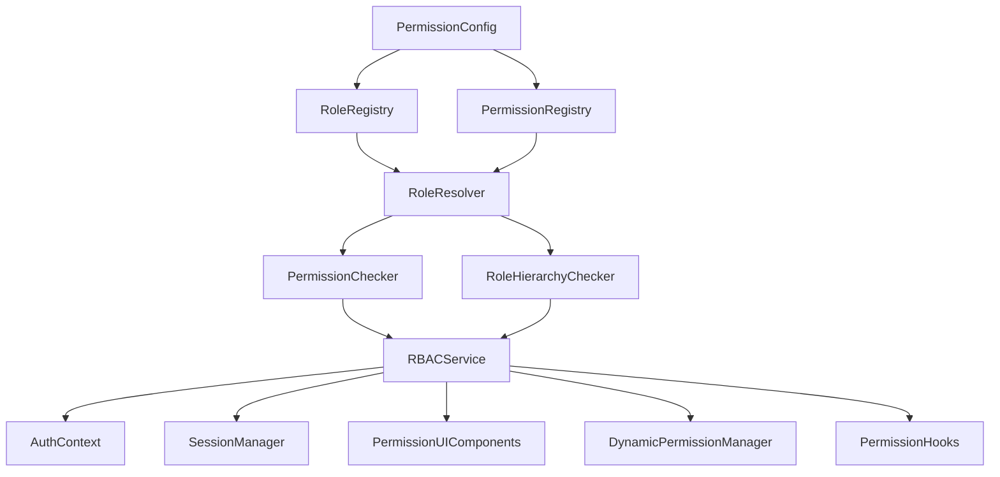

# Enhanced RBAC System Redesign Plan

## Problem Analysis

The current RBAC system has several critical issues:

1. **Circular Dependencies**: Multiple circular dependencies between functions and modules
2. **Multiple Role Definitions**: Duplicate role definitions in different parts of the code
3. **Inconsistent Initialization**: System tries to access roles before they are properly initialized
4. **Poor Error Handling**: When a role is undefined, the system crashes instead of gracefully handling it
5. **Complex Proxy Implementation**: The proxy-based approach adds unnecessary complexity
6. **Lack of Centralized Configuration**: Role and permission definitions are scattered
7. **Limited Extensibility**: Hard to add dynamic permissions or role-based UI elements
8. **Poor Code Organization**: Code is not well organized into logical modules
9. **Misalignment with Backend**: The frontend RBAC system doesn't align well with the Karen Python backend system
10. **Code Remnants**: Old, unused code and files that need cleanup

The error `Cannot read properties of undefined (reading 'user')` occurs in `resolveRolePermissions` function because the roles object is undefined when the function is called.

## Karen Python System Alignment

To ensure the new RBAC system aligns with the Karen Python backend, we need to:

1. **Map Python Roles to TypeScript**: Ensure the frontend roles match the backend roles
2. **Consistent Permission Names**: Use the same permission names as the backend
3. **API Integration**: Design the RBAC system to work seamlessly with the existing API
4. **Session Management**: Ensure session handling works with the Python authentication system
5. **Error Handling**: Handle API errors consistently with the backend's error format

### Python Backend Integration Points

```typescript
// Example integration points
interface PythonRoleMapping {
  frontendRole: UserRole;
  backendRole: string;
  description: string;
}

interface PythonPermissionMapping {
  frontendPermission: Permission;
  backendPermission: string;
  description: string;
}

// Mapping between frontend and backend
const PYTHON_ROLE_MAPPING: PythonRoleMapping[] = [
  { frontendRole: 'user', backendRole: 'user', description: 'Standard user' },
  { frontendRole: 'admin', backendRole: 'admin', description: 'Administrator' },
  { frontendRole: 'super_admin', backendRole: 'superuser', description: 'Super user' },
  // Add more mappings as needed
];

const PYTHON_PERMISSION_MAPPING: PythonPermissionMapping[] = [
  { frontendPermission: 'data:read', backendPermission: 'read_data', description: 'Read data' },
  { frontendPermission: 'data:write', backendPermission: 'write_data', description: 'Write data' },
  { frontendPermission: 'user:read', backendPermission: 'read_user', description: 'Read user data' },
  // Add more mappings as needed
];
```

## Enhanced Bulletproof RBAC Architecture



### Core Components:

1. **PermissionConfig**: A centralized configuration object that defines all permissions and roles
2. **RoleRegistry**: Manages role definitions with proper validation
3. **PermissionRegistry**: Manages permission definitions with validation
4. **RoleResolver**: Resolves role permissions with inheritance, with proper error handling
5. **PermissionChecker**: Checks if a role has a specific permission
6. **RoleHierarchyChecker**: Checks role hierarchy relationships
7. **RBACService**: A singleton service that provides a clean API for all RBAC operations
8. **DynamicPermissionManager**: Manages dynamic permissions that can be added at runtime
9. **PermissionUIComponents**: Reusable UI components for role-based rendering
10. **PermissionHooks**: React hooks for easy permission checking in components
11. **Error Handling**: Comprehensive error handling with fallbacks

## File Organization

```
src/lib/security/
├── rbac/
│   ├── types.ts                 # Type definitions
│   ├── config.ts                # Configuration constants
│   ├── errors.ts                # Custom error classes
│   ├── interfaces.ts            # Interface definitions
│   ├── registries/
│   │   ├── role-registry.ts     # Role management
│   │   └── permission-registry.ts # Permission management
│   ├── resolvers/
│   │   ├── role-resolver.ts     # Role permission resolution
│   │   └── permission-resolver.ts # Permission checking
│   ├── managers/
│   │   ├── rbac-service.ts      # Main RBAC service
│   │   └── dynamic-permissions.ts # Dynamic permission management
│   └── utils/
│       ├── permission-utils.ts  # Utility functions
│       └── validation-utils.ts  # Validation utilities
├── components/
│   ├── rbac/
│   │   ├── PermissionGate.tsx   # Component for permission-based rendering
│   │   ├── RoleGate.tsx         # Component for role-based rendering
│   │   └── SecureComponent.tsx  # Generic secure component wrapper
│   └── hooks/
│       ├── usePermissions.ts    # Hook for checking permissions
│       ├── useRoles.ts         # Hook for checking roles
│       └── useRBAC.ts          # Combined RBAC hook
└── contexts/
    └── RBACContext.tsx         # Context for RBAC state
```

## Implementation Plan

### 1. Type Definitions and Interfaces

Create comprehensive type definitions:

```typescript
// src/lib/security/rbac/types.ts
export type UserRole = 'guest' | 'readonly' | 'user' | 'analyst' | 'routing_auditor' | 'routing_operator' | 'support_agent' | 'data_steward' | 'model_manager' | 'content_manager' | 'trainer' | 'security_audit' | 'routing_admin' | 'data_admin' | 'model_admin' | 'security_admin' | 'system_admin' | 'admin' | 'super_admin';

export type Permission = string;
export type PermissionGroup = string;

export interface RoleDefinition {
  permissions: readonly Permission[];
  inherits_from: UserRole | null;
  description?: string;
  ui_visibility?: {
    [key: string]: boolean;
  };
  metadata?: Record<string, unknown>;
}

export interface PermissionDefinition {
  name: Permission;
  description: string;
  group: PermissionGroup;
  ui_component?: string;
  metadata?: Record<string, unknown>;
}

export interface PermissionConfig {
  permissions: PermissionDefinition[];
  roles: Record<UserRole, RoleDefinition>;
  groups: Record<PermissionGroup, string>;
}

export interface DynamicPermission {
  name: Permission;
  description: string;
  roles: UserRole[];
  expires_at?: Date;
  metadata?: Record<string, unknown>;
}
```

### 2. Configuration Constants

```typescript
// src/lib/security/rbac/config.ts
export const RBAC_CONFIG = {
  DEFAULT_ROLE: 'user' as UserRole,
  ADMIN_ROLES: ['admin', 'super_admin'] as UserRole[],
  PERMISSION_CACHE_TTL: 5 * 60 * 1000, // 5 minutes
  ENABLE_DYNAMIC_PERMISSIONS: true,
  ENABLE_UI_COMPONENTS: true,
  LOGGING_ENABLED: true,
};
```

### 3. Custom Error Classes

```typescript
// src/lib/security/rbac/errors.ts
export class RBACError extends Error {
  constructor(message: string, public code: string) {
    super(message);
    this.name = 'RBACError';
  }
}

export class RoleNotFoundError extends RBACError {
  constructor(role: string) {
    super(`Role not found: ${role}`, 'ROLE_NOT_FOUND');
    this.name = 'RoleNotFoundError';
  }
}

export class PermissionNotFoundError extends RBACError {
  constructor(permission: string) {
    super(`Permission not found: ${permission}`, 'PERMISSION_NOT_FOUND');
    this.name = 'PermissionNotFoundError';
  }
}

export class CircularInheritanceError extends RBACError {
  constructor(role: string) {
    super(`Circular inheritance detected for role: ${role}`, 'CIRCULAR_INHERITANCE');
    this.name = 'CircularInheritanceError';
  }
}
```

### 4. Role Registry Implementation

```typescript
// src/lib/security/rbac/registries/role-registry.ts
export class RoleRegistry {
  private static instance: RoleRegistry;
  private roles: Map<UserRole, RoleDefinition>;
  private config: PermissionConfig;
  
  private constructor() {
    this.roles = new Map();
    this.config = this.loadConfig();
    this.initializeRoles();
  }
  
  static getInstance(): RoleRegistry {
    if (!RoleRegistry.instance) {
      RoleRegistry.instance = new RoleRegistry();
    }
    return RoleRegistry.instance;
  }
  
  private loadConfig(): PermissionConfig {
    // Load from permissions.json or other config source
    // This could be enhanced to load from API or environment variables
    return {} as PermissionConfig;
  }
  
  private initializeRoles(): void {
    for (const [roleName, roleDef] of Object.entries(this.config.roles)) {
      this.roles.set(roleName as UserRole, roleDef);
    }
  }
  
  getRole(role: UserRole): RoleDefinition | undefined {
    return this.roles.get(role);
  }
  
  hasRole(role: UserRole): boolean {
    return this.roles.has(role);
  }
  
  getAllRoles(): UserRole[] {
    return Array.from(this.roles.keys());
  }
  
  addRole(role: UserRole, definition: RoleDefinition): void {
    this.roles.set(role, definition);
  }
  
  removeRole(role: UserRole): boolean {
    return this.roles.delete(role);
  }
  
  updateRole(role: UserRole, definition: Partial<RoleDefinition>): boolean {
    const existing = this.roles.get(role);
    if (!existing) return false;
    
    this.roles.set(role, { ...existing, ...definition });
    return true;
  }
}
```

### 5. Permission Registry Implementation

```typescript
// src/lib/security/rbac/registries/permission-registry.ts
export class PermissionRegistry {
  private static instance: PermissionRegistry;
  private permissions: Map<Permission, PermissionDefinition>;
  private groups: Map<PermissionGroup, Permission[]>;
  private config: PermissionConfig;
  
  private constructor() {
    this.permissions = new Map();
    this.groups = new Map();
    this.config = this.loadConfig();
    this.initializePermissions();
  }
  
  static getInstance(): PermissionRegistry {
    if (!PermissionRegistry.instance) {
      PermissionRegistry.instance = new PermissionRegistry();
    }
    return PermissionRegistry.instance;
  }
  
  private loadConfig(): PermissionConfig {
    // Load from permissions.json or other config source
    return {} as PermissionConfig;
  }
  
  private initializePermissions(): void {
    for (const permission of this.config.permissions) {
      this.permissions.set(permission.name, permission);
      
      if (!this.groups.has(permission.group)) {
        this.groups.set(permission.group, []);
      }
      this.groups.get(permission.group)?.push(permission.name);
    }
  }
  
  getPermission(permission: Permission): PermissionDefinition | undefined {
    return this.permissions.get(permission);
  }
  
  hasPermission(permission: Permission): boolean {
    return this.permissions.has(permission);
  }
  
  getAllPermissions(): Permission[] {
    return Array.from(this.permissions.keys());
  }
  
  getPermissionsByGroup(group: PermissionGroup): Permission[] {
    return this.groups.get(group) || [];
  }
  
  getAllGroups(): PermissionGroup[] {
    return Array.from(this.groups.keys());
  }
  
  addPermission(permission: PermissionDefinition): void {
    this.permissions.set(permission.name, permission);
    
    if (!this.groups.has(permission.group)) {
      this.groups.set(permission.group, []);
    }
    this.groups.get(permission.group)?.push(permission.name);
  }
  
  removePermission(permission: Permission): boolean {
    const permissionDef = this.permissions.get(permission);
    if (!permissionDef) return false;
    
    const group = permissionDef.group;
    const groupPermissions = this.groups.get(group);
    if (groupPermissions) {
      const index = groupPermissions.indexOf(permission);
      if (index > -1) {
        groupPermissions.splice(index, 1);
      }
    }
    
    return this.permissions.delete(permission);
  }
}
```

### 6. Role Resolver Implementation

```typescript
// src/lib/security/rbac/resolvers/role-resolver.ts
export class RoleResolver {
  private roleRegistry: RoleRegistry;
  private permissionRegistry: PermissionRegistry;
  private cache: Map<UserRole, Permission[]>;
  private cacheTimestamps: Map<UserRole, number>;
  
  constructor() {
    this.roleRegistry = RoleRegistry.getInstance();
    this.permissionRegistry = PermissionRegistry.getInstance();
    this.cache = new Map();
    this.cacheTimestamps = new Map();
  }
  
  resolveRolePermissions(role: UserRole, visited: Set<UserRole> = new Set()): Permission[] {
    // Check cache first
    if (this.isCacheValid(role)) {
      return this.cache.get(role) || [];
    }
    
    // Check for circular dependencies
    if (visited.has(role)) {
      throw new CircularInheritanceError(role);
    }
    
    const roleDef = this.roleRegistry.getRole(role);
    if (!roleDef) {
      throw new RoleNotFoundError(role);
    }
    
    const newVisited = new Set(visited).add(role);
    const inheritedPermissions = roleDef.inherits_from
      ? this.resolveRolePermissions(roleDef.inherits_from, newVisited)
      : [];
    
    const allPermissions = [...new Set([...inheritedPermissions, ...roleDef.permissions])];
    
    // Update cache
    this.cache.set(role, allPermissions);
    this.cacheTimestamps.set(role, Date.now());
    
    return allPermissions;
  }
  
  private isCacheValid(role: UserRole): boolean {
    if (!this.cache.has(role) || !this.cacheTimestamps.has(role)) {
      return false;
    }
    
    const timestamp = this.cacheTimestamps.get(role) || 0;
    return (Date.now() - timestamp) < RBAC_CONFIG.PERMISSION_CACHE_TTL;
  }
  
  invalidateCache(): void {
    this.cache.clear();
    this.cacheTimestamps.clear();
  }
  
  invalidateCacheForRole(role: UserRole): void {
    this.cache.delete(role);
    this.cacheTimestamps.delete(role);
  }
}
```

### 7. Permission Resolver Implementation

```typescript
// src/lib/security/rbac/resolvers/permission-resolver.ts
export class PermissionResolver {
  private roleResolver: RoleResolver;
  private permissionRegistry: PermissionRegistry;
  
  constructor() {
    this.roleResolver = new RoleResolver();
    this.permissionRegistry = PermissionRegistry.getInstance();
  }
  
  hasPermission(role: UserRole, permission: Permission): boolean {
    const canonicalPermission = this.normalizePermission(permission);
    if (!canonicalPermission) {
      return false;
    }
    
    // Check if permission exists in registry
    if (!this.permissionRegistry.hasPermission(canonicalPermission)) {
      return false;
    }
    
    const permissions = this.roleResolver.resolveRolePermissions(role);
    return permissions.includes(canonicalPermission);
  }
  
  hasAnyPermission(role: UserRole, permissions: Permission[]): boolean {
    return permissions.some(permission => this.hasPermission(role, permission));
  }
  
  hasAllPermissions(role: UserRole, permissions: Permission[]): boolean {
    return permissions.every(permission => this.hasPermission(role, permission));
  }
  
  private normalizePermission(permission: Permission): Permission | null {
    if (!permission) return null;
    const trimmed = permission.trim();
    if (!trimmed) return null;
    return trimmed;
  }
}
```

### 8. Role Hierarchy Checker Implementation

```typescript
// src/lib/security/rbac/resolvers/hierarchy-resolver.ts
export class HierarchyResolver {
  private roleHierarchy: Record<UserRole, number>;
  
  constructor() {
    this.roleHierarchy = {
      guest: 1,
      readonly: 2,
      user: 3,
      analyst: 4,
      routing_auditor: 5,
      routing_operator: 6,
      support_agent: 7,
      data_steward: 8,
      model_manager: 9,
      content_manager: 10,
      trainer: 11,
      security_audit: 12,
      routing_admin: 13,
      data_admin: 14,
      model_admin: 15,
      security_admin: 16,
      system_admin: 17,
      admin: 18,
      super_admin: 19,
    };
  }
  
  roleHierarchy(userRole: UserRole, requiredRole: UserRole): boolean {
    const userLevel = this.roleHierarchy[userRole] ?? 0;
    const requiredLevel = this.roleHierarchy[requiredRole] ?? 0;
    return userLevel >= requiredLevel;
  }
  
  canManageRole(managerRole: UserRole, targetRole: UserRole): boolean {
    if (managerRole === targetRole) {
      return false;
    }
    return this.roleHierarchy(managerRole) > this.roleHierarchy(targetRole);
  }
  
  getHighestRole(roles: UserRole[]): UserRole {
    if (!roles || roles.length === 0) return RBAC_CONFIG.DEFAULT_ROLE;
    
    let highestRole: UserRole = RBAC_CONFIG.DEFAULT_ROLE;
    let highestRank = this.roleHierarchy[highestRole];
    
    for (const role of roles) {
      if (!this.roleHierarchy[role]) continue;
      const rank = this.roleHierarchy[role];
      if (rank > highestRank) {
        highestRank = rank;
        highestRole = role;
      }
    }
    
    return highestRole;
  }
  
  getRolesAtOrAboveLevel(minLevel: number): UserRole[] {
    return Object.entries(this.roleHierarchy)
      .filter(([, level]) => level >= minLevel)
      .map(([role]) => role as UserRole);
  }
}
```

### 7. RBACService Singleton

```typescript
// src/lib/security/rbac-service.ts
export class RBACService {
  private static instance: RBACService;
  private roleRegistry: RoleRegistry;
  private permissionRegistry: PermissionRegistry;
  private roleResolver: RoleResolver;
  private permissionChecker: PermissionChecker;
  private roleHierarchyChecker: RoleHierarchyChecker;
  
  private constructor() {
    this.roleRegistry = RoleRegistry.getInstance();
    this.permissionRegistry = PermissionRegistry.getInstance();
    this.roleResolver = new RoleResolver();
    this.permissionChecker = new PermissionChecker();
    this.roleHierarchyChecker = new RoleHierarchyChecker();
  }
  
  static getInstance(): RBACService {
    if (!RBACService.instance) {
      RBACService.instance = new RBACService();
    }
    return RBACService.instance;
  }
  
  hasPermission(role: UserRole, permission: Permission): boolean {
    return this.permissionChecker.hasPermission(role, permission);
  }
  
  getRolePermissions(role: UserRole): Permission[] {
    return this.roleResolver.resolveRolePermissions(role);
  }
  
  roleHierarchy(userRole: UserRole, requiredRole: UserRole): boolean {
    return this.roleHierarchyChecker.roleHierarchy(userRole, requiredRole);
  }
  
  canManageRole(managerRole: UserRole, targetRole: UserRole): boolean {
    return this.roleHierarchyChecker.canManageRole(managerRole, targetRole);
  }
  
  getHighestRole(roles: UserRole[]): UserRole {
    return this.roleHierarchyChecker.getHighestRole(roles);
  }
  
  isValidRole(role: string): role is UserRole {
    return this.roleRegistry.hasRole(role as UserRole);
  }
}
```

### 8. Updated AuthContext

```typescript
// src/contexts/AuthContext.tsx
// Import the new RBACService
import { RBACService } from '@/lib/security/rbac-service';

// Inside AuthProvider component:
const rbacService = RBACService.getInstance();

// Update hasRole function:
const hasRole = useCallback(
  (role: UserRole): boolean => {
    if (!user) return false;
    const userRole = user.role || rbacService.getHighestRole(user.roles);
    return rbacService.roleHierarchy(userRole, role);
  },
  [user]
);

// Update hasPermission function:
const hasPermission = useCallback(
  (permission: string): boolean => {
    if (!user) return false;
    const userRole = user.role || rbacService.getHighestRole(user.roles);
    return rbacService.hasPermission(userRole, permission);
  },
  [user]
);
```

### 9. Updated Session Management

```typescript
// src/lib/auth/session.ts
// Import the new RBACService
import { RBACService } from '@/lib/security/rbac-service';

const rbacService = RBACService.getInstance();

// Update hasRole function:
export function hasRole(role: string): boolean {
  if (!currentSession) return false;
  if (currentSession.role) {
    return rbacService.roleHierarchy(currentSession.role, role);
  }
  return currentSession.roles.includes(role);
}

// Update hasPermission function:
export function hasPermission(permission: string): boolean {
  if (!currentSession) return false;
  const role = currentSession.role || rbacService.getHighestRole(currentSession.roles);
  return rbacService.hasPermission(role, permission);
}
```

## Benefits of New Architecture

1. **Single Responsibility**: Each class has a single responsibility
2. **Centralized Configuration**: All RBAC configuration is in one place
3. **Singleton Pattern**: Ensures consistent state throughout the application
4. **Proper Error Handling**: Graceful handling of missing roles and permissions
5. **Type Safety**: Strong TypeScript typing throughout
6. **Testability**: Each component can be unit tested independently
7. **Maintainability**: Clear separation of concerns makes the system easier to maintain
8. **Performance**: Lazy initialization and efficient caching

## Implementation Steps

1. Analyze Karen Python backend RBAC system to ensure alignment
2. Create file structure and directories
3. Implement type definitions and interfaces with Python backend alignment
4. Create configuration constants and custom error classes
5. Implement registries (RoleRegistry and PermissionRegistry)
6. Implement resolvers (RoleResolver, PermissionResolver, HierarchyResolver)
7. Implement managers (DynamicPermissionManager, RBACService)
8. Create UI components for role-based rendering
9. Implement custom hooks for permission checking
10. Update AuthContext to use new RBAC service
11. Update session management to use new RBAC service
12. Replace old rbac-shared.ts file with a compatibility layer that uses the new service
13. Test implementation thoroughly
14. Create unit tests for all components
15. Document new system for developers

## Cleanup Tasks

### Old Code Cleanup

1. **Remove deprecated files**:
   - Remove old rbac-shared.ts file after creating compatibility layer
   - Clean up any unused permission-related files
   - Remove old role-related components that are no longer needed

2. **Update imports**:
   - Update all imports from old RBAC system to use new system
   - Remove unused imports from components and contexts
   - Clean up any circular dependencies

3. **Code organization**:
   - Move all RBAC-related code to the new structure
   - Ensure no duplicate role or permission definitions exist
   - Remove any redundant permission checking logic

4. **Configuration cleanup**:
   - Consolidate all RBAC configuration into the new system
   - Remove any hardcoded role or permission checks
   - Clean up environment variables related to RBAC

### Migration Strategy

1. **Phase 1 - Implementation**:
   - Implement the new RBAC system in isolation
   - Create all the classes and components as designed
   - Ensure the new system works correctly

2. **Phase 2 - Migration**:
   - Create a compatibility layer that uses the new system
   - Update AuthContext and session management to use the new system
   - Test that existing functionality still works

3. **Phase 3 - Cleanup**:
   - Remove all old RBAC code
   - Update any remaining references to the old system
   - Ensure no remnants of the old system remain

This enhanced architecture will resolve the current error and provide a solid, extensible foundation for the RBAC system going forward, with better organization, modularity, developer experience, and alignment with the Karen Python backend.