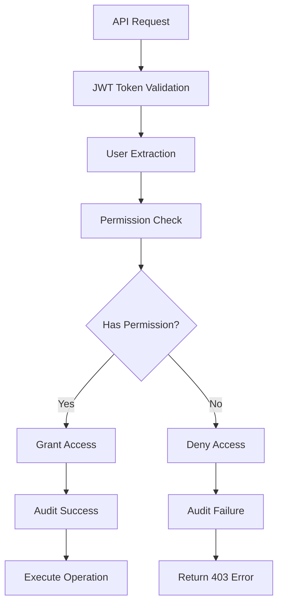
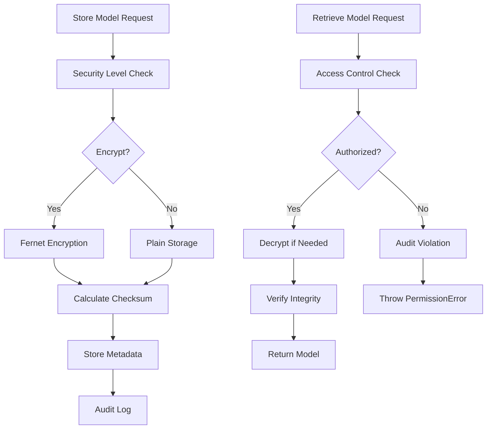

# Security and RBAC Integration for Response Core Orchestrator

## Overview

This document describes the comprehensive security and Role-Based Access Control (RBAC) integration implemented for the Response Core Orchestrator. The implementation provides enterprise-grade security controls for training operations, model management, and administrative features.

## Requirements Addressed

- **4.1**: Comprehensive observability and security controls with Prometheus metrics and audit logging
- **4.2**: RBAC integration for admin-only features with proper permission checking
- **4.3**: Audit logging for all training and model management operations
- **4.4**: Secure model storage and version management with encryption
- **4.5**: Access controls for training data and model configurations
- **4.6**: Security monitoring and threat detection capabilities

## Components Implemented

### 1. RBAC Middleware (`src/ai_karen_engine/auth/rbac_middleware.py`)

**Key Features:**
- Comprehensive permission system with 5 roles and 15+ permissions
- Role hierarchy: Admin > Trainer > Analyst > User > Readonly
- JWT token validation and user extraction
- Permission checking decorators for FastAPI endpoints
- Comprehensive audit logging of access decisions

**Roles and Permissions:**
```python
# Roles
ADMIN = "admin"        # Full system access
TRAINER = "trainer"    # Training and model management
ANALYST = "analyst"    # Read access with export capabilities
USER = "user"          # Basic read access
READONLY = "readonly"  # Minimal read access

# Key Permissions
TRAINING_READ/WRITE/DELETE/EXECUTE
MODEL_READ/WRITE/DELETE/DEPLOY
DATA_READ/WRITE/DELETE/EXPORT
SCHEDULER_READ/WRITE/EXECUTE
ADMIN_READ/WRITE/SYSTEM
AUDIT_READ
SECURITY_READ/WRITE
```

**Usage Example:**
```python
from ai_karen_engine.auth.rbac_middleware import require_permission, Permission

@router.post("/training/start")
@require_permission(Permission.TRAINING_EXECUTE, "training_job")
async def start_training(current_user: UserData = Depends(get_current_user)):
    # Only users with TRAINING_EXECUTE permission can access
    pass
```

### 2. Secure Model Storage (`src/ai_karen_engine/core/response/secure_model_storage.py`)

**Key Features:**
- Encrypted model storage using Fernet encryption
- Integrity verification with SHA-256 checksums
- Version management and metadata tracking
- Tenant isolation and access controls
- Comprehensive audit logging of model operations

**Security Levels:**
- `PUBLIC`: No encryption, basic access controls
- `INTERNAL`: Standard encryption, tenant isolation
- `CONFIDENTIAL`: Strong encryption, admin-only access
- `RESTRICTED`: Maximum security, audit all access

**Usage Example:**
```python
storage = get_secure_model_storage()

# Store encrypted model
model_id = await storage.store_model(
    model_path=model_file,
    name="Sensitive Model",
    model_type=ModelType.TRANSFORMER,
    user=current_user,
    security_level=SecurityLevel.CONFIDENTIAL,
    encrypt=True
)

# Retrieve with access control
model_path = await storage.retrieve_model(model_id, current_user)
```

### 3. Training Audit Logger (`src/ai_karen_engine/services/training_audit_logger.py`)

**Key Features:**
- Specialized audit events for training operations
- Security event tracking and analysis
- Performance metrics logging
- Comprehensive event categorization
- Integration with base audit logging system

**Event Types:**
```python
# Training Events
TRAINING_STARTED/COMPLETED/FAILED/CANCELLED
MODEL_CREATED/UPDATED/DELETED/DEPLOYED/ACCESSED
TRAINING_DATA_UPLOADED/MODIFIED/DELETED/EXPORTED
SCHEDULE_CREATED/UPDATED/DELETED/EXECUTED

# Security Events
UNAUTHORIZED_ACCESS_ATTEMPT
PERMISSION_DENIED
SECURITY_VIOLATION
MODEL_INTEGRITY_CHECK_FAILED
```

**Usage Example:**
```python
audit_logger = get_training_audit_logger()

# Log training start
audit_logger.log_training_started(
    user=current_user,
    training_job_id="job-123",
    model_id="model-456",
    training_config={"epochs": 10}
)

# Log security violation
audit_logger.log_unauthorized_access_attempt(
    user=malicious_user,
    resource_type="model",
    resource_id="sensitive-model",
    permission_required="model:read"
)
```

### 4. API Route Integration

**Updated Routes with RBAC:**
- `training_data_routes.py`: Data management with DATA_* permissions
- `scheduler_routes.py`: Scheduler management with SCHEDULER_* permissions
- `advanced_training_routes.py`: Advanced training with TRAINING_* permissions

**Protection Patterns:**
```python
# Permission-based protection
@router.post("/datasets")
async def create_dataset(
    request: CreateDatasetRequest,
    current_user: UserData = Depends(get_current_user)
):
    if not check_data_access(current_user, "write"):
        raise HTTPException(status_code=403, detail="DATA_WRITE permission required")
    # Implementation...

# Admin-only protection
@router.post("/schedules")
async def create_schedule(
    config: AutonomousConfigModel,
    current_user: UserData = Depends(require_admin_user)
):
    # Only admin users can access
    # Implementation...
```

## Security Architecture

### Access Control Flow



### Model Storage Security



### Audit Trail

All security-relevant operations are logged with:
- **User Context**: User ID, email, roles, tenant
- **Operation Details**: Resource type, operation type, success/failure
- **Security Context**: Permissions required, IP address, user agent
- **Performance Metrics**: Duration, memory usage, CPU usage
- **Metadata**: Additional context specific to operation

## Testing

### Comprehensive Test Coverage

1. **RBAC Manager Tests** (`tests/test_rbac_integration.py`)
   - Permission checking for all roles
   - Access control validation
   - Audit logging verification

2. **Security Integration Tests** (`tests/test_security_integration_complete.py`)
   - End-to-end security workflows
   - Tenant isolation verification
   - Attack scenario simulation

3. **Model Storage Tests**
   - Encryption/decryption validation
   - Access control enforcement
   - Integrity checking

### Test Scenarios

- **Legitimate Access**: Admin and trainer users performing authorized operations
- **Unauthorized Access**: Users attempting operations beyond their permissions
- **Cross-Tenant Access**: Users attempting to access resources from other tenants
- **Integrity Violations**: Detection of model tampering or corruption
- **Security Escalation**: Attempts to gain elevated privileges

## Deployment Considerations

### Environment Variables

```bash
# Encryption
MODEL_ENCRYPTION_KEY=your-32-byte-encryption-key

# JWT Configuration
JWT_SECRET_KEY=your-jwt-secret-key
JWT_ALGORITHM=HS256

# Security Settings
ENABLE_RBAC=true
ENABLE_AUDIT_LOGGING=true
ENABLE_MODEL_ENCRYPTION=true
```

### Database Schema

The RBAC system integrates with existing user tables:
- `auth_users.roles`: JSON array of user roles
- `auth_sessions`: Session tracking for audit trails
- Model metadata stored in secure storage system

### Monitoring and Alerting

**Prometheus Metrics:**
```python
# Access control metrics
rbac_permission_checks_total{permission, granted}
rbac_role_assignments_total{role}

# Security metrics
security_violations_total{type, severity}
model_access_attempts_total{result}
audit_events_total{event_type, severity}
```

**Alert Rules:**
- Multiple failed permission checks from same user
- Unauthorized access attempts to sensitive models
- Model integrity check failures
- Unusual access patterns across tenants

## Best Practices

### For Developers

1. **Always Use RBAC Decorators**: Protect all sensitive endpoints
2. **Check Permissions Explicitly**: Use helper functions for complex logic
3. **Audit All Operations**: Log security-relevant actions
4. **Validate Input**: Sanitize all user inputs
5. **Handle Errors Gracefully**: Don't leak sensitive information

### For Administrators

1. **Regular Permission Audits**: Review user roles and permissions
2. **Monitor Security Events**: Set up alerting for violations
3. **Rotate Encryption Keys**: Regular key rotation for model storage
4. **Backup Audit Logs**: Ensure audit trail preservation
5. **Test Security Controls**: Regular penetration testing

### For Users

1. **Principle of Least Privilege**: Request only necessary permissions
2. **Secure Token Handling**: Protect JWT tokens
3. **Report Suspicious Activity**: Alert administrators of anomalies
4. **Follow Data Handling Policies**: Respect data classification levels

## Integration Points

### Existing Systems

- **Authentication Service**: Uses existing JWT token validation
- **Audit Logging**: Extends existing audit infrastructure
- **Memory Service**: Integrates with tenant isolation
- **Chat Orchestrator**: Maintains backward compatibility

### Future Enhancements

- **Multi-Factor Authentication**: Additional security layer
- **Dynamic Permissions**: Runtime permission adjustment
- **Advanced Threat Detection**: ML-based anomaly detection
- **Compliance Reporting**: Automated compliance reports

## Conclusion

The RBAC integration provides comprehensive security controls for the Response Core Orchestrator while maintaining usability and performance. The system follows security best practices including:

- **Defense in Depth**: Multiple security layers
- **Principle of Least Privilege**: Minimal necessary permissions
- **Comprehensive Auditing**: Full audit trail
- **Secure by Default**: Safe default configurations
- **Tenant Isolation**: Multi-tenant security

This implementation ensures that training operations, model management, and administrative features are properly secured while providing the flexibility needed for different user roles and use cases.