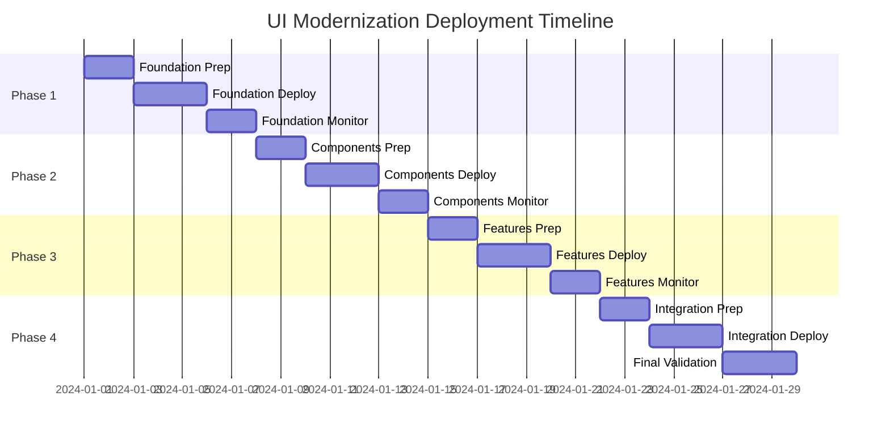

# UI Modernization Deployment Plan

## Overview

This document outlines the phased deployment strategy for the UI modernization project, including feature flags, monitoring, and rollback procedures.

## Deployment Strategy

### Phase 1: Foundation Deployment (Week 1)
**Target**: Core infrastructure and design system

#### Components to Deploy:
- Design token system (`src/design-tokens/`)
- Modern CSS architecture (`src/styles/`)
- Layout components (`src/components/ui/layout/`)
- Performance monitoring (`src/utils/performance-monitor.ts`)

#### Feature Flags:
```typescript
// Feature flags for Phase 1
const PHASE_1_FLAGS = {
  MODERN_DESIGN_TOKENS: true,
  MODERN_LAYOUT_SYSTEM: true,
  PERFORMANCE_MONITORING: true,
  CONTAINER_QUERIES: true
};
```

#### Success Criteria:
- [ ] Design tokens load correctly
- [ ] Layout system renders without errors
- [ ] Performance monitoring captures metrics
- [ ] No regression in existing functionality

#### Rollback Triggers:
- CSS loading failures
- Layout breaking on any device
- Performance degradation > 20%
- Critical accessibility issues

### Phase 2: Component Modernization (Week 2)
**Target**: Modern component patterns and interactions

#### Components to Deploy:
- Compound components (`src/components/ui/compound/`)
- Polymorphic components (`src/components/ui/polymorphic/`)
- Micro-interactions (`src/components/ui/micro-interactions/`)
- Animation system (`src/components/ui/animation/`)

#### Feature Flags:
```typescript
// Feature flags for Phase 2
const PHASE_2_FLAGS = {
  MODERN_COMPONENTS: true,
  MICRO_INTERACTIONS: true,
  ANIMATION_SYSTEM: true,
  COMPOUND_PATTERNS: true
};
```

#### Success Criteria:
- [ ] All components render correctly
- [ ] Animations run at 60fps
- [ ] Interactions feel responsive
- [ ] Component API works as expected

#### Rollback Triggers:
- Component rendering failures
- Animation performance issues
- Interaction bugs
- Memory leaks

### Phase 3: Enhanced Features (Week 3)
**Target**: Advanced functionality and optimizations

#### Components to Deploy:
- Accessibility enhancements (`src/components/ui/accessibility/`)
- Error boundaries (`src/components/error/`)
- Lazy loading (`src/components/ui/lazy-loading/`)
- Performance optimizations

#### Feature Flags:
```typescript
// Feature flags for Phase 3
const PHASE_3_FLAGS = {
  ENHANCED_ACCESSIBILITY: true,
  MODERN_ERROR_HANDLING: true,
  LAZY_LOADING: true,
  PERFORMANCE_OPTIMIZATIONS: true
};
```

#### Success Criteria:
- [ ] Accessibility score > 95%
- [ ] Error handling works correctly
- [ ] Lazy loading improves performance
- [ ] Bundle size optimized

#### Rollback Triggers:
- Accessibility regressions
- Error boundary failures
- Loading performance issues
- Bundle size increases

### Phase 4: Full Integration (Week 4)
**Target**: Complete UI modernization

#### Components to Deploy:
- All remaining modern components
- Complete page integrations
- Final optimizations

#### Feature Flags:
```typescript
// Feature flags for Phase 4
const PHASE_4_FLAGS = {
  FULL_MODERNIZATION: true,
  ALL_MODERN_COMPONENTS: true,
  COMPLETE_INTEGRATION: true
};
```

#### Success Criteria:
- [ ] All pages use modern components
- [ ] Performance targets met
- [ ] Accessibility compliance achieved
- [ ] User acceptance testing passed

## Feature Flag Implementation

### Configuration File
```typescript
// src/lib/feature-flags.ts
export interface FeatureFlags {
  MODERN_DESIGN_TOKENS: boolean;
  MODERN_LAYOUT_SYSTEM: boolean;
  MODERN_COMPONENTS: boolean;
  MICRO_INTERACTIONS: boolean;
  ENHANCED_ACCESSIBILITY: boolean;
  PERFORMANCE_MONITORING: boolean;
  LAZY_LOADING: boolean;
  FULL_MODERNIZATION: boolean;
}

export const defaultFlags: FeatureFlags = {
  MODERN_DESIGN_TOKENS: false,
  MODERN_LAYOUT_SYSTEM: false,
  MODERN_COMPONENTS: false,
  MICRO_INTERACTIONS: false,
  ENHANCED_ACCESSIBILITY: false,
  PERFORMANCE_MONITORING: false,
  LAZY_LOADING: false,
  FULL_MODERNIZATION: false,
};

export function getFeatureFlags(): FeatureFlags {
  // Load from environment variables or remote config
  return {
    MODERN_DESIGN_TOKENS: process.env.NEXT_PUBLIC_MODERN_DESIGN_TOKENS === 'true',
    MODERN_LAYOUT_SYSTEM: process.env.NEXT_PUBLIC_MODERN_LAYOUT_SYSTEM === 'true',
    MODERN_COMPONENTS: process.env.NEXT_PUBLIC_MODERN_COMPONENTS === 'true',
    MICRO_INTERACTIONS: process.env.NEXT_PUBLIC_MICRO_INTERACTIONS === 'true',
    ENHANCED_ACCESSIBILITY: process.env.NEXT_PUBLIC_ENHANCED_ACCESSIBILITY === 'true',
    PERFORMANCE_MONITORING: process.env.NEXT_PUBLIC_PERFORMANCE_MONITORING === 'true',
    LAZY_LOADING: process.env.NEXT_PUBLIC_LAZY_LOADING === 'true',
    FULL_MODERNIZATION: process.env.NEXT_PUBLIC_FULL_MODERNIZATION === 'true',
  };
}
```

### Usage in Components
```typescript
// Example usage in a component
import { useFeatureFlags } from '@/hooks/use-feature-flags';

export function ModernButton({ children, ...props }) {
  const flags = useFeatureFlags();
  
  if (flags.MODERN_COMPONENTS) {
    return <ModernButtonComponent {...props}>{children}</ModernButtonComponent>;
  }
  
  return <LegacyButton {...props}>{children}</LegacyButton>;
}
```

## Monitoring and Observability

### Key Metrics to Monitor

#### Performance Metrics
- **Core Web Vitals**
  - LCP (Largest Contentful Paint) < 2.5s
  - FID (First Input Delay) < 100ms
  - CLS (Cumulative Layout Shift) < 0.1

- **Custom Metrics**
  - Component render time
  - Animation frame rate
  - Bundle size
  - Memory usage

#### User Experience Metrics
- **Accessibility**
  - Screen reader compatibility
  - Keyboard navigation success rate
  - Color contrast compliance

- **Interaction Metrics**
  - Click response time
  - Form submission success rate
  - Error recovery rate

#### Technical Metrics
- **Error Rates**
  - JavaScript errors
  - Component rendering failures
  - Network request failures

- **Resource Usage**
  - CPU usage during animations
  - Memory consumption
  - Network bandwidth

### Monitoring Implementation

#### Dashboard Configuration
```typescript
// monitoring/dashboard-config.ts
export const MONITORING_CONFIG = {
  alerts: {
    performance: {
      lcp_threshold: 2500,
      fid_threshold: 100,
      cls_threshold: 0.1
    },
    errors: {
      error_rate_threshold: 0.01,
      component_failure_threshold: 0.005
    },
    accessibility: {
      violation_threshold: 0
    }
  },
  dashboards: [
    {
      name: 'UI Modernization Performance',
      metrics: ['lcp', 'fid', 'cls', 'component_render_time'],
      refresh_interval: '1m'
    },
    {
      name: 'User Experience',
      metrics: ['interaction_success_rate', 'accessibility_score'],
      refresh_interval: '5m'
    }
  ]
};
```

#### Alert Rules
```yaml
# monitoring/alert-rules.yml
groups:
  - name: ui-modernization
    rules:
      - alert: HighLCP
        expr: web_vitals_lcp > 2500
        for: 5m
        labels:
          severity: warning
        annotations:
          summary: "LCP is above threshold"
          
      - alert: ComponentRenderingFailure
        expr: component_render_errors > 0.005
        for: 1m
        labels:
          severity: critical
        annotations:
          summary: "Component rendering failures detected"
          
      - alert: AccessibilityViolations
        expr: accessibility_violations > 0
        for: 1m
        labels:
          severity: warning
        annotations:
          summary: "Accessibility violations detected"
```

## Rollback Procedures

### Automatic Rollback Triggers

#### Critical Issues (Immediate Rollback)
- Application crashes or fails to load
- Critical accessibility violations (WCAG AA failures)
- Performance degradation > 50%
- Security vulnerabilities introduced

#### Warning Issues (Staged Rollback)
- Performance degradation 20-50%
- Non-critical accessibility issues
- Component rendering issues affecting < 5% of users
- Minor functionality regressions

### Rollback Implementation

#### Feature Flag Rollback
```typescript
// scripts/rollback-feature.ts
export async function rollbackFeature(featureName: string, reason: string) {
  console.log(`Rolling back feature: ${featureName}`);
  console.log(`Reason: ${reason}`);
  
  // Disable feature flag
  await updateFeatureFlag(featureName, false);
  
  // Clear CDN cache
  await clearCDNCache();
  
  // Notify team
  await notifyTeam({
    type: 'rollback',
    feature: featureName,
    reason,
    timestamp: new Date().toISOString()
  });
  
  console.log(`Feature ${featureName} rolled back successfully`);
}
```

#### Database Rollback (if needed)
```sql
-- Rollback script for any database changes
-- This should be minimal for UI changes
BEGIN TRANSACTION;

-- Revert any user preference changes
UPDATE user_preferences 
SET ui_version = 'legacy' 
WHERE ui_version = 'modern';

-- Log the rollback
INSERT INTO deployment_log (action, timestamp, reason)
VALUES ('rollback', NOW(), 'UI modernization rollback');

COMMIT;
```

## Testing Strategy

### Pre-Deployment Testing

#### Automated Tests
- [ ] Unit tests for all components (>95% coverage)
- [ ] Integration tests for key user flows
- [ ] Visual regression tests with Chromatic
- [ ] Accessibility tests with axe-core
- [ ] Performance tests with Lighthouse CI

#### Manual Testing
- [ ] Cross-browser testing (Chrome, Firefox, Safari, Edge)
- [ ] Device testing (mobile, tablet, desktop)
- [ ] Screen reader testing (NVDA, JAWS, VoiceOver)
- [ ] Keyboard navigation testing
- [ ] Touch interaction testing

### Post-Deployment Testing

#### Smoke Tests
```typescript
// tests/smoke/post-deployment.test.ts
describe('Post-Deployment Smoke Tests', () => {
  test('Application loads successfully', async () => {
    await page.goto('/');
    await expect(page).toHaveTitle(/Karen AI/);
  });
  
  test('Modern components render', async () => {
    await page.goto('/');
    const modernCard = await page.locator('.modern-card').first();
    await expect(modernCard).toBeVisible();
  });
  
  test('Animations work correctly', async () => {
    await page.goto('/');
    const button = await page.locator('button').first();
    await button.hover();
    // Check for animation classes or transforms
  });
});
```

#### Performance Validation
```typescript
// tests/performance/post-deployment.test.ts
describe('Performance Validation', () => {
  test('Core Web Vitals meet thresholds', async () => {
    const metrics = await page.evaluate(() => {
      return new Promise((resolve) => {
        new PerformanceObserver((list) => {
          const entries = list.getEntries();
          resolve(entries);
        }).observe({ entryTypes: ['largest-contentful-paint'] });
      });
    });
    
    expect(metrics.lcp).toBeLessThan(2500);
  });
});
```

## Communication Plan

### Stakeholder Updates

#### Pre-Deployment
- [ ] Technical review with development team
- [ ] Design review with UX team
- [ ] Security review with security team
- [ ] Performance review with infrastructure team

#### During Deployment
- [ ] Real-time updates in deployment channel
- [ ] Status page updates for users
- [ ] Monitoring dashboard sharing

#### Post-Deployment
- [ ] Success metrics report
- [ ] User feedback collection
- [ ] Performance impact analysis
- [ ] Lessons learned documentation

### User Communication

#### Announcement Template
```markdown
# UI Modernization Update

We're excited to announce the rollout of our modernized user interface! 

## What's New
- ✨ Improved visual design with modern components
- 🚀 Better performance and faster loading times
- ♿ Enhanced accessibility features
- 📱 Better mobile and tablet experience

## Rollout Schedule
- Phase 1: Foundation (Week 1)
- Phase 2: Components (Week 2)  
- Phase 3: Features (Week 3)
- Phase 4: Complete (Week 4)

## Need Help?
If you experience any issues, please contact support or check our status page.
```

## Risk Mitigation

### Identified Risks and Mitigations

| Risk | Impact | Probability | Mitigation |
|------|--------|-------------|------------|
| Performance regression | High | Medium | Comprehensive performance testing, gradual rollout |
| Accessibility issues | High | Low | Automated testing, manual validation |
| Browser compatibility | Medium | Medium | Cross-browser testing, progressive enhancement |
| User confusion | Medium | Medium | User communication, training materials |
| Component failures | High | Low | Extensive testing, feature flags, monitoring |

### Contingency Plans

#### Plan A: Feature Flag Rollback
- Immediate disable of problematic features
- Minimal user impact
- Quick recovery time

#### Plan B: Partial Rollback
- Rollback specific components or pages
- Maintain working functionality
- Targeted fixes

#### Plan C: Full Rollback
- Complete revert to previous version
- Maximum stability
- Longer recovery time

## Success Criteria

### Technical Success Metrics
- [ ] Zero critical bugs in production
- [ ] Performance metrics within thresholds
- [ ] Accessibility compliance maintained
- [ ] Error rates < 0.1%

### User Success Metrics
- [ ] User satisfaction score > 4.5/5
- [ ] Task completion rate maintained or improved
- [ ] Support ticket volume unchanged
- [ ] Positive feedback on new design

### Business Success Metrics
- [ ] No impact on key business metrics
- [ ] Improved user engagement
- [ ] Reduced support costs
- [ ] Positive brand perception

## Timeline



## Conclusion

This deployment plan ensures a safe, monitored, and reversible rollout of the UI modernization. The phased approach minimizes risk while allowing for continuous validation and improvement.

For questions or concerns about this deployment plan, please contact the development team or project manager.